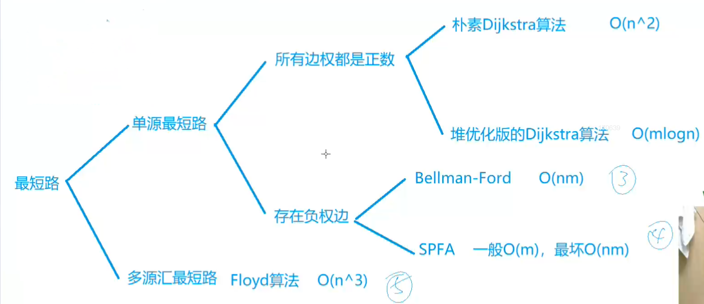

 

# 数论


## 1.判断质数


```C++
//输入一个数返回是否是质数
bool is_prim(int num) {
    if(num == 1) {
        return false;
    }
    
    for(int i = 2; i <= num / i; ++i) {
        if(num % i == 0) {
            return false;
        }
    }
    return true;
}

```

 

## 2.分解质因数

```C++
void divide(int n) {
    for(int i = 2; i <= n / i; ++i) {
        if(n % i == 0) {
            int s = 0; 
            while(n % i == 0) {
                n /= i;
                s++;
            }
            printf("%d %d\n", i, s);
        }
    }
    if(n > 1) {
        printf("%d %d\n", n, 1);
    }
    puts("");
}
```

输入样例：

```
2
6
8
```

输出样例：

```
2 1
3 1

2 3
```


## 3.筛质数

给出n，找出1-n的质数的个数

(1)埃氏筛法

**O(N * LOG LOG N)**

```C++
#include <iostream> 

using namespace std;

#define N 1000010

int primes[N];
bool st[N];

int cnt = 0;

void cnt_prim(int n) {
    
    for(int i = 2; i <= n; ++i) {
        if(!st[i]){
            primes[cnt++] = n;
            for(int j = i + i; j <= n; j += i) st[j] = true;
        }
    }
}


```

（2）线性筛法

**O(N)**

```C++
#include <iostream> 

using namespace std;

#define N 1000010

int primes[N];
bool st[N];

int cnt = 0;

void cnt_prim(int n) {
    for(int i = 2; i <= n; ++i) {
        if(!st[i]) primes[cnt++] = i;
        for(int j = 0; primes[j] <= n / i; ++j) {
            st[primes[j] * i] = true;
            if(i % primes[j] == 0) break;
        }
    }
}
```


## 4.试除法找约数

**O(sqrt(n))**

```C++
#include <algorithm>
#include <vector>

using namespace std;

vector<int> get_divisors(int n) {
    vector<int> res;
    for(int i = 1; i <= n / i; ++i) {
        if(n % i == 0) {
            res.push_back(i);
            if(i != n / i) res.push_back(n / i);
        }
    }
    
    sort(res.begin(), res.end());
    return res;
}
```


## 5.数组所有元素乘积的约数个数

 ***O*(n*m)，其中 `m` 是输入整数中的最大值。**

**空间复杂度为 *O*(log*m*)。**

```c++
#include <iostream>
#include <unordered_map>

using namespace std;

typedef long long LL;

const int mod = 1e9 + 7;

int main() {
    
    int n;
    int x;
    cin >> n;
    unordered_map<int, int> primes;
    
    while(n--) {
        cin >> x;
        for(int i = 2; i <= x / i; ++i) {
            while(x % i == 0) {
                primes[i]++;
                x /= i;
            }
        }
        if(x > 1) primes[x]++;
    }
    
    LL res = 1;
    
    for(auto p : primes) res = res * (p.second + 1) % mod;
    
    cout << res;
    return 0;
}
```

## 6.数组中所有数字乘积的约数之和

 *O*(*N*)

```C++
#include <iostream>
#include <unordered_map>
#include <cmath>

using namespace std;

typedef long long LL;

const int mod = 1e9 + 7;

int main() {
    
    int n;
    int x;
    cin >> n;
    unordered_map<int, int> primes;
    //分解质因数
    while(n--) {
        cin >> x;
        for(int i = 2; i <= x / i; ++i) {
            while(x % i == 0) {
                primes[i]++;
                x /= i;
            }
        }
        if(x > 1) primes[x]++;
    }
    
    LL res = 1;
    //求解约数之和
    for(auto p : primes)  {
        int m = p.first;
        int a = p.second;
        LL t = 1;
        while(a--) t = (t * m + 1) % mod;
        res = res * t % mod;
    }
    
    cout << res;
    return 0;
}
```

以上两个例子的公式：

$ N = \prod_{i = 1}^{k} p_{i}^{a_{i}} = p_{1}^{a_{1}} \cdot p_{2}^{a_{2}} \cdots p_{k}^{a_{k}}  $

约数个数：$  \prod_{i = 1}^{k} (a_{i} + 1) = (a_{1} + 1)(a_{2} + 1)\cdots(a_{k} + 1)  $

约数之和： $ \begin{align*} \prod_{i = 1}^{k} \sum_{j = 0}^{a_{i}} p_{i}^{j} &= \prod_{i = 1}^{k} (p_{i}^{0} + p_{i}^{1} + \cdots + p_{i}^{a_{i}})\\ &= (p_{1}^{0} + p_{1}^{1} + \cdots + p_{1}^{a_{1}})(p_{2}^{0} + p_{2}^{1} + \cdots + p_{2}^{a_{2}})\cdots(p_{k}^{0} + p_{k}^{1} + \cdots + p_{k}^{a_{k}}) \end{align*} $


## 7.最大公约数

辗转相除法（欧几里得算法）：

（a， b） = (b, a mod b);

```C++
int gcd(int a, int b) {
    
    return b ? gcd(b, a % b) : a;
}
```


## 8. 欧拉函数

> 给定 n 个正整数 ai，请你求出每个数的欧拉函数。
>
> 1～N 中与 N 互质的数的个数被称为欧拉函数，记为 $\phi(N)$。 若在算数基本定理中，$N = p_1^{a_1}p_2^{a_2}\cdots p_m^{a_m}$，则： $\phi(N) = N\times\frac{p_1 - 1}{p_1}\times\frac{p_2 - 1}{p_2}\times\cdots\times\frac{p_m - 1}{p_m}$ 

时间复杂度：**O(sqrt(N))**

```C++
int Phi(int a) {
    int res = a;
    for(int i = 2; i <= a / i; ++i) {
        if(a % i == 0) {
            
            res = res / i * (i - 1);
            while(a % i == 0) a /= i;
        }
    }
    if(a > 1) res = res / a * (a - 1);
    
    return res;
}
```

## 9. 筛法求欧拉函数

给定一个正整数 n，求 1∼n 中每个数的欧拉函数之和。

时间复杂度：**O(N)**

```c++
#include <iostream>


using namespace std;

typedef long long LL;

#define N 1000010

int primes[N], cnt;

int phi[N];

bool st[N];

LL getEuLes(int n) {
    phi[1] = 1;
    for(int i = 2; i <= n; ++i) {
        if(!st[i]) {
            primes[ cnt ++ ] = i;
            phi[i] = i - 1;
        }
        for(int j = 0; primes[j] <= n / i; ++j) {
            st[primes[j] * i] = true;
            if(i % primes[j] == 0) {
                phi[primes[j] * i] = phi[i] * primes[j];
                break;
            }
             phi[primes[j] * i] = phi[i] * (primes[j] - 1);
        }
    }
    LL res = 0;
    for(int i = 1; i <= n; ++i) res += phi[i];
    return res;
}
```


## 10 快速幂

应用：a的b次方mod p

O(logb)

```C++
#include <iostream>

using namespace std;

typedef long long LL; 

int qmi(int a, int b, int p) {
    int res = 1;
    
    while(b) {
        if(b & 1) res = (LL)res * a % p;
        b >>= 1;
        a =(LL)a * a % p;
    }
    
    return res;
}
```


## 11.快速幂求逆元

给定 *n* 组 *ai*,*pi*，其中 *pi* 是质数，求 *ai* 模 *pi* 的乘法逆元，若逆元不存在则输出 `impossible` 。

**注意**：请返回在 0∼*p*−1 之间的逆元。

```C++
#include <iostream>

using namespace std;

typedef long long LL; 

int qmi(int a, int b, int p) {
    int res = 1;
    
    while(b) {
        if(b & 1) res = (LL)res * a % p;
        b >>= 1;
        a =(LL)a * a % p;
    }
    
    return res;
}

int main() {
    int n;
    
    cin >> n;
    
    while(n--) {
        int a, b;
        
        cin >> a >> b;
        
        LL res = qmi(a, b - 2, b);
        
        if(a % b) cout << res << endl;
        else cout << "impossible" << endl;
        
    }
}
```


## 12 . 裴蜀定理

对于任意一对正整数a、b，都存在非零整数x和y，使得 a * x + b * y = GCD(a, b);

```C++
#include <iostream>


using namespace std;

//求出满足裴蜀定理的x和y
int exgcd(int a, int b, int &x, int &y) {
    if(!b) {
        x = 1;
        y = 0;
        return a;
    }
    int d = exgcd(b, a % b, y, x);
    y -= a / b * x;
    
    return d;
} 
int main() {
    
    int n;
    
    cin >> n;
    
    while(n--) {
        int x = 0;
        int y = 0;
        int a;
        int b;
        cin >> a >> b;
        exgcd(a, b, x, y);
        
        cout << x << " " << y << endl;
        
    }

    return 0;
}
```

## 13.线性同余方程

给定 $n$ 组数据 $a_i, b_i, m_i$，对于每组数求出一个 $x_i$，使其满足 $a_i \times x_i \equiv b_i \pmod{m_i}$，如果无解则输出 `impossible`。 

```C++
#include <iostream>


using namespace std;

typedef long long LL;

int exgcd(int a, int b, int &x, int &y) {
    if(!b) {
        x = 1;
        y = 0;
        return a;
    }
    int d = exgcd(b, a % b, y, x);
    y -= a / b * x;
    
    return d;
} 


int main() {
    
    int n;
    
    cin >> n;
    
    while(n--) {
        int x = 0;
        int y = 0;
        int a;
        int b;
        int m;
        cin >> a >> b >> m;
        LL d = exgcd(a, m, x, y);
        
        if(b % d) puts("impossible");
        else cout << (LL)x * (b / d) % m << endl;
    }
    

    return 0;
}
```

 ## 14. 中国剩余定理


定义 中国剩余定理是数论中的一个重要定理，用于求解一次同余方程组

设 $m_1, m_2, \cdots, m_k$ 是两两互质的正整数，即对于任意的 $i \neq j$，都有 $\gcd(m_i, m_j) = 1$

考虑如下形式的同余方程组：$ \begin{cases} x \equiv a_1 \pmod{m_1} \\ x \equiv a_2 \pmod{m_2} \\ \cdots \\ x \equiv a_k \pmod{m_k} \end{cases}  $

该定理表明，此同余方程组在模 $M = m_1m_2\cdots m_k$ 下有唯一解。 

求解步骤 

1.**计算 $M$**： 令 $M = \prod_{i = 1}^{k} m_i$，即 $M$ 为所有模数 $m_i$ 的乘积。 

2.**计算 $M_i$**： 对于每个 $i$，计算 $M_i=\frac{M}{m_i}$，也就是 $M$ 除以 $m_i$ 的商。

3.**计算 $M_i$ 的逆元 $t_i$**： 求解同余方程 $M_i t_i \equiv 1 \pmod{m_i}$，得到 $M_i$ 模 $m_i$ 下的逆元 $t_i$。这一步通常可以使用扩展欧几里得算法（Extended Euclidean Algorithm）来求解。 

4.**计算方程组的解 $x$**： 同余方程组的解 $x$ 可以通过公式 $x = \sum_{i = 1}^{k} a_i M_i t_i \pmod{M}$ 计算得出。

代码实现：

```C++
#include <iostream>

using namespace std;

typedef long long LL;

// 扩展欧几里得算法
LL exgcd(LL a, LL b, LL &x, LL &y) {
    if (!b) {
        x = 1;
        y = 0;
        return a;
    }
    LL d = exgcd(b, a % b, y, x);
    y -= a / b * x;
    return d;
}

int main() {
    int n;
    cin >> n;

    bool has_answer = true;

    LL a1, m1;
    cin >> a1 >> m1; // 读取第一组数据

    for (int i = 1; i < n; ++i) {
        LL a2, m2;
        cin >> a2 >> m2;

        LL k1, k2;
        LL d = exgcd(a1, a2, k1, k2);
        if ((m2 - m1) % d) {
            has_answer = false;
            break;
        }

        k1 *= (m2 - m1) / d;
        LL t = a2 / d;
        k1 = (k1 % t + t) % t;

        m1 = a1 * k1 + m1; 
        a1 = abs(a1 / d * a2);
    }

    if (has_answer) {
        cout << (m1 % a1 + a1) % a1 << endl;
    } else {
        cout << "-1" << endl;
    }

    return 0;
}
```

##  15.高斯消元

输入一个包含 $n$ 个方程 $n$ 个未知数的线性方程组。 方程组中的系数为实数。 求解这个方程组。 下图为一个包含 $m$ 个方程 $n$ 个未知数的线性方程组示例：

$  \begin{cases} a_{11}x_1 + a_{12}x_2 + \cdots + a_{1n}x_n = b_1 \\ a_{21}x_1 + a_{22}x_2 + \cdots + a_{2n}x_n = b_2 \\ \cdots\cdots\cdots\cdots\cdots\cdots\cdots\cdots\cdots\cdots \\ a_{m1}x_1 + a_{m2}x_2 + \cdots + a_{mn}x_n = b_m \end{cases}  $

```C++
#include <iostream>
#include <cstring>
#include <algorithm>
#include <cmath>

using namespace std;

const int N = 110;
const double eps = 1e-8;

int n;
double a[N][N];

int gauss()  // 高斯消元，答案存于a[i][n]中，0 <= i < n
{
    int c, r;
    for (c = 0, r = 0; c < n; c ++ )
    {
        int t = r;
        for (int i = r; i < n; i ++ )  // 找绝对值最大的行
            if (fabs(a[i][c]) > fabs(a[t][c]))
                t = i;

        if (fabs(a[t][c]) < eps) continue;

        for (int i = c; i <= n; i ++ ) swap(a[t][i], a[r][i]);  // 将绝对值最大的行换到最顶端
        for (int i = n; i >= c; i -- ) a[r][i] /= a[r][c];  // 将当前行的首位变成1
        for (int i = r + 1; i < n; i ++ )  // 用当前行将下面所有的列消成0
            if (fabs(a[i][c]) > eps)
                for (int j = n; j >= c; j -- )
                    a[i][j] -= a[r][j] * a[i][c];

        r ++ ;
    }

    if (r < n)
    {
        for (int i = r; i < n; i ++ )
            if (fabs(a[i][n]) > eps)
                return 2; // 无解
        return 1; // 有无穷多组解
    }

    for (int i = n - 1; i >= 0; i -- )
        for (int j = i + 1; j < n; j ++ )
            a[i][n] -= a[i][j] * a[j][n];

    return 0; // 有唯一解
}


int main()
{
    scanf("%d", &n);
    for (int i = 0; i < n; i ++ )
        for (int j = 0; j < n + 1; j ++ )
            scanf("%lf", &a[i][j]);

    int t = gauss();
    if (t == 2) puts("No solution");
    else if (t == 1) puts("Infinite group solutions");
    else
    {
        for (int i = 0; i < n; i ++ )
        {
            if (fabs(a[i][n]) < eps) a[i][n] = 0;  // 去掉输出 -0.00 的情况
            printf("%.2lf\n", a[i][n]);
        }
    }

    return 0;
}
```


## 16.高斯消元求解异或线性方程

输入一个包含 $n$ 个方程 $n$ 个未知数的异或线性方程组。 方程组中的系数和常数为 $0$ 或 $1$，每个未知数的取值也为 $0$ 或 $1$。 求解这个方程组。 异或线性方程组示例如下： 

``` M[1][1]x[1] ^ M[1][2]x[2] ^ ... ^ M[1][n]x[n] = B[1] ``` 

 ```M[2][1]x[1] ^ M[2][2]x[2] ^ ... ^ M[2][n]x[n] = B[2] ```

 ```... ```

 ```M[n][1]x[1] ^ M[n][2]x[2] ^ ... ^ M[n][n]x[n] = B[n] ``` 

其中 `^` 表示异或(XOR)，$M[i][j]$ 表示第 $i$ 个式子中 $x[j]$ 的系数，$B[i]$ 是第 $i$ 个方程右端的常数，取值均为 $0$ 或 $1$。 

```C++
#include <iostream>
#include <cstring>
#include <algorithm>

using namespace std;

const int N = 110;

int n;
int a[N][N];

int gauss() {
    int c, r;
    for (c = 0, r = 0; c < n; c++) {
        int t = r;
        for (int i = r; i < n; i++) {  // 找绝对值最大（这里是找首个 1 所在行，因为只有 0 和 1 ）
            if (a[i][c]) {
                t = i;
                break;
            }
        }
        if (!a[t][c]) continue;  // 该列全为 0 ，跳过
        for (int i = c; i <= n; i++) swap(a[t][i], a[r][i]);  // 将有 1 的行换到顶端

        for (int i = r + 1; i < n; i++) {
            if (a[i][c]) {
                for (int j = c; j <= n; j++) {
                    a[i][j] ^= a[r][j];
                }
            }
        }
        r++;
    }

    if (r < n) {
        for (int i = r; i < n; i++) {
            if (a[i][n]) {
                return 2;  // 无解
            }
        }
        return 1;  // 有无穷多组解
    }

    for (int i = n - 1; i >= 0; i--) {
        for (int j = i + 1; j < n; j++) {
            if (a[i][j]) {
                a[i][n] ^= a[j][n];
            }
        }
    }
    return 0;  // 有唯一解
}

int main() {
    scanf("%d", &n);
    for (int i = 0; i < n; i++) {
        for (int j = 0; j < n + 1; j++) {
            scanf("%d", &a[i][j]);
        }
    }

    int t = gauss();
    if (t == 2) puts("No solution");
    else if (t == 1) puts("Multiple sets of solutions");
    else {
        for (int i = 0; i < n; i++) {
            printf("%d\n", a[i][n]);
        }
    }
    return 0;
}
```

## 17.求组合数

1.数据范围   $1 \leq n \leq 10000$，   $1 \leq b \leq a \leq 2000$ 

```C++
#include <iostream>

using namespace std;

const int N = 2010, mod = 1e9 + 7; 


int c[N][N];

void init() {
    
    for(int i = 0; i < N; ++i) 
        for(int j = 0; j <= i; ++j) {
            if(!j) c[i][j] = 1;
            else c[i][j] = (c[i - 1][j] + c[i - 1][j - 1]) % mod;
        }
}

int main() {
    
    init();
    
    int n;
    cin >> n;
    
    while(n--) {
        int a, b;
        
        cin >> a >> b;
        
        cout << c[a][b] << endl;
        
    }
    return 0;
}
```

2. 数据范围   $1 \leq n \leq 10000$，   $1 \leq b \leq a \leq 10^5$ 

```C++
#include <iostream>

using namespace std;

typedef long long LL;


const int N = 100010, mod = 1e9 + 7;

int fact[N], infact[N];

int qmi(int a, int k, int p) {
    
    int res = 1;
    
    while(k) {
        if(k & 1) res = (LL)res * a % p;
        a = (LL) a * a % p;
        
        k >>= 1;
    }
    return res;
}


int main() {
    fact[0] = infact[0] = 1;
    for(int i = 1; i < N; ++i) {
        fact[i] = (LL)fact[i - 1] * i % mod;
        infact[i] = (LL)infact[i - 1] * qmi(i, mod - 2, mod) % mod;
    }
    
    int n;
    
    cin >> n;

    
    while(n--) {
        int a, b;
        
        cin >> a >> b;
        
        cout << (LL)fact[a] * infact[a - b] % mod * infact[b] % mod << endl;
        
    }
    
    return 0;
}
```

### 卢卡斯定理

  题目描述   给定 $n$ 组询问，每组询问给定三个整数 $a, b, p$ ，其中 $ p$ 是质数，输出 $C_{a}^{b} \mod p $ 的值。

数据范围:

 $1 \leq n \leq 20$，

 $1 \leq b \leq a \leq 10^{18}$， 

$1 \leq p \leq 10^{5}$

```C++
#include <iostream>

typedef long long LL;

using namespace std;

int p;

int qmi(int a, int k) {
    
    int res = 1;
    while(k) {
        if(k & 1) res = (LL)res * a % p;
        a = (LL)a * a % p;
        k >>= 1;
    }
    
    return res;
}

int C(int a, int b) {
    int res = 1;
    for(int i = 1, j = a; i <= b; ++i, --j) {
        res = (LL)res * j % p;
        res = (LL)res * qmi(i, p - 2) % p;
    }
    
    return res;
}

LL lucas(LL a, LL b) {
    if(a < p && b < p) return C(a, b);
    else {
        return (LL)C(a % p, b % p) * lucas(a / p, b / p) % p;
    }
}


int main() {
    
    int n; 
    
    cin >> n;
    
    while(n--) {
        LL a, b;
        
        cin >> a >> b >> p;
        
        
        cout << lucas(a, b) << endl;
    }
    
    return 0;
}
```

### 计算真实值

- 针对每个质数 p，使用勒让德公式分别计算 \(a!\)、\(b!\) 和 \((a - b)!\) 中质因数 p 的幂次。
- 组合数 $C_{a}^b $中质因数 p 的幂次等于 \(a!\) 中质因数 p 的幂次减去 \(b!\) 和 \((a - b)!\) 中质因数 p 的幂次，将结果存于 `sum` 数组。

```c++
#include <iostream>
#include <algorithm>
#include <vector>

using namespace std;

const int N = 5010;

int primes[N], cnt;
int sum[N];
bool st[N];

void cnt_primes(int n) {
    for(int i = 2; i <= n; ++i) {
        if(!st[i]) primes[cnt++] = i;
        for(int j = 0; primes[j] <= n / i; ++j) {
            st[primes[j] * i] = true;
            if(i % primes[j] == 0) break;
        }
    }
}

int get(int n, int p) {
    
    int res = 0;
    
    while(n) {
        res += n / p;
        n /= p;
    }
    return res;
}

vector<int> mul(vector<int> a, int b) {
    vector<int> c;
    int t = 0;
    for(int i = 0; i < a.size(); ++i) {
        t += a[i] * b;
        c.push_back(t % 10);
        t /= 10;
    }
    
    while(t) {
        c.push_back(t % 10);
        t /= 10;
    }
    
    return c;
}

int main() {
    
    int a, b;
    
    cin >> a >> b;
    
    cnt_primes(a);
    
    for(int i = 0; i < cnt; ++i) {
        int p = primes[i];
        sum[i] = get(a, p) - get(b, p) - get(a - b, p);
    }
    
    
    vector<int> res;
    res.push_back(1);
    
    for(int i = 0; i < cnt; ++i)
        for(int j = 0; j < sum[i]; ++j) 
            res = mul(res, primes[i]);
            
            
    for(int i = res.size() - 1; i >= 0; --i) cout << res[i];
    
    puts("");
    
    return 0;
}
```

### 卡特兰数

$ C_n = \frac{1}{n+1} \binom{2n}{n} = \frac{(2n)!}{(n+1)! \, n!}$

代码中的res即是卡特兰数

```C++
#include <iostream>

using namespace std;

const int N = 100010, mod = 1e9 + 7;

typedef long long LL;

int qmi(int a,int k, int p) {
    
    int res = 1;
    while(k) {
        if(k & 1) res = (LL)res * a % p;
        a = (LL)a * a % p;
        k >>= 1;
    }
    return res;
}


int main() {
    
    int n;
    
    cin >> n;
    
    int a = 2 * n;
    int b = n;
    int res = 1;
    
    for(int i = a; i > a - b; --i) res = (LL) res * i % mod;
    for(int j = 1; j <= b + 1; ++j) res = (LL)res * qmi(j, mod - 2, mod) % mod;
    cout << res;
    
    
    return 0;
}
```


## 18. 容斥原理

给定一个整数 `n` 和 `m` 个不同的质数 `p1, p2, ..., pm`。

请你求出 1 ～ n 中能被 `p1, p2, ..., pm` 中的至少一个数整除的整数有多少个。

```C++
#include <iostream>
#include <algorithm>
using namespace std;

// 定义常量 N 为 20
const int N = 20;
typedef long long LL;

// 输入参数 m 和 n，质数数组 p[] 的最大长度为 N
int m, n;
int p[N];

int main()
{
    // 输入 n 和 m 的值，n 是上限，m 是质数的个数
    cin >> n >> m;
    
    // 输入 m 个质数并存储到数组 p[] 中
    for(int i = 0; i < m; i++) {
        cin >> p[i];
    }

    int res = 0;  // 用于存储最终结果，即能被至少一个质数整除的数的个数

    // 遍历所有可能的子集，子集的个数是 2^m - 1
    for(int i = 1; i < 1 << m; i++) {  // 从 1 到 2^m - 1，表示所有的子集
        int t = 1;  // 用于存储当前子集的质数的乘积
        int cnt = 0;  // 用于记录当前子集中质数的个数
        
        // 遍历每个质数，检查当前子集是否包含该质数
        for(int j = 0; j < m; j++) {
            // 判断当前子集是否包含第 j 个质数
            if(i >> j & 1) {
                cnt++;  // 子集中的质数个数加 1
                // 如果乘积超出 n，提前结束当前子集的计算
                if((LL)t * p[j] > n) {
                    t = -1;  // 设置 t 为 -1，表示该子集的乘积无效
                    break;
                }
                t *= p[j];  // 更新乘积 t
            }
        }

        // 如果 t 不为 -1，说明当前子集的乘积合法
        if(t != -1) {
            // 如果子集的质数个数为奇数，按照容斥原理加上该子集的贡献
            // 如果子集的质数个数为偶数，按照容斥原理减去该子集的贡献
            if(cnt % 2) 
                res += n / t;  // 计算 n 中能被 t 整除的数的个数，并加到结果中
            else 
                res -= n / t;  // 计算 n 中能被 t 整除的数的个数，并从结果中减去
        }
    }

    // 输出最终结果
    cout << res << endl;

    return 0;
}

```


## 19 博弈论

### **Nim游戏**

给定 n 堆石子，两位玩家轮流操作，每次操作可以从任意一堆石子中拿走任意数量的石子（可以拿完，但不能不拿），最后无法进行操作的人视为失败。

问如果两人都采用最优策略，先手是否必胜。

-  在Nim游戏中，判断先手是否必胜的核心数学公式基于**异或运算（XOR）**，公式表述如下：   设游戏中有 \( n \) 堆物品，每堆物品数量分别为 \( $a_1, a_2, \dots, a_n$ \)，
- **异或和**为：$    G = a_1 \oplus a_2 \oplus \dots \oplus a_n   $ 
-  若 \( G != 0 \)，则**先手必胜**；   
-  若 \( G = 0 \)，则**先手必败**。

输入样例：

```
2
2 3
```

输出样例：

```cpp
Yes
```

**代码：**

```cpp
#include <iostream>
using namespace std;
int n;
int main() {
    cin >> n;
    int t = 0;
    for(int i = 0; i < n ; i++)
    {
        int x ;
        cin >> x;
        t ^= x;
    }
    if(!t) cout  << "No";
    else cout << "Yes";
    
    
    
    return 0;
}
```

### 台阶Nim游戏

现在，有一个 $n$ 级台阶的楼梯，每级台阶上都有若干个石子，其中第 $i$ 级台阶上有 $a_i$ 个石子 ($i \geq 1$)。 两位玩家轮流操作，每次操作可以从任意一级台阶上拿若干个石子放到下一级台阶中（不能不拿）。 已经拿到地面上的石子不能再拿，最后无法进行操作的人视为失败。 问如果两人都采用最优策略，先手是否必胜。 

```C++
#include <iostream>

using namespace std;
int n;

int main() {
    cin >> n;
    int t = 0;
    for(int i = 1; i <= n ; i++)
    {
        int x ;
        cin >> x;
        if(i % 2)t ^= x;
    }
    if(!t) cout  << "No";
    else cout << "Yes";
    
    
    
    return 0;
}
```


### Mex()

`mex(minimal excludant)`是对一个集合的运算，表示最小的不属于这个集合的非负整数 。

比如，mex{0, 1, 2, 4}=3、mex{1, 3, 5}=0、mex{} = 0 。

### SG函数

 递归计算SG值 

- 对于终态（没有出边的状态，即无法进行合法操作的状态 ），其SG值为0。

- 对于非终态 \(x\) ，计算其所有后继状态 \(y_i\) 的SG值 \(SG(y_i)\) 。

  假设 \(x\) 的后继状态的SG值集合为$ S = \{SG(y_1),SG(y_2),\cdots,SG(y_k)\}$ ，那么 $SG(x)=mex(S)$  。即 SG(x) 是最小的不属于集合 \(S\) 的非负整数。


### 集合Nim游戏

给定 \(n\) 堆石子以及一个由 \(k\) 个不同正整数构成的数字集合 \(S\)。 现在有两位玩家轮流操作，每次操作可以从任意一堆石子中拿取石子，每次拿取的石子数量必须包含于集合 \(S\)，最后无法进行操作的人视为失败。 问如果两人都采用最优策略，先手是否必胜。 

```c++
#include <iostream>
#include <cstring>
#include <algorithm>
#include <unordered_set>


using namespace std;


const int M = 110, N = 10010;

int s[M], f[N];

int n;

int sg(int x) {
    if(f[x] != -1) return f[x];
    
    unordered_set<int> S;
    for(int i = 0; i < n; ++i) {
        int sum = s[i];
        if(x >= sum) S.insert(sg(x - sum));
    }
    
    for(int i = 0; ;++i) 
        if(!S.count(i)) 
            return f[x] = i;
    
}


int main() {
    
    cin >> n;
    
    for(int i = 0; i < n; ++i) {
        cin >> s[i];
    }
    
    memset(f, -1, sizeof f);
    int k;
    
    cin >> k;
    
    int res = 0;
    
    for(int i = 0; i < k; ++i) {
        int x;
        cin >> x;
        res ^= sg(x);
    }
    
    if(res) puts("Yes");
    else puts("No");
    
    return 0;
}
```

### 拆分Nim游戏

给定 n 堆石子，两位玩家轮流操作，每次操作可以取走其中的一堆石子，然后放入两堆**规模更小**的石子（新堆规模可以为 0，且两个新堆的石子总数可以大于取走的那堆石子数），最后无法进行操作的人视为失败。

问如果两人都采用最优策略，先手是否必胜。

```C++
#include <iostream>
#include <cstring>
#include <unordered_set>
#include <algorithm>

using namespace std;

const int N = 110;

int n;

int f[N];

int sg(int x) {
    if(f[x] != -1) return f[x];
    
    unordered_set<int> S;
    
    for(int i = 0; i < x; ++i)
        for(int j = 0; j <= i; ++j) 
            S.insert(sg(i) ^ sg(j));
    
    for(int i = 0; ; ++i) 
        if(!S.count(i)) 
            return f[x] = i;
}


int main() {
    
    cin >> n;
    
    int res = 0;
    memset(f, -1, sizeof f);
    
    for(int i = 0; i < n; ++i) {
        int x;
        cin >> x;
        res ^= sg(x);
    }
    
    if(res) puts("Yes");
    else puts("No");
    
    return 0;
}
```

 

# 搜索与图论

## 1.dfs-->排列

```C++
#include <iostream>
#include <algorithm>

using namespace std;

const int N = 10;

int path[N];
bool st[N];
int n;

void dfs(int u) {
    if(n == u) {
        for(int i = 0; i < n; ++i) {
            printf("%d ", path[i]);
        }
        puts("");
    }
    
    for(int i = 1; i <= n; ++i) {
        if(!st[i]){
            path[u] = i;
            st[i] = true;
            dfs(u + 1);
            st[i] = false;
        }
    }
}


int main() {
    cin >> n;
    dfs(0);
    return 0;
}
```

## 2. N皇后

```C++
#include <iostream>
#include <algorithm>

using namespace std;

const int N = 20;

bool col[N], dg[N], udg[N];

char g[N][N];

int n;

void dfs(int u) {
    
    if(n == u) {
        for(int i = 0; i < n; ++i) {
            puts(g[i]);
        }
        puts("");
    }
    
    for(int i = 0; i < n; ++i) {
        if(!col[i] && !dg[u + i] && !udg[n - u + i]) {
            col[i] = dg[u + i] = udg[n - u + i] = true;
            g[u][i] = 'Q';
            dfs(u + 1);
            g[u][i] = '.';
            col[i] = dg[u + i] = udg[n - u + i] = false;
        }
    }
    
}

int main() {
    
    cin >> n;
    
    for(int i = 0; i < n; ++i)
        for(int j = 0; j < n; ++j) {
            g[i][j] = '.';
        }
    
    dfs(0);
    
    return 0;
}
```

## 3. BFS

BFS可以用于找最短路

### 走迷宫

给定一个 `n × m` 的二维整数数组，用来表示一个迷宫，数组中只包含 `0` 或 `1`，其中 `0` 表示可以走的路，`1` 表示不可通过的墙壁。 最初，有一个人位于左上角 `(1, 1)` 处，已知该人每次可以向上、下、左、右任意一个方向移动一个位置。 请问，该人从左上角移动至右下角 `(n, m)` 处，至少需要移动多少次。 数据保证 `(1, 1)` 处和 `(n, m)` 处的数字为 `0`，且一定至少存在一条通路。 

```C++
#include <iostream>
#include <algorithm>
#include <cstring>

using namespace std;

typedef pair<int, int> PII;

const int N = 110;

int g[N][N];
int d[N][N];
PII q[N * N];

int n, m;

void bfs() {
    int hh = 0, tt = 0;
    memset(d, -1, sizeof d);
    q[0] = {1, 1};
    d[1][1] = 0;
    
    while(hh <= tt) {
        auto t =  q[hh++];
        int dx[] = {-1, 0, 1, 0};
        int dy[] = {0, 1, 0, -1};
        
        for(int i = 0; i < 4; ++i) {
            int x = t.first + dx[i], y = t.second + dy[i];
            if(x > 0 && x <= n && y > 0 && y <= m && d[x][y] == -1 && g[x][y] == 0) {
                q[++tt] = {x, y};
                d[x][y] = d[t.first][t.second] + 1;
            }
        }
    }
}


int main() {
    
    cin >> n >> m;
    
    for(int i = 1; i <= n; ++i) 
        for(int j = 1; j <= m; ++j) {
            cin >> g[i][j];
        }
    bfs();
    
    cout << d[n][m];
    
    return 0;
}
```


### 八字码

在一个 `3 × 3` 的网格中，`1 ~ 8` 这 `8` 个数字和一个 `x` 恰好不重不漏地分布在其中。 例如： ``` 1 2 3 x 4 6 7 5 8 ``` 在游戏过程中，可以把 `x` 与其上、下、左、右四个方向之一的数字交换（如果存在）。 我们的目的是通过交换，使得网格变为如下排列（称为正确排列）： ``` 1 2 3 4 5 6 7 8 x ``` 

```c++
#include <iostream>
#include <unordered_map>
#include <string>
#include <queue>

using namespace std;

string start;

int bfs() {
    
    string end = "12345678x";
    unordered_map<string, int> hash;
    hash[start] = 0;
    
    queue<string> q;
    q.push(start);
    
    int dx[] = {1, 0, -1, 0};
    int dy[] = {0, -1, 0, 1};
    
    while(!q.empty()) {
        
        string t = q.front();
        q.pop();
        
        int distance = hash[t];
        
        if(t == end) {
            return distance; 
        }
        
        int idx = t.find('x');
        int x = idx / 3, y = idx % 3;
        
        for(int i = 0; i < 4; ++i) {
            int nx = x + dx[i];
            int ny = y + dy[i];
            if(nx >= 0 && nx < 3 && ny >= 0 && ny < 3) {
                swap(t[idx], t[nx * 3 + ny]);
                if(!hash.count(t)) {
                    hash[t] = distance + 1;
                    q.push(t);
                }
                swap(t[idx], t[nx * 3 + ny]);
            }
        }
    }
    return -1;
}


int main() {
    
    for(int i = 0; i < 9; ++i) {
        char c;
        cin >> c;
        start += c;
    }
    
    cout << bfs();
}

```

## 4. 树与图的深度搜索

### 树的重心

题目描述 给定一棵树，树中包含 $n$ 个结点（编号 $1 \sim n$）和 $n - 1$ 条无向边。请找到树的重心，并输出将重心删除后，剩余各个连通块中点数的最大值。 

**重心定义**：重心是指树中的一个结点，如果将这个点删除后，剩余各个连通块中点数的最大值最小，那么这个节点被称为树的重心。 

```C++
#include <iostream>
#include <algorithm>
#include <cstring>
using namespace std;

const int N = 100010, M = N * 2;

int n;
int h[N], e[M], ne[M], idx;
bool st[N];
int ans = N; // 初始化为一个较大的值

// 添加边的函数
void add(int a, int b)
{
    e[idx] = b, ne[idx] = h[a], h[a] = idx++;
}

// 深度优先搜索函数，返回以 u 为根的子树的节点数量
int dfs(int u)
{
    st[u] = true;
    int size = 1; // 记录以 u 为根的子树的节点数量
    int max_part = 0; // 记录删除 u 后最大子树的节点数量

    for (int i = h[u]; i != -1; i = ne[i])
    {
        int j = e[i];
        if (!st[j])
        {
            int s = dfs(j);
            size += s;
            max_part = max(max_part, s);
        }
    }

    // 计算删除 u 后父节点方向的子树的节点数量
    max_part = max(max_part, n - size);

    // 更新答案
    ans = min(ans, max_part);

    return size;
}

int main()
{
    cin >> n;

    // 初始化表头数组
    memset(h, -1, sizeof h);

    // 读入边的信息
    for (int i = 0; i < n - 1; i++)
    {
        int a, b;
        cin >> a >> b;
        add(a, b);
        add(b, a); // 无向树，需要双向添加边
    }

    // 从任意节点开始进行深度优先搜索，这里从节点 1 开始
    dfs(1);

    cout << ans << endl;

    return 0;
}    
```

### 图中点的层次


```c++
#include <iostream>
#include <queue>
#include <cstring>


using namespace std;


const int N = 100010, M = N * 2;

int h[N], e[M], ne[M], idx;

int d[N];


int n, m;

void add(int a, int b) {
    e[idx] = b, ne[idx] = h[a], h[a] = idx++;
}

int bfs() {
    
    queue<int> q;
    
    memset(d, -1, sizeof d);
    q.push(1);
    d[1] = 0;
    
    while(!q.empty()) {
        
        auto t = q.front();
        q.pop();
        for(int i = h[t]; i != -1; i = ne[i]) {
            int j = e[i];
            if(d[j] == -1) {
                q.push(j);
                d[j] = d[t] + 1;
            }
        }
    }
    
    return d[n];
}


int main() {
    
    cin >> n >> m;
    
    memset(h, -1, sizeof h);

    for(int i = 0; i < m; ++i) {
        int a, b;
        cin >> a >> b;
        add(a, b);
    }
    
    cout << bfs();
    return 0;
}
```

### 拓扑排序BFS

```C++
#include <iostream>
#include <algorithm>
#include <queue>
#include <vector>
#include <cstring>

using namespace std;

const int N = 100010;
int h[N], e[N], ne[N];
int d[N];

int n, m, idx;

vector<int> res;

void add(int a, int b) {
    e[idx] = b, ne[idx] = h[a], h[a] = idx++;
}

int top_sort() {
    queue<int> q;
    
    for(int i = 1; i <= n; ++i) {
        if(d[i] == 0) {
            q.push(i);
            res.push_back(i);
        }
    }
    
    while(!q.empty()) {
        auto t = q.front();
        q.pop();
        
        for(int i = h[t]; i != -1; i = ne[i]) {
            int j = e[i];
            d[j]--;
            if(d[j] == 0) {
                q.push(j);
                res.push_back(j);
            }
        }
    }
    
    return res.size();
}


int main() {
    
    cin >> n >> m;
    
    memset(h, -1, sizeof h);
    memset(d, 0, sizeof d);
    
    for(int i = 0; i < m; ++i) {
        int a, b;
        cin >> a >> b;
        add(a, b);
        d[b]++;
    }
    
    if(top_sort() == n) {
       for(auto v : res) {
           cout << v << " ";
       } 
    } else {
        puts("-1");
    }
    return 0;
}
```

## 5. 最短路



## 

### Dijkstra

```C++
#include<iostream>
#include<algorithm>
#include<cstring>
using namespace std;
const int  N = 510;
int g[N][N];
int n,m;
int dist[N];
bool st[N];
int dijkstra()
{
    memset(dist,0x3f,sizeof dist);
    
    dist[1] = 0;
    
    for(int i = 0; i < n - 1; i++)
    {
        int  t = -1;
        
        for(int j = 1; j <= n; j++)
            if(!st[j] && (t == -1 || dist[t] > dist[j]))
                t = j;
        
        st[t] =true;
        
        for(int j = 1; j <= n; j++)
            dist[j] = min(dist[j], dist[t] + g[t][j]);
    }
    
    if(dist[n] == 0x3f3f3f3f) return -1;
    
    return dist[n];
}
int main()
{
    cin>>n>>m;
    memset(g,0x3f,sizeof g);
    while(m--)
    {
        int a,b,c;
        cin>>a>>b>>c;
        //重路更新为最短路
        g[a][b] = min(g[a][b], c);
    }
    cout<<dijkstra()<<endl;
}
```

### DijkstraII

```C++
#include <iostream>
#include <algorithm>
#include <queue>
#include <vector>
#include <cstring>

using namespace std;

typedef pair<int, int> PII;

const int N = 100010, M = N * 2;

int h[N], e[M], ne[M], w[M], dist[N];
bool st[N];

int n, m, idx;

void add(int a, int b, int c) {
    e[idx] = b, w[idx] = c, ne[idx] = h[a], h[a] = idx ++;
}

int dijkstra() {
    
    memset(dist, 0x3f, sizeof dist);
    dist[1] = 0;
    
    priority_queue<PII, vector<PII>, greater<PII>> heap;
    
    heap.push({0, 1});
    
    
    while(!heap.empty()) {
        auto t = heap.top();
        heap.pop();
        
        if(st[t.second]) continue;
        st[t.second] = true; 
        for(int i = h[t.second]; i != -1; i = ne[i]) {
            int j = e[i];
            if(dist[j] > t.first + w[i]) {
                dist[j] = t.first + w[i];
                heap.push({dist[j], j});
            }
        }
    }
    if(dist[n] == 0x3f3f3f3f) return -1;
    return dist[n];
}


int main() {
    
    cin >> n >> m;
    
    memset(h, -1, sizeof h);
    
    for(int i = 0; i < m; ++i) {
        int a, b, c;
        cin >> a >> b >> c;
        add(a, b, c);
    }
    
    cout << dijkstra();
    
    return 0;
}
```

### bellman_ford

用于求最多经过 k 条边的最短距离类似问题；

给定一个 n 个点 mm 条边的有向图，图中可能存在重边和自环， **边权可能为负数**。

请你求出从 1 号点到 n 号点的最多经过 k 条边的最短距离，如果无法从 1 号点走到 n 号点，输出 `impossible`。

```C++
#include <iostream>
#include <cstring>

using namespace std;

/* ---------- 常量区 ---------- */
const int N   = 510;          // 最大顶点数（题目保证 n ≤ 500）
const int M   = 100010;       // 最大边数（题目保证 m ≤ 1e5）
const int INF = 0x3f3f3f3f;   // 表示“无穷大”，用于初始化最短距离

/* ---------- 全局变量 ---------- */
int n, m, k;                  // n: 点数, m: 边数, k: 允许的最大边数
int dist[N], backup[N];       // dist 存当前最短路结果，backup 存上一轮结果

/* ---------- 边的结构体 ---------- */
struct Edge {
    int a, b, w;              // a->b 的有向边，权值 w (可为负)
} edges[M];

/* ---------- Bellman-Ford（k 次松弛版） ---------- *
 * 作用：求 1 号点到 n 号点、且最多经过 k 条边时的最短距离
 * 若 dist[n] >= INF/2 则视为不可达
 */
int bellman_ford()
{
    /* 1) 初始化：除源点外全部设为 INF */
    memset(dist, 0x3f, sizeof dist);
    dist[1] = 0;                              // 源点到自身距离为 0

    /* 2) 进行 k 轮松弛（每轮用 backup 记录上轮全部结果） */
    for (int i = 0; i < k; ++i) {
        memcpy(backup, dist, sizeof dist);    // 拷贝一份上一轮结果

        for (int j = 0; j < m; ++j) {         // 枚举每一条边
            int a = edges[j].a,
                b = edges[j].b,
                w = edges[j].w;

            /* 只有当 a 可达时才尝试更新 b，避免 INF + w 溢出 */
            if (backup[a] < INF)
                dist[b] = min(dist[b], backup[a] + w);
        }
    }
    return dist[n];                           // 返回最终结果
}

/* ---------- 主函数 ---------- */
int main()
{
    ios::sync_with_stdio(false);              // 加速 cin/cout
    cin.tie(nullptr);

    /* 读入 n, m, k */
    cin >> n >> m >> k;

    /* 读入 m 条边 */
    for (int i = 0; i < m; ++i)
        cin >> edges[i].a >> edges[i].b >> edges[i].w;

    /* 求解并输出 */
    int ans = bellman_ford();
    if (ans > INF / 2)                        // 不可达判定
        cout << "impossible\n";
    else
        cout << ans << '\n';

    return 0;
}
```

### spfa

用队列优化了上一个算法	

```C++
#include <iostream>
#include <queue>
#include <cstring>

using namespace std;

const int N = 100010, M = N * 2;

int h[N], w[M] ,e[M], ne[M]; 
int dist[N];
bool st[N];

int n, m, idx;

void add(int a, int b, int c) {
    e[idx] = b, w[idx] = c, ne[idx] = h[a], h[a] = idx++;
}

int spfa(){
    
    memset(dist, 0x3f, sizeof dist);
    queue<int> q;
    q.push(1);
    dist[1] = 0;
    st[1] = true;
    
    while(q.size()){
        int t = q.front();
        q.pop();
        st[t] = false;
        
        for(int i = h[t]; i != -1; i = ne[i]){
            int j = e[i];
            if(dist[j] > dist[t] + w[i]) {
                dist[j] = dist[t] + w[i];
                if(!st[j]) {
                    q.push(j);
                    st[j] = true;
                }
            }
        }
    }
    return dist[n];
}


int main() {
    
    cin >> n  >> m;
    
    memset(h, -1, sizeof h);
    
    for(int i = 0; i < m; ++i) {
        int a, b, c;
        cin >> a >> b >> c;
        add(a, b, c);
    }
    
    int res = spfa();
    if(res == 0x3f3f3f3f) puts("impossible");
    else cout << res;
    
    
    return 0;
}
```

### spfa判负环

```c++
#include <iostream>
#include <queue>
#include <cstring>

using namespace std;

const int N = 100010, M = N * 2;

int h[N], w[M] ,e[M], ne[M]; 
int dist[N], cnt[N];
bool st[N];

int n, m, idx;

void add(int a, int b, int c) {
    e[idx] = b, w[idx] = c, ne[idx] = h[a], h[a] = idx++;
}

int spfa(){
    
    queue<int> q;
    for(int i = 1; i <= n; ++i) {
        q.push(i);
        st[i] = true;
    }
    
    while(q.size()){
        int t = q.front();
        q.pop();
        st[t] = false;
        
        for(int i = h[t]; i != -1; i = ne[i]){
            int j = e[i];
            if(dist[j] > dist[t] + w[i]) {
                dist[j] = dist[t] + w[i];
                cnt[j] = cnt[t] + 1;
                if(cnt[j] > n) return true;
                if(!st[j]) {
                    q.push(j);
                    st[j] = true;
                }
            }
        }
    }
    return false;
}


int main() {
    
    cin >> n  >> m;
    
    memset(h, -1, sizeof h);
    
    for(int i = 0; i < m; ++i) {
        int a, b, c;
        cin >> a >> b >> c;
        add(a, b, c);
    }
    
    int res = spfa();
    if(res) puts("Yes");
    else puts("No");
    
    
    return 0;
}
```


### prim

朴素找最小生成树

```C++
#include <iostream>
#include <cstring>
#include <algorithm>

using namespace std;

/* -------- 常量与宏 -------- */
const int N = 510;           // 最大点数
#define INF 0x3f3f3f3f       // 无穷大（十六进制写法）

/* -------- 全局变量 -------- */
int dist[N];                 // dist[j]：当前生成树到 j 的最短边权
int g[N][N];                 // 邻接矩阵，g[u][v] 表示边 (u,v) 的权值
bool st[N];                  // st[j] = true 表示顶点 j 已加入生成树
int n, m;                    // n：顶点数，m：边数

/* -------- Prim 算法（邻接矩阵版） --------
   返回最小生成树权值；若图不连通则返回 INF */
int prim() {
    int res = 0;                             // 生成树总权值
    memset(dist, 0x3f, sizeof dist);         // 初始 dist 全为 INF

    for (int i = 0; i < n; ++i) {            // 共选 n 个顶点
        int t = -1;                          // t：本轮待加入的顶点
        for (int j = 1; j <= n; ++j)         // 找到未选、且 dist 最小的顶点
            if (!st[j] && (t == -1 || dist[t] > dist[j]))
                t = j;

        if (i && dist[t] == INF) return INF; // 若非首轮且无法联通 → 图不连通

        if (i) res += dist[t];               // 从第 2 个顶点开始累加权值

        st[t] = true;                        // 标记顶点 t 已加入生成树

        for (int j = 1; j <= n; ++j)         // 用顶点 t 更新其他顶点的最小边权
            dist[j] = min(dist[j], g[t][j]);
    }
    return res;                              // 返回最小生成树权值
}

int main() {
    cin >> n >> m;

    memset(g, 0x3f, sizeof g);               // 初始化邻接矩阵为 INF

    for (int i = 0; i < m; ++i) {            // 读入 m 条边
        int a, b, c;
        cin >> a >> b >> c;
        g[a][b] = g[b][a] = min(g[a][b], c); // 处理重边：保留较小权值
    }

    int res = prim();                        // 运行 Prim 算法
    if (res == INF) puts("impossible");      // 不连通则输出 impossible
    else cout << res;                        // 否则输出最小生成树权值
    return 0;
}
```

### Floyd

```C++
#include <iostream>

using namespace std;

#define INF 1e9          // “无穷大”——初始的不可达距离

const int N = 210;       // 最大顶点数

int d[N][N];             // d[i][j]：顶点 i 到 j 的最短距离（邻接矩阵）
int n, k, m;             // n：顶点数；k：边数；m：询问次数

/* ---------------- Floyd–Warshall 算法 ----------------
   功能：在 O(n^3) 时间内求所有点对最短路径 */
void Floyd() {
    for (int k = 1; k <= n; ++k)          // 枚举中转点 k
        for (int i = 1; i <= n; ++i)      // 枚举起点 i
            for (int j = 1; j <= n; ++j)  // 枚举终点 j
                d[i][j] = min(d[i][j], d[i][k] + d[k][j]); // 松弛
}

int main() {
    cin >> n >> k >> m;                   // 读入点数、边数、查询数

    /* ----- 初始化邻接矩阵 ----- */
    for (int i = 1; i <= n; ++i)
        for (int j = 1; j <= n; ++j)
            if (i == j) d[i][j] = 0;      // 自己到自己距离为 0
            else        d[i][j] = INF;    // 其它设为 INF（不可达）

    /* ----- 读入 k 条边 ----- */
    while (k--) {
        int a, b, c;
        cin >> a >> b >> c;               // 有向边 a→b，权值 c
        d[a][b] = min(d[a][b], c);        // 处理重边：保留最小权值
    }

    Floyd();                              // 运行 Floyd 算法求 APSP

    /* ----- 回答 m 次查询 ----- */
    while (m--) {
        int a, b;
        cin >> a >> b;                    // 查询 a→b 的最短距离
        if (d[a][b] > INF / 2)            // 不可达：仍为“无穷大” 这里/2的原因是有很多负权值
            puts("impossible");
        else
            cout << d[a][b] << endl;      // 输出最短距离
    }
    return 0;
}
```

###  Kruskal

```C++
#include <iostream>
#include <cstring>
#include <algorithm>

using namespace std;
const int N = 100010;
int p[N];//保存并查集

struct E{
    int a;
    int b;
    int w;
    bool operator < (const E& rhs){//通过边长进行排序
        return this->w < rhs.w;
    }

}edg[N * 2];
int res = 0;

int n, m;
int cnt = 0;
int find(int a){//并查集找祖宗
    if(p[a] != a) p[a] = find(p[a]);
    return p[a];
}
void klskr(){
    for(int i = 1; i <= m; i++)//依次尝试加入每条边
    {
        int pa = find(edg[i].a);// a 点所在的集合
        int pb = find(edg[i].b);// b 点所在的集合
        if(pa != pb){//如果 a b 不在一个集合中
            res += edg[i].w;//a b 之间这条边要
            p[pa] = pb;// 合并a b
            cnt ++; // 保留的边数量+1
        }
    }
}
int main()
{

    cin >> n >> m;
    for(int i = 1; i <= n; i++) p[i] = i;//初始化并查集
    for(int i = 1; i <= m; i++){//读入每条边
        int a, b , c;
        cin >> a >> b >>c;
        edg[i] = {a, b, c};
    }
    sort(edg + 1, edg + m + 1);//按边长排序
    klskr();
    //如果保留的边小于点数-1，则不能连通
    if(cnt < n - 1) {
        cout<< "impossible";
        return 0;
    }
    cout << res;
    return 0;
}
```

### 并查集实现

```c++
class UnionFindSet
{
public:
	UnionFindSet(size_t n)
		:_ufs(n, -1)
	{}
	//两个集合合并
	void Union(int x1, int x2)
	{
		//先找到这两个集合的根
		int root1 = FindRoot(x1);
		int root2 = FindRoot(x2);
		//本身在一个集合中
		if (root1 == root2)
		{
			return;
		}
		//我们姑且默认往小的下标中合并，这里我们随意，也可以不加
		if (root1 > root2)
		{
			swap(root1, root2);
		}
		_ufs[root1] += _ufs[root2];
		_ufs[root2] = root1;
	}
	//寻找某一个元素的根节点下标
	int FindRoot(int x)
	{
		int parent = x;
		while (_ufs[parent] >= 0)
		{
			parent = _ufs[parent];
		}
		return parent;
	}
	//判断是否在一个集合中
	bool InSet(int x1, int x2)
	{
		return FindRoot(x1) == FindRoot(x2);
	}
	//集合的个数
	size_t SetSize()
	{
		size_t size = 0;
		for (size_t i = 0; i < _ufs.size(); i++)
		{
			if (_ufs[i] < 0)
			{
				size++;
			}
		}
		return size;
	}
private:
	vector<int> _ufs;
};

```

### 二分图染色

```c++
/*******************************************************
 * 功能 : 判断给定无向图是否为二分图
 * 算法 : 深度优先搜索（DFS）+ 二着色法
 * 说明 : 仅在原代码基础上增加注释，逻辑与实现保持不变
 *******************************************************/

#include <iostream>
#include <cstring>
using namespace std;

/*-------------- 常量与全局变量 --------------*/
const int N = 100010;        // 最大点数
const int M = N * 2;         // 最大边数（无向图需开两倍空间）

int h[N];       // 邻接表表头数组，h[u] 存储顶点 u 的第一条边的编号
int e[M];       // 边的目标顶点 e[idx] 表示编号 idx 对应的边指向的顶点
int ne[M];      // 同一顶点的下一条边的编号
int color[N];   // 颜色数组：0 表示未染色，1 / 2 表示两种颜色

int idx;        // 当前已存储的边的数量，即下一条边的编号
int n, m;       // n 为顶点数，m 为边数

/*-------------- 边的插入（邻接表） --------------*/
void add(int a, int b) {
    e[idx] = b;        // 存储边的终点
    ne[idx] = h[a];    // 将原先 a 的第一条边接到新边之后
    h[a] = idx++;      // 更新 a 的第一条边为新边
}

/*-------------- 深度优先染色 --------------*/
bool dfs(int u, int c) {
    color[u] = c;                 // 给顶点 u 染色 c

    for (int i = h[u]; i != -1; i = ne[i]) {  // 枚举 u 的所有邻边
        int j = e[i];                          // 邻接顶点 j
        if (!color[j]) {                       // 若 j 未染色
            if (!dfs(j, 3 - c)) return false;  // 递归染成对立颜色，若失败返回 false
        }
        else if (color[j] == c) return false;  // 若邻点颜色与 u 相同，则不是二分图
    }
    return true;   // 所有邻点染色成功且无冲突
}

/*-------------- 主函数 --------------*/
int main() {

    cin >> n >> m;

    memset(h, -1, sizeof h);  // 初始化邻接表表头为 -1，表示无边

    /* 读取输入并建图（无向图需插入两条有向边） */
    for (int i = 0; i < m; ++i) {
        int a, b;
        cin >> a >> b;
        add(a, b);
        add(b, a);
    }

    bool flag = true;   // 标记图是否为二分图

    /* 对每个连通块进行 DFS 染色 */
    for (int i = 1; i <= n; ++i) {
        if (!color[i]) {            // 未染色则作为新的连通块起点
            if (!dfs(i, 1)) {       // 尝试从颜色 1 开始染色
                flag = false;       // 发现冲突
                break;
            }
        }
    }

    /* 输出结果 */
    if (flag) cout << "Yes" << endl;
    else      cout << "No"  << endl;

    return 0;
}

```

### 二分图最大匹配(匈牙利)

```c++
#include<iostream>
#include<algorithm>
#include<cstring>

using namespace std;

const int N = 510, M = 1e5 + 10;  // N为节点数上限，M为边数上限

int n1, n2, m;    // n1, n2: 分别表示集合1和集合2的大小，m: 边数
int h[N], ne[M], e[M], idx;  // h: 邻接表的头部，ne: 存储当前节点的下一条边，e: 存储目标节点，idx: 当前边的编号
int match[N];      // match: 存储匹配结果，match[i]表示集合2中的第i个节点匹配集合1中的哪个节点
bool st[N];        // st: 标记集合2中哪些节点在当前递归过程中已被访问过

// 向邻接表中添加一条边
void add(int a, int b) {
    e[idx] = b;        // 目标节点是b
    ne[idx] = h[a];    // 当前节点a的下一条边是h[a]
    h[a] = idx++;      // 更新节点a的第一条边
}

// 深度优先搜索，用于寻找增广路径
bool find(int x) {
    // 遍历节点x的所有邻接边
    for(int i = h[x]; ~i; i = ne[i]) {
        int j = e[i];  // 当前边的目标节点是j
        if(!st[j]) {    // 如果节点j没有被访问过
            st[j] = true;  // 标记节点j为已访问
            // 如果节点j没有匹配或者其已匹配的节点能够找到增广路径，则进行匹配
            if(!match[j] || find(match[j])) {
                match[j] = x;  // 将节点x与节点j匹配
                return true;
            }
        }
    }
    return false;   // 找不到增广路径
}

int main() {
    cin >> n1 >> n2 >> m;    // 输入集合1的大小n1，集合2的大小n2，以及边的数目m
    memset(h, -1, sizeof h);  // 初始化邻接表，所有表头置为-1

    // 输入边，构建邻接表
    while(m--) {
        int a, b;
        cin >> a >> b;      // 输入一条边，a属于集合1，b属于集合2
        add(a, b);          // 将边加入邻接表
    }

    int res = 0;  // 用于统计最大匹配数

    // 对集合1中的每个节点进行匹配
    for(int i = 1; i <= n1; i++) {
        memset(st, 0, sizeof st);  // 每次匹配前清空访问标记
        if(find(i)) res++;         // 如果为当前节点找到增广路径，匹配数加1
    }

    cout << res << endl;  // 输出最大匹配数
}

```

## 6.贪心

### 区间选点==最大不相交区间数量

```C++
#include <iostream>
#include <algorithm>

using namespace std;

const int N = 100010;

struct range {
    int l, r;
    
    bool operator < (const range& W) {
        return r < W.r;
    }
}ranges[N];

int main() {
    int n;
    cin >> n;
    
    for(int i = 0; i < n; ++i) {
        int a, b;
        cin >> a >> b;
        ranges[i] = {a , b};
    }
    
    sort(ranges, ranges + n);
    
    int res = 0, ed = -2e9;
    
    for(int i = 0; i < n; ++i) {
        if(ed < ranges[i].l) {
            res++;
            ed = ranges[i].r;
        }
    }
    
    cout << res;
    
    return 0;
}
```

### 区间分组

组内区间没交集，求最小组数

```c++
#include <iostream>
#include <queue>
#include <algorithm>

using namespace std;

// 定义一个常量 N，表示范围的最大数量
const int N = 100010;

// 定义一个结构体 range，用于表示一个区间
struct range{
    int l, r;  // l 表示区间的左端点，r 表示区间的右端点
    // 重载小于运算符，用于对区间按左端点进行排序
    bool operator < (const range& w) {
        return l < w.l;
    }
}ranges[N];  // 定义一个 range 类型的数组，用于存储所有的区间

int main() {
    int n;  // 定义一个整数 n，表示区间的数量
    cin >> n;  // 从标准输入读取区间的数量

    // 循环读取每个区间的左右端点
    for(int i = 0; i < n ; ++i)  {
        int a, b;  // 定义两个整数 a 和 b，用于临时存储区间的左右端点
        cin >> a >> b;  // 从标准输入读取区间的左右端点
        ranges[i] = {a, b};  // 将读取的区间存储到 ranges 数组中
    }
    // 对所有区间按左端点进行排序
    sort(ranges, ranges + n);

    // 定义一个小顶堆，用于存储每个组的最大右端点
    priority_queue<int, vector<int>, greater<int>> heap;

    // 遍历每个区间
    for(int i = 0; i < n; ++i) {
        auto r = ranges[i];  // 获取当前区间
        // 如果堆为空或者当前区间的左端点小于等于堆顶元素
        if(heap.empty() || r.l <= heap.top()) heap.push(r.r);
        else {
            // 否则，弹出堆顶元素
            heap.pop();
            // 将当前区间的右端点加入堆中
            heap.push(r.r);
        }
    }

    // 输出堆的大小，即最少需要的分组数量
    cout << heap.size();
    return 0;
}
```

### 区间覆盖

给定 $N$ 个区间 $[a_i, b_i]$ 以及一个区间 $[s, t]$，请你选择尽量少的区间，将指定区间完全覆盖。 输出最少区间数，如果无法完全覆盖则输出 $-1$。

```C++
#include <iostream>
#include <algorithm>

using namespace std;

// 定义常量 N 作为区间数组的最大长度
const int N = 100010;

// 定义区间结构体，包含左端点 l 和右端点 r
struct range {
    int l;
    int r;
    
    // 重载小于运算符，用于对区间按左端点进行排序
    bool operator < (const range& w) {
        return l < w.l;
    }
}ranges[N];

int main() {
    int n;
    int st, ed;
    // 输入目标区间的起始点和结束点
    cin >> st >> ed;
    // 输入区间的数量
    cin >> n;
    
    // 循环读取每个区间的左右端点，并存储到 ranges 数组中
    for(int i = 0; i < n; ++i) {
        int a, b;
        cin >> a >> b;
        ranges[i] = {a, b};
    }
    
    // 对所有区间按照左端点从小到大进行排序
    sort(ranges, ranges + n);
    
    // 标记是否成功覆盖目标区间
    bool succesed = false;
    // 记录所需区间的数量
    int res = 0;
    
    // 遍历所有区间
    for(int i = 0; i < n; ++i) {
        // 初始化当前能覆盖到的最大右端点为一个极小值
        int maxr = -2e9;
        int j;
        // 从当前区间 i 开始往后找，找到所有左端点小于等于 st 的区间
        for(j = i; j < n; ++j) {
            if(st >= ranges[j].l) {
                // 更新能覆盖到的最大右端点
                maxr = max(maxr, ranges[j].r);
            } else {
                // 如果当前区间的左端点大于 st，停止寻找
                break;
            }
        }
        
        // 如果最大右端点小于 st，说明无法继续覆盖，退出循环
        if(maxr < st)  break;
        
        // 每找到一个合适的区间，所需区间数量加 1
        res++;
        
        // 如果最大右端点大于等于目标区间的结束点，说明成功覆盖目标区间
        if(maxr >= ed) {
            succesed = true;
            break;
        }
        
        // 更新 st 为当前能覆盖到的最大右端点，继续寻找下一个区间
        st = maxr;
        
        // 因为内层循环结束时 j 指向第一个左端点大于 st 的区间
        // 所以将 i 更新为 j - 1，保证下次外层循环从最后一个左端点小于等于 st 的区间开始
        i = j - 1;
    }
    
    // 如果没有成功覆盖目标区间，将结果设为 -1
    if(!succesed) res = -1;
    
    // 输出所需区间的数量
    cout << res;
    
    return 0;
}
```

### 哈夫曼

合并果子

```C++
#include<iostream>
#include<algorithm>
#include<queue>
using namespace std;
// 定义一个全局变量 n 用于存储输入数字的数量
int n;
int main()
{
    // 从标准输入读取数字的数量
    cin>>n;
    // 定义一个小顶堆优先队列 q，用于存储输入的数字
    // priority_queue<int, vector<int>, greater<int>> 表示小顶堆，堆顶元素是最小的
    priority_queue<int, vector<int>, greater<int>> q;
    // 循环 n 次，每次读取一个数字并将其加入优先队列
    while(n--)
    {
        int x;
        // 从标准输入读取一个整数
        scanf("%d",&x);
        // 将读取的整数加入优先队列
        q.push(x);
    }
    // 定义一个变量 res 用于存储最终结果，初始化为 0
    int res = 0;
    // 当优先队列中的元素数量大于 1 时，继续循环
    while(q.size()>1)
    {
        // 取出优先队列中最小的元素
        int a = q.top();
        // 从优先队列中移除最小的元素
        q.pop();
        // 取出优先队列中当前最小的元素（原第二小的元素）
        int b = q.top();
        // 从优先队列中移除该元素
        q.pop();
        // 将取出的两个元素之和累加到结果 res 中
        res += a + b;
        // 将两个元素之和重新加入优先队列
        q.push(a+b);
    }
    // 输出最终结果
    cout<< res <<endl;
}
```

### 贪心牛-->叠罗汉

```C++
#include<iostream>
#include<algorithm>
using namespace std;
// 定义一个整数对类型 PII，用于存储每头牛的相关信息
typedef pair<int ,int> PII;
// 定义常量 N，表示牛的最大数量
const int  N = 50010;
// 定义变量 n，用于存储实际输入的牛的数量
int n;
// 定义一个 PII 类型的数组 cow，用于存储每头牛的信息
PII cow[N];

int main()
{
    // 从标准输入读取牛的数量
    cin>>n;
    // 循环读取每头牛的重量和强壮度信息
    for(int i = 0; i < n; i++)
    {
        int s,w;
        // 读取当前牛的重量 w 和强壮度 s
        cin>>w>>s;
        // 将每头牛的 s + w 和 w 信息存储到数组中
        // 这里用 s + w 作为排序的依据，后续解释
        cow[i]={s+w,w};
    }
    // 对存储牛信息的数组进行排序，按照 s + w 从小到大排序
    sort(cow,cow+n);

    // 初始化结果变量 res 为一个极小值，用于存储最大的风险值
    int res = -2e9;
    // 初始化 sum 为 0，用于记录当前已经堆叠的牛的总重量
    int sum = 0;
    // 遍历排序后的牛信息数组
    for(int i = 0; i < n; i++)
    {
        // 从当前牛的信息中提取出强壮度 s 和重量 w
        // 因为存储的是 {s + w, w}，所以 s = (s + w) - w
        int s = cow[i].first - cow[i].second, w = cow[i].second;
        // 计算当前牛的风险值（已经堆叠的牛的总重量减去当前牛的强壮度）
        // 并更新最大风险值 res
        res = max(res, sum - s);
        // 将当前牛的重量累加到总重量 sum 中
        sum +=w;
    }
    // 输出最大风险值
    cout<<res<<endl;
}
```

