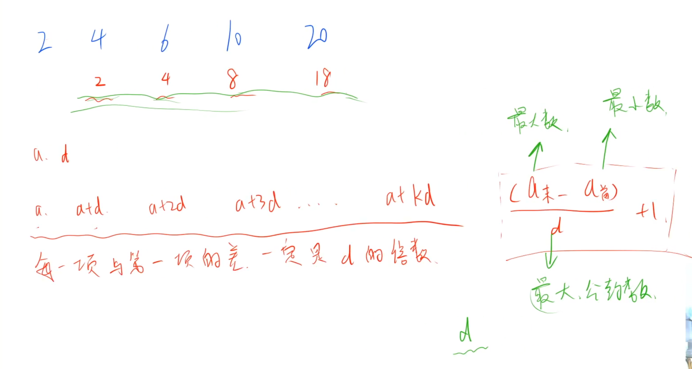

# 数论

## 等差数列

> 链接：
>
> 思路：

```cpp
#include<iostream>
#include<cstdio>
#include<algorithm>

using namespace std;

const int N = 100010;

int n;

int arr[N];

int gcd(int a, int b)
{
    return b ? gcd(b, a % b) : a;
}

int main()
{
    
    cin >> n;
    for(int i = 0; i < n; ++i) scanf("%d", &arr[i]);
    
    sort(arr, arr + n);
    
    int d = 0;
    for(int i = 0; i < n; ++i) d = gcd(d, arr[i] - arr[0]);
    
    if(!d)  printf("%d", n);
    else printf("%d", (arr[n - 1] - arr[0]) / d + 1);
    return 0;
}
```

