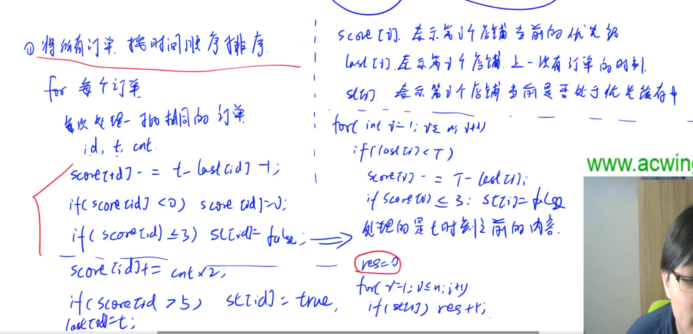

# 枚举与模拟习题

## 1.移动距离

> 链接：[1219. 移动距离 - AcWing题库](https://www.acwing.com/problem/content/1221/)
>
> ①曼哈顿距离：$|x_1 - x_2| + |y_1 - y_2|$
>
> ②欧几里得距离：$\sqrt{(x_1 - x_2)^2 + (y_1 - y_2)^2}$
>
> 计算行号：值/每行的宽度;
>
> 计算列号：宽度 - 1 - 值%每行的宽度；

```cpp
#include<iostream>
#include<algorithm>

using namespace std;

int w, m, n;
int x1, x2, y1, y2;

int main()
{
    
    cin >> w >> m >> n;
    m--, n--;
    //计算行号
    x1 = m / w;
    x2 = n / w;
    if(x1 % 2 != 0)
    y1 = (w - 1) - m % w;
    else 
    y1 = m % w;
    if(x2 % 2 != 0)
    y2 = (w - 1) - n % w;
    else 
    y2 = n % w;
    
    
    cout << abs(x1 - x2) + abs(y1 - y2);
    
    return 0;
}
```

## 2.日期问题

> 链接：[1229. 日期问题 - AcWing题库](https://www.acwing.com/file_system/file/content/whole/index/content/4184164/)
>
> 思路：枚举所有的日期，然后判断日期是否符合要求，然后再排列日期，后输出

```cpp
#include<iostream>

using namespace std;

int days[13] = {0, 31, 28, 31, 30, 31, 30, 31, 31, 30, 31, 30, 31};

bool check_date(int year, int month, int day)
{
    if(month < 1 || month > 12) return false;
    if(day == 0) return false;
    
    if(month != 2) 
    {
        if(day > days[month])
        return false;
    }
    else 
    {
        int leap = year % 100 != 0 && year % 4 == 0 || year % 400 == 0;
        if(day > 28 + leap) return false;
    }
    
    return true;
}

int main()
{
    int a, b, c;
    scanf("%d/%d/%d",&a, &b, &c);
    
    for(int date = 19600101; date < 20591231; ++date)
    {
        int year = date / 10000, month = date % 10000 / 100, day = date % 100;
        if(check_date(year, month, day))
        {
            if(year % 100 == a && month == b && day == c ||
            month == a && day == b && year % 100 == c ||
            day == a && month == b && year % 100 == c)
            printf("%d-%02d-%02d\n", year, month, day);
        }
    }

    return 0;
}
```

## 3.航班时间

> 链接：[1231. 航班时间 - AcWing题库](https://www.acwing.com/file_system/file/content/whole/index/content/4184166/)
>
> 思路：首先我们想一个例子，就是我们在水中行船，然后扔下一颗石头，我们划船走一段之后，然后再回头去找石头。那么我们和石头之间的最大距离就可以等价为我们在飞机上的时间，所以以水为参考系，我们来回走的距离都是一样的，因此切换到时间，我们只需要计算时差两次起飞和落地之间的时差，然后除以二即可。

```cpp
#include<iostream>
#include<string>

using namespace std;

int get_second(int h, int m, int s)
{
    return h * 3600 + m * 60 + s;
}

int get_time()
{
    string line;
    getline(cin, line);
    
    if(line.back() != ')') line += " (+0)";
    
    int h1, m1, s1, h2, m2, s2, d;
    sscanf(line.c_str(),"%d:%d:%d %d:%d:%d (+%d)", &h1, &m1, &s1, &h2, &m2, &s2, &d);
    
    return get_second(h2, m2, s2) - get_second(h1, m1, s1) + d * 24 * 3600; 
}


int main()
{
    int n;
    cin >> n;
    string line;
    getline(cin, line); // 忽略掉第一行的回车
    while(n--)
    {
        int time = (get_time() + get_time()) / 2;
        int h = time / 3600, m = time % 3600 / 60, s = time % 60;
        printf("%02d:%02d:%02d\n", h, m, s);
    }
    return 0;
}
```

## 4.外卖店优先级

> 链接：[1241. 外卖店优先级 - AcWing题库](https://www.acwing.com/file_system/file/content/whole/index/content/4184176/)
>
> 思路：首先将所有的订单进行排序，我们按时间的先后顺序来处理订单，然后根据时间的先后顺序遍历订单，首先先将没有收到订单的时间点的分数扣掉是否需要被加入优先队列，或者移除出优先队列，然后加入订单来确定外卖店是否需要被加入优先队列，或者移除出优先队列。然后遍历完订单之后，然后去遍历剩余的时间有没有外卖店从优先队列里离开。
>
> 

```cpp
#include<iostream>
#include<cstdio>
#include<cstring>
#include<algorithm>

#define x first
#define y second

using namespace std;

const int N = 100010;

typedef pair<int, int> PII;

int n, m, T;
int score[N], last[N]; //存分数，以及上一次订单的时间
bool st[N]; //如否在优先队列
 
PII order[N];  //存储订单

int main()
{
    scanf("%d%d%d", &n, &m, &T);
    for(int i = 0; i < m; ++i) scanf("%d%d", &order[i].x, &order[i].y);
    //排序
    sort(order, order + m);
    
    for(int i = 0; i < m;)
    {
        int j = i;
        while(j < m && order[j] == order[i]) j++;
        int t = order[i].x, id = order[i].y, cnt = j - i; //cnt表示收到订单的数量
        i = j;
        
        score[id] -= t - last[id] - 1;
        if(score[id] < 0) score[id] = 0;  //不小于零
        if(score[id] <= 3) st[id] = false; //小于三挪出优先队列
        //以上是订单之前的情况
        
        //处理订单
        score[id] += cnt * 2;
        if(score[id] > 5) st[id] = true;
        
        last[id] = t;
    }
    
    for(int i = 1; i <= n; ++i)
        if(last[i] < T)
        {
            score[i] -= T - last[i];  //减去没有收到订单的时间
            if(score[i] <= 3) st[i] = false; //如果优先级太低就退出优先队列 
        }

    int res = 0;        
    for(int i = 1; i <= n; ++i) res += st[i];

    cout << res;
    return 0;
}
```

