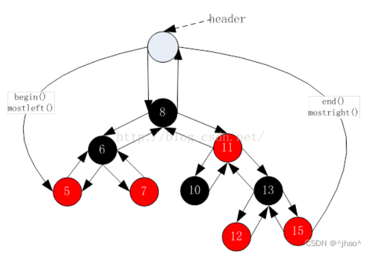

#  红黑树

## Ⅰ.红黑树的概念

> 红黑树，是一种二叉搜索树，但在每个结点上增加一个存储位表示结点的颜色，可以是Red或 Black。 通过对任何一条从根到叶子的路径上各个结点着色方式的限制，红黑树确保没有一条路 径会比其他路径长出俩倍，因而是接近平衡的。
>
> 

## Ⅱ.红黑树的性质

> ①每个结点不是红色就是黑色
>
> ②根节点是黑色的 
>
> ③如果一个节点是红色的，则它的两个孩子结点是黑色的
>
> ④ 对于每个结点，从该结点到其所有后代叶结点的简单路径上，均 包含相同数目的黑色结点 
>
> ⑤每个叶子结点都是黑色的(此处的叶子结点指的是空结点)
>
> 思考：为什么满足上面的性质，红黑树就能保证：其最长路径中节点个数不会超过最短路径节点 个数的两倍？
>
> 因为满足以上的性质我们可以得到
>
> 最短的路径： 全黑
>
> 最长的路径：一黑一红
>
> 所以最大就是最长的路径是最短路径的两倍；

## Ⅲ. 红黑树节点的定义

> ```cpp
> // 节点的颜色
> enum Color{RED, BLACK};
> // 红黑树节点的定义
> template<class ValueType>
> struct RBTreeNode
> {
>  RBTreeNode(const ValueType& data = ValueType()，Color color = RED)
>      : _pLeft(nullptr), _pRight(nullptr), _pParent(nullptr)
>      , _data(data), _color(color)
>  {}
>  RBTreeNode<ValueType>* _pLeft;   // 节点的左孩子
>  RBTreeNode<ValueType>* _pRight;  // 节点的右孩子
>  RBTreeNode<ValueType>* _pParent; // 节点的双亲(红黑树需要旋转，为了实现简单给
> 出该字段)
>  ValueType _data;            // 节点的值域
>  Color _color;               // 节点的颜色
> };
> 
> ```
>
> 思考：在节点的定义中，为什么要将节点的默认颜色给成红色的？
>
> 因为红黑树有一个原则就是每条路径的黑色节点数量相同，那么当我们插入一个节点默认颜色给成黑色的时候就会造成这个原则被打破。

## Ⅳ.红黑树结构

> 为了后续实现关联式容器简单，红黑树的实现中增加一个头结点，因为跟节点必须为黑色，为了 与根节点进行区分，将头结点给成黑色，并且让头结点的 pParent 域指向红黑树的根节点，pLeft 域指向红黑树中最小的节点，_pRight域指向红黑树中最大的节点，如下：
> 

## Ⅴ. 红黑树的插入操作

> 红黑树是在二叉搜索树的基础上加上其平衡限制条件，因此红黑树的插入可分为两步：
>
> ①插入新节点
>
> ```cpp
> bool Insert(const pair<k, v>& kv)
> 	{
> 		if (_root == nullptr)
> 		{
> 			_root = new node(kv);
> 			return true;
> 		}
> 
> 		node* parent = nullptr;
> 		node* cur = _root;
> 		while (cur)
> 		{
> 			if (cur->_kv.first < kv.first)
> 			{
> 				parent = cur;
> 				cur = cur->_right;
> 			}
> 			else if (cur->_kv.first > kv.first)
> 			{
> 				parent = cur;
> 				cur = cur->_left;
> 			}
> 			else
> 			{
> 				return false;
> 			}
> 		}
> 
> 		cur = new node(kv);
> 		if (parent->_kv.first > cur->_kv.first)
> 		{
> 			parent->_left = cur;
> 
> 		}
> 		else
> 		{
> 			parent->_right = cur;
> 		}
> 		cur->_parent = parent;
> 
> 		while (parent && parent->_col == RED)
> 		{
> 			node* GrandFather = parent->_parent;
> 			if (GrandFather->_left == parent)
> 			{
> 				node* uncle = GrandFather->_right;
> 				//情况1 ： u存在且为红，变色处理，并且向上调整
> 				if (uncle && uncle->_col == RED)
> 				{
> 					parent->_col = BLACK;
> 					uncle->_col = BLACK;
> 					GrandFather->_col = RED;
> 
> 					//继续往上调整
> 					cur = GrandFather;
> 					parent = cur = parent;
> 				} 
> 				else // 情况2 + 3：u不存在/u存在且为黑，旋转+变色
> 				{
> 					//     g
> 					//   p   u
> 					// c 
> 					if (cur = parent->_left)
> 					{
> 						RotateR(GrandFather);
> 						parent->_col = BLACK;
> 						GrandFather->_col = RED;
> 					}
> 					else
> 					{
> 						RotateL(parent);
> 						RotateR(grandfather);
> 
> 						cur->_col = BLACK;
> 						GrandFather->_col = RED;
> 					}
> 					break;
> 				}
> 			}
> 			else
> 			{
> 				//    g
> 				//u       p
> 				//               c
> 				node* uncle = GrandFather->_left;
> 				//情况1 ： u存在且为红，变色处理，并且向上调整
> 				if (uncle && uncle->_col == RED)
> 				{
> 					parent->_col = BLACK;
> 					uncle->_col = BLACK;
> 					GrandFather->_col = RED;
> 
> 					//继续往上调整
> 					cur = GrandFather;
> 					parent = cur = parent;
> 				}
> 				else//情况2 + 3
> 				{
> 					//    g
> 					//u       p
> 					//               c
> 					if (parent->_right == cur)
> 					{
> 						RotateL(GrandFather);
> 						parent->_col = BLACK;
> 						GrandFather->_col = RED;
> 					}
> 					//     g
> 					//u         p
> 					//     c
> 					else
> 					{
> 						RotateR(parent);
> 						RotateL(GrandFather);
> 						cur->_col = BLACK;
> 						GrandFather->_col = RED;
> 					}
> 					break;
> 				}
> 			}
> 		}
> 		_root->_col = BLACK;
> 		return true;
> 	}
> ```

## Ⅵ. 红黑树的验证

> 红黑树的检测分为两步：
>
> ①检测其是否满足二叉搜索树(中序遍历是否为有序序列)
>
> ②检测其是否满足红黑树的性质
>
> ```cpp
> bool IsBalance()
> 	{
> 		if (_root == nullptr)
> 		{
> 			return true;
> 		}
> 
> 		if (_root&& _root->_col = RED)
> 		{
> 			cout << "根节点是红色的" << endl;
> 		}
> 		
> 		int benchmark = 0;
> 		node* cur = _root;
> 		while (cur)
> 		{
> 			if (cur->_col == BLACK)
> 				benchmark++;
> 			cur = cur->_left;
> 		}
> 
> 		return _check(_root, 0, benchmark);
> 	}
> 
> 
> bool _check(node* root, int BlackNum, int benchmark)
> 	{
> 		if (root == nullptr)
> 		{
> 			if (benchmark != BlackNum)
> 			{
> 				cout << "黑色节点数量不相同" << endl;
> 				return false;
> 			}
> 			return true;
> 		}
> 
> 		if (root->_col == BLACK)
> 		{
> 			BlackNum++;
> 		}
> 
> 		if (root->_col == RED && root->parent && root->parent->_col == RED)
> 		{
> 			cout << "出现了连续的红色" << endl;
> 		}
> 
> 		return _check(root->_left, BlackNum, benchmark) &&
> 			_check(root->_right, BlackNum, benchmark);
> 
> 	}
> ```

## Ⅶ.红黑树的删除

> 红黑树的删除本节不做讲解，有兴趣的同学可参考：《算法导论》或者《STL源码剖析》
>
> http://www.cnblogs.com/fornever/archive/2011/12/02/2270692.html

## Ⅷ.红黑树和AVL树的比较

> 红黑树和AVL树都是高效的平衡二叉树，增删改查的时间复杂度都是O($log_2 N$)，红黑树不追 求绝对平衡，其只需保证最长路径不超过最短路径的2倍，相对而言，降低了插入和旋转的次数， 所以在经常进行增删的结构中性能比AVL树更优，而且红黑树实现比较简单，所以实际运用中红 黑树更多。

## Ⅸ.红黑树的一些应用

> ①C++ STL库 -- map/set、mutil_map/mutil_set
>
> ②Java 库
>
> ③linux内核
>
> ④其他一些库

## Ⅹ.红黑树模拟实现STL中的map和set

### Ⅹ.Ⅰ红黑树的迭代器

> 迭代器的好处是可以方便遍历，是数据结构的底层实现与用户透明。如果想要给红黑树增加迭代 器，需要考虑以前问题：
>
> - begin()和end()
>
>   STL明确规定，begin()与end()代表的是一段前闭后开的区间，而对红黑树进行中序遍历后， 可以得到一个有序的序列，因此：begin()可以放在红黑树中最小节点(即最左侧节点)的位 置，end()放在最大节点(最右侧节点)的下一个位置，关键是最大节点的下一个位置在哪块？ 能否给成nullptr呢？答案是行不通的，因为对end()位置的迭代器进行--操作，必须要能找最 后一个元素，此处就不行，因此最好的方式是将end()放在头结点的位置：
>
>   
>
> - operator--()和operator++()
>
>   ```cpp
>   Self& operator++()
>   	{
>   		if (_node->_right)
>   		{
>   			//右不为空找右子树的最左节点
>   			Node* subleft = _node->_right;
>   			while (subleft->_left)
>   			{
>   				subleft = subleft->_left;
>   			}
>   			_node = subleft;
>   		}
>   		else
>   		{
>   			//右为空沿着根的路径，找到孩子是父亲左的那个祖先
>   			Node* cur = _node;
>   			Node* parent = cur->_parent;
>   			while (parent != nullptr && cur == parent->_right)
>   			{
>   				cur = cur->_parent;
>   				parent = parent->_parent;
>   			}
>   			_node = parent;
>   		}
>   		return *this;
>   	}
>     
>   	Self& operator--()
>   	{
>   		if (_node->_left)
>   		{
>   			//左子树存在那么我们找到左子树的最右节点
>   			Node* subright = _node->_left;
>   			while (subright->_right)
>   			{
>   				subright = subright->_right;
>   			}
>   			_node = subright;
>   		}
>   		else
>   		{
>   			//如果左子树不存在那么我们找到孩子是父节点右子树的祖先节点
>   			Node* cur = _node;
>   			Node* parent = cur->_parent;
>   			while (parent && parent->_left == cur)
>   			{
>   				cur = cur->_parent;
>   				parent = parent->_parent;
>   			}
>   			_node = parent;
>   		}
>   		return *this;
>   	}
>   ```

### Ⅹ. Ⅱ红黑树的改造

> 因为`map`和`set`结构的不同，但是他们底层都是红黑树。所以我们这里利用C++泛型变成的特性擦汗给你是去改造红黑树，让他们表面看起来在用同一棵红黑树(底层实例化出了两个不同的红黑树)
>
> ```cpp
> // 因为关联式容器中存储的是<key, value>的键值对，因此
> // k为key的类型，
> // T: 如果是map，则为pair<K, V>; 如果是set，则为k
> // KeyOfT: 通过value来获取key的一个仿函数类
> template<class k, class T, class KeyOfT>
> class RBTree
> {
> 	typedef RBTreeNode<T> node;
> public:
> 	~RBTree()
> 	{
> 		_Destroy(_root);
> 		_root = nullptr;
> 	}
> 
> public:
> 	typedef __RBTreeIterator<T, T&, T*> iterator;
> 	typedef __RBTreeIterator<T, const T&, const T*> const_iterator;
> //...
> //做出以上的修改那么我们还需要将insert函数进行修改
> //1.首先我们修改了形参为T类型这样既可以兼容set也同时可以兼容map
> //2.又因为set和map的关键值比较不同虽然pair的比较C++内部支持了但是不是我们想要的比较方式
> //所以我们自行编写一个仿函数来解决这个问题
> //3.再就是返回值我们返回了当前插入值的迭代器和是否插入的真值作为返回。原因是map是需要支持下标访问的
> //且需要支持可以通过下标进行插入，所以我们这里选择改造insert函数来实现；
> pair<iterator, bool> Insert(const T& data)
> 	{
> 		if (_root == nullptr)
> 		{
> 			_root = new node(data);
> 			_root->_col = BLACK;
> 			return make_pair(iterator(_root), true);
> 		}
> 
> 		node* parent = nullptr;
> 		node* cur = _root;
> 		KeyOfT kot;
> 		while (cur)
> 		{
> 			if (kot(cur->_data) < kot(data))
> 			{
> 				parent = cur;
> 				cur = cur->_right;
> 			}
> 			else if (kot(cur->_data) > kot(data))
> 			{
> 				parent = cur;
> 				cur = cur->_left;
> 			}
> 			else
> 			{
> 				return make_pair(iterator(cur), false);
> 			}
> 		}
>     //...
> }
> ```

### Ⅹ. Ⅲ map的模拟实现

> 上面我们已经结合set和map的功能改造了红黑树，所以接下来我们只需要根据自己的需要去调用红黑树的接口即可。
>
> ```cpp
> namespace xupt
> {
> 
> 	template<class K, class V>
> 	class map
> 	{
> 	public:
>      //这里是仿函数的实现
> 		struct MapKeyOfT
> 		{
> 			const K&  operator()(const pair<K, V>& kv)
> 			{
>              //我们需要返回的是pair中的first
> 				return kv.first;
> 			}
> 		};
> 	public:
>      //在红黑树迭代器的基础上去构造map自己的迭代器
>      //这里的typename的作用就是告诉 c++ 编译器，typename 后面的字符串为一个类型名称，而不是成员函数或者成员变量
> 		typedef typename RBTree<K, pair<const K, V>, MapKeyOfT> :: iterator iterator;
> 
> 		iterator begin()
> 		{
> 			return _t.begin();
> 		}
> 
> 		iterator end()
> 		{
> 			return _t.end();
> 		}
> 
> 		V& operator[](const K& key)
> 		{
>          //用到insert返回值的地方
> 			pair<iterator, bool> ret = _t.Insert(make_pair(key, V()));
> 			return ret->first->second;
> 		}
> 
> 		pair<iterator, bool> Insert(const pair<const K, V>& kv)
> 		{
> 			return _t.Insert(kv);
> 		}
> 
> 	private:
>         //这里pair里面的K用const进行了修饰目的是防止K被改变
>         //和set中使用const迭代器的策略不同
> 		RBTree<K, pair<const K, V>, MapKeyOfT> _t;
> 	};
> }
> ```
>

### Ⅹ. Ⅳ set的模拟实现

> set的底层为红黑树，因此只需在set内部封装一棵红黑树，即可将该容器实现出来
>
> ```cpp
> namespace xupt
> {
> 
> 	template<class K>
> 	class set
> 	{
> 	public:
> 		
> 		struct SetKeyOfT
> 		{
> 			const K& operator()(const K& key)
> 			{
> 				return key;
> 			}
> 		};
> 	public:
> 
> 		typedef typename RBTree<K, K, SetKeyOfT> :: const_iterator iterator;
> 		typedef typename RBTree<K, K, SetKeyOfT> :: const_iterator const_iterator;
> 
> 
> 		pair<iterator, bool> Insert(const K& key)
> 		{
> 			return _t.Insert(key);
> 		}
> 
> 		iterator begin()
> 		{
> 			return _t.begin();
> 		}
> 
> 		iterator end()
> 		{
> 			return _t.end();
> 		}
> 	private:
> 		RBTree<K, K, SetKeyOfT> _t;
> 	};
> 
> 
> }
> ```
>
> 


