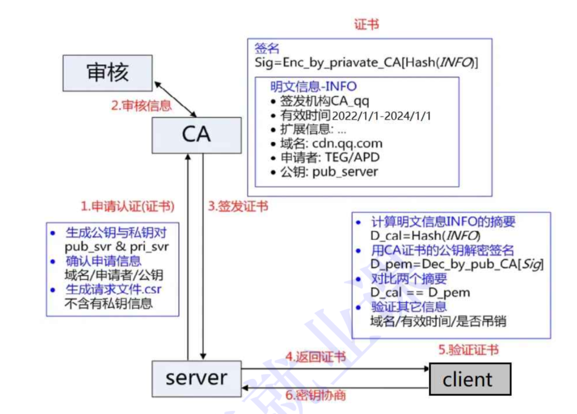
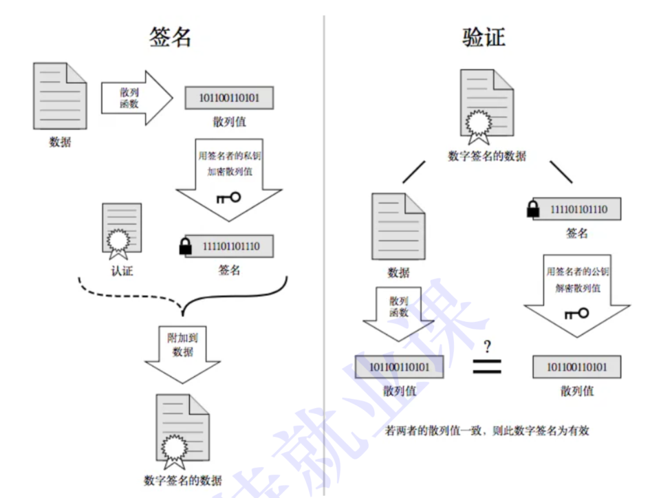
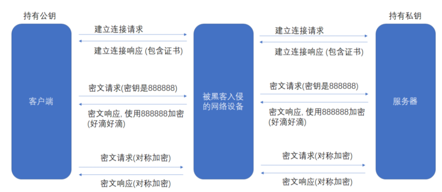
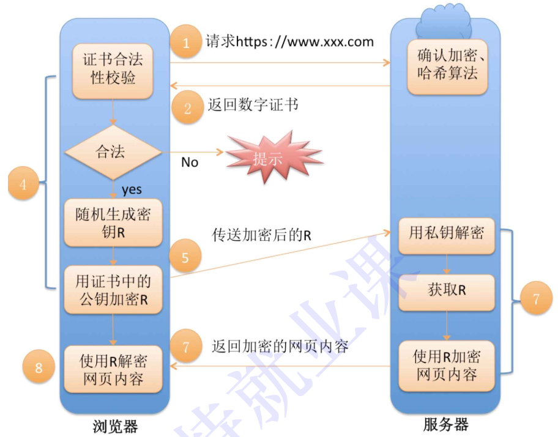

# HTTPS前置

## 1.加密

### 1.1什么是加密

加密就是把**明⽂**(要传输的信息)进⾏⼀系列变换,⽣成**密⽂**.
解密就是把**密⽂**再进⾏⼀系列变换,还原成**明⽂**.
在这个加密和解密的过程中,往往需要⼀个或者多个中间的数据,辅助进⾏这个过程,这样的数据称为密钥(正确发⾳yue四声,不过⼤家平时都读作yao四声)  

### 1.2为什么要加密

**臭名昭著的"运营商劫持"**  

> 由于我们通过⽹络传输的任何的数据包都会经过运营商的⽹络设备(路由器,交换机等),那么运营商的⽹络设备就可以解析出你传输的数据内容,并进⾏篡改.当谈及运营商劫持时，一个典型的例子是针对 HTTP 错误页面的劫持。运营商有时会将他们自己的广告页面或搜索引擎页面替换掉原本由互联网服务提供商（ISP）或者网站服务器提供的标准 HTTP 错误页面。
>
> 举个例子，假设你试图访问一个网站，但是这个网站不存在或者无法连接。在正常情况下，你会看到浏览器显示的标准的 HTTP 错误页面，比如 "404 Not Found"。然而，有些运营商会拦截这些错误页面，并将它们替换为自己的页面，通常是一些广告页面或搜索引擎页面。
>
> 这种劫持会让用户误以为网站不存在或者无法连接，而实际上是运营商进行了干预。这种行为可能会影响用户体验，尤其是当用户试图访问一个不存在的网页时，被重定向到广告页面可能会让用户感到困惑或者不满。
>
> 尽管这种运营商劫持行为在某些情况下可能被用来提供一些额外的服务或广告收入，但它也引发了一些争议，因为它会改变用户原本期望的网络体验，并可能损害网站的声誉。

不⽌运营商可以劫持,其他的⿊客也可以⽤类似的⼿段进⾏劫持,来窃取⽤⼾隐私信息,或者篡改内容.
试想⼀下,如果⿊客在⽤⼾登陆⽀付宝的时候获取到⽤⼾账⼾余额,甚⾄获取到⽤⼾的⽀付密码.....在互联⽹上,明⽂传输是⽐较危险的事情!!!
**HTTPS就是在HTTP的基础上进⾏了加密,进⼀步的来保证⽤⼾的信息安全**

### 1.3常见的加密方式

#### 1.3.1对称加密

> - 特点：使用相同的密钥进行加密和解密。
> - 优点：加解密速度快，适合处理大量数据；算法简单，效率高。
> - 缺点：密钥传输和管理相对困难；如果密钥泄露，可能导致数据被轻易解密。
> - 应用场景：适用于需要高效加密大量数据的场景，如数据传输过程中的加密。
> - 常见的对称加密算法包括DES、AES等。

#### 1.3.2非对称加密

> - 特点：使用一对密钥，公钥和私钥，其中公钥用于加密，私钥用于解密。
> - 优点：密钥传输相对安全；即使公钥泄露，也不会影响数据的安全性。
> - 缺点：加解密速度相对较慢，适合处理小量数据；算法复杂，效率低。
> - 应用场景：适用于安全性要求较高的场景，如密钥交换、数字签名等。
> - 常见的非对称加密算法包括RSA、ECC等

那么我们如何判断一个加密是安全的：**当解密的成本 > 解密后的收益**

### 1.4对称和非对称的加密解密过程

> ### 对称加密的加密和解密过程：
>
> 1. **加密过程**：
>    - 选择一个密钥（例如，AES算法通常使用128位、192位或256位的密钥）。
>    - 使用选定的密钥对要加密的数据进行处理，生成密文。
> 2. **解密过程**：
>    - 使用相同的密钥（即加密时使用的密钥）对密文进行处理，以还原出原始的明文数据。
>
> ### 非对称加密的加密和解密过程：
>
> 1. **加密过程**：
>    - 每个用户拥有一对密钥：公钥和私钥。公钥可以公开分享，而私钥必须严格保密。
>    - 发送方使用接收方的公钥对要传输的数据进行加密，生成密文。
> 2. **解密过程**：
>    - 接收方使用自己的私钥对收到的密文进行解密，还原出原始的明文数据。
>
> ### 对称加密与非对称加密的区别：
>
> - **密钥数量**：对称加密只使用一个密钥，而非对称加密使用一对密钥。
> - **加密速度**：对称加密通常加解密速度较快，而非对称加密速度相对较慢。
> - **密钥管理**：对称加密需要解决密钥的传输和管理问题，而非对称加密则不需要在密钥传输上做太多考虑。
> - **安全性**：非对称加密相对于对称加密更为安全，因为即使公钥泄露，也不会影响数据的安全性。

### 1.5数据摘要和数据指纹

> ### 数据摘要（Data Digest）：
>
> - **定义**：数据摘要是一种通过对数据应用哈希函数生成固定长度的唯一输出（摘要），用于验证数据完整性的技术。
> - **过程**：通过将原始数据作为输入应用到哈希函数，生成一个固定长度的摘要。常见的哈希函数包括MD5、SHA-1、SHA-256等。
> - **特点**：
>   - 摘要长度固定，无论输入数据的大小，生成的摘要长度都是固定的。
>   - 即使原始数据只有微小的改动，生成的摘要也会完全不同，因此可以用于验证数据的完整性。
>   - 不可逆，即不能从摘要反推出原始数据。
> - **应用**：数据传输中的消息摘要可以用于验证数据的完整性，密码学中的数字签名也是利用了数据摘要的原理。
>
> ### 数据指纹（Data Fingerprint）：
>
> - **定义**：数据指纹是数据的唯一标识符，用于表示数据的内容或结构。
> - **过程**：数据指纹的生成过程与数据摘要类似，但通常更加复杂，并且可能包含更多的数据属性，以便更准确地描述数据。
> - **特点**：
>   - 数据指纹不仅用于验证数据的完整性，还可以用于标识数据的内容或结构。
>   - 可以包含更多的数据属性，例如时间戳、数据版本号等，以提供更丰富的信息。
>   - 通常用于数据管理和识别领域，如数据去重、数据搜索等。
> - **应用**：数据指纹常用于数据管理系统中，例如用于检测和识别重复数据、数据去重、数据搜索等。
>
> ### 区别：
>
> - **用途不同**：数据摘要主要用于验证数据的完整性，而数据指纹除了验证完整性外，还可以用于标识数据的内容或结构。
> - **复杂度不同**：数据指纹通常比数据摘要更复杂，可能包含更多的数据属性。
> - **应用领域不同**：数据摘要主要应用于数据传输和安全领域，而数据指纹更多地应用于数据管理和识别领域。
>
> 综上所述，数据摘要和数据指纹都是用于验证数据完整性和安全性的技术，但它们在用途、复杂度和应用领域上存在一些差异，尽管它们有一些不同之处，但在某些情况下，人们可能会将它们用作同义词使用，特别是在一般性讨论中。

### 1.6数字签名

> 数字签名是一种用于确保数字信息完整性、认证发送者身份以及防止否认的技术手段。
>
> 简要说，数字签名的过程如下：
>
> 1. **创建签名**：发送方使用自己的私钥对要发送的数据进行加密，并生成一个数字签名。
> 2. **发送数据**：发送方将原始数据和数字签名一起发送给接收方。
> 3. **验证签名**：接收方使用发送方的公钥对接收到的数字签名进行解密，得到原始数据的摘要。
> 4. **比对摘要**：接收方对比接收到的数据的摘要与使用相同的哈希函数对接收到的原始数据生成的摘要，如果两者一致，则验证通过。
>
> 数字签名的作用在于：
>
> - **数据完整性验证**：接收方可以确保接收到的数据在传输过程中没有被篡改。
> - **身份认证**：接收方可以确定数据的发送者确实是预期的发送者。
> - **防止否认**：发送方无法否认已经发送过的数据，因为数字签名是使用其私钥生成的，其他人无法伪造

## 2.证书

> CA认证
> 服务端在使⽤HTTPS前，需要向CA机构申领⼀份数字证书，数字证书⾥含有证书申请者信息、公钥信
> 息等。服务器把证书传输给浏览器，浏览器从证书⾥获取公钥就⾏了，**证书就如⾝份证，证明服务端**
> **公钥的权威性**  

这个证书可以理解成是⼀个结构化的字符串,⾥⾯包含了以下信息:
• 证书发布机构
• 证书有效期
• 公钥
• 证书所有者
• 签名
• ......
需要注意的是：申请证书的时候，需要在特定平台⽣成查，会同时⽣成⼀对⼉密钥对⼉，即公钥和私钥。这对密钥对⼉就是⽤来在⽹络通信中进⾏明⽂加密以及数字签名的。
其中公钥会随着CSR⽂件，⼀起发给CA进⾏权威认证，私钥服务端⾃⼰保留，⽤来后续进⾏通信（其实主要就是⽤来交换对称秘钥）  

**注解：**

> - 只能用CA形成的私钥形成签名，CA私钥只有CA知道，那么只有私钥能完成签名的过程。
> - 因为CA是权威机构，为了保证合法性，一般OS和浏览器内部，在出场的时候就已经内置了CA的公钥

### 2.1理解数据签名

> 签名的形成是基于⾮对称加密算法的，注意，⽬前暂时和https没有关系，不要和https中的公钥私钥搞
> 混了  

> 当服务端申请CA证书的时候，CA机构会对该服务端进⾏审核，并专⻔为该⽹站形成数字签名，过程如
> 下：
> -CA机构拥有⾮对称加密的私钥A和公钥A'
> -CA机构对服务端申请的证书明⽂数据进⾏hash，形成数据摘要
> -然后对数据摘要⽤CA私钥A'加密，得到数字签名S
> 服务端申请的证书明⽂和数字签名S共同组成了数字证书，这样⼀份数字证书就可以颁发给服务端了  

## 3.加密方案

采用非对称+对称+证书的加密方式

> 在客⼾端和服务器刚⼀建⽴连接的时候,服务器给客⼾端返回⼀个证书，证书包含了之前服务端的公
> 钥,也包含了⽹站的⾝份信息  

**客⼾端进⾏认证**

> 当客⼾端获取到这个证书之后,会对证书进⾏校验(防⽌证书是伪造的).
> • 判定证书的有效期是否过期
> • 判定证书的发布机构是否受信任(操作系统中已内置的受信任的证书发布机构).
> • 验证证书是否被篡改:从系统中拿到该证书发布机构的公钥,对签名解密,得到⼀个hash值(称为数据摘要),设为hash1.然后计算整个证书的hash值,设为hash2.对⽐hash1和hash2是否相等.如果相等,则说明证书是没有被篡改过的。

**中间⼈有没有可能篡改该证书？**
• 中间⼈篡改了证书的明⽂
• 由于他没有CA机构的私钥，所以⽆法hash之后⽤私钥加密形成签名，那么也就没法办法对篡改后
的证书形成匹配的签名
• 如果强⾏篡改，客⼾端收到该证书后会发现明⽂和签名解密后的值不⼀致，则说明证书已被篡改，
证书不可信，从⽽终⽌向服务器传输信息，防⽌信息泄露给中间⼈
**中间⼈整个掉包证书？**
• 因为中间⼈没有CA私钥，所以⽆法制作假的证书(为什么？)
• 所以中间⼈只能向CA申请真证书，然后⽤⾃⼰申请的证书进⾏掉包
• 这个确实能做到证书的整体掉包，但是别忘记，证书明⽂中包含了域名等服务端认证信息，如果整体掉包，客⼾端依旧能够识别出来。
• 永远记住：中间⼈没有CA私钥，所以对任何证书都⽆法进⾏合法修改，包括⾃⼰的  

**常见问题：**

为什么摘要内容在⽹络传输的时候⼀定要加密形成签名?  

> 常⻅的摘要算法有:MD5和SHA系列
> 以MD5为例,我们不需要研究具体的计算签名的过程,只需要了解MD5的特点:
> • 定⻓:⽆论多⻓的字符串,计算出来的MD5值都是固定⻓度(16字节版本或者32字节版本)
> • 分散:源字符串只要改变⼀点点,最终得到的MD5值都会差别很⼤.
> • 不可逆:通过源字符串⽣成MD5很容易,但是通过MD5还原成原串理论上是不可能的.
> 比特就业课
> 正因为MD5有这样的特性,我们可以认为如果两个字符串的MD5值相同,则认为这两个字符串相同.  

理解判定证书篡改的过程:(这个过程就好⽐判定这个⾝份证是不是伪造的⾝份证)  

假设我们的证书只是⼀个简单的字符串hello,对这个字符串计算hash值(⽐如md5),结果为
BC4B2A76B9719D91
如果hello中有任意的字符被篡改了,⽐如变成了hella,那么计算的md5值就会变化很⼤.
BDBD6F9CF51F2FD8
然后我们可以把这个字符串hello和哈希值BC4B2A76B9719D91从服务器返回给客⼾端,此时客⼾端
如何验证hello是否是被篡改过?
那么就只要计算hello的哈希值,看看是不是BC4B2A76B9719D91即可.  

**但是还有个问题,如果⿊客把hello篡改了,同时也把哈希值重新计算下,客⼾端就分辨不出来了呀.**  

**所以被传输的哈希值不能传输明⽂,需要传输密⽂.**  

所以，对证书明⽂(这⾥就是“hello”)hash形成散列摘要，然后CA使⽤⾃⼰的私钥加密形成签名，将hello和加密的签名合起来形成CA证书，颁发给服务端，当客⼾端请求的时候，就发送给客⼾端，中间⼈截获了，因为没有CA私钥，就⽆法更改或者整体掉包，就能安全的证明，证书的合法性。最后，客⼾端通过操作系统⾥已经存的了的证书发布机构的公钥进⾏解密,还原出原始的哈希值,再进⾏校验.  

**为什么签名不直接加密，⽽是要先hash形成摘要?**  

• 缩⼩签名密⽂的⻓度,加快数字签名的验证签名的运算速度  

### **3.1完整流程**

###   

**总结：**

HTTPS⼯作过程中涉及到的密钥有三组.
**第⼀组(⾮对称加密):**⽤于校验证书是否被篡改.服务器持有私钥(私钥在形成CSR⽂件与申请证书时获得),客⼾端持有公钥(操作系统包含了可信任的CA认证机构有哪些,同时持有对应的公钥).服务器在客⼾端请求是，返回携带签名的证书.客⼾端通过这个公钥进⾏证书验证,保证证书的合法性，进⼀步保证证书中携带的服务端公钥权威性。
**第⼆组(⾮对称加密):**⽤于协商⽣成对称加密的密钥.客⼾端⽤收到的CA证书中的公钥(是可被信任的)给随机⽣成的对称加密的密钥加密,传输给服务器,服务器通过私钥解密获取到对称加密密钥.
**第三组(对称加密):**客⼾端和服务器后续传输的数据都通过这个对称密钥加密解密.  

其实⼀切的关键都是围绕这个对称加密的密钥.其他的机制都是辅助这个密钥⼯作的.

> 第⼆组⾮对称加密的密钥是为了让客⼾端把这个对称密钥传给服务器.
> 第⼀组⾮对称加密的密钥是为了让客⼾端拿到第⼆组⾮对称加密的公钥.  
