# Linux网络基础1

## 1.计算机网络背景

### 1.1网络发展

- 独立模式：计算机之间相互独立;  

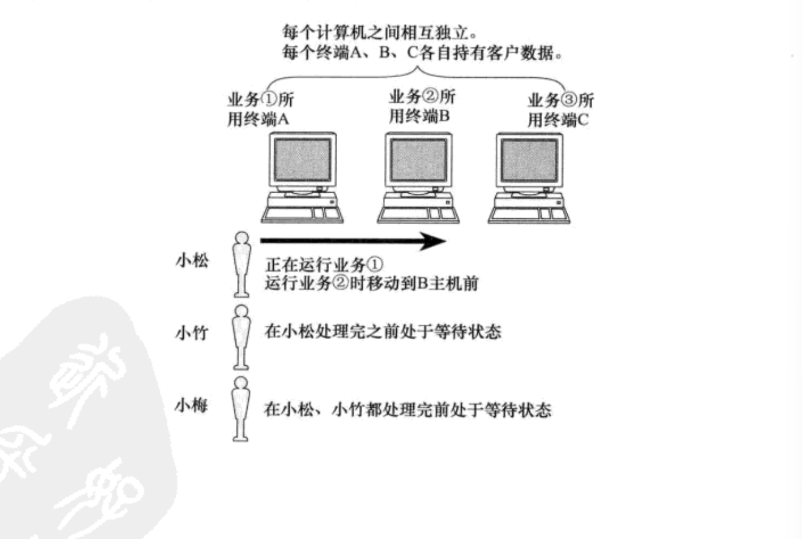

- 网络互联：多台计算机连接在一起, 完成数据共享;  

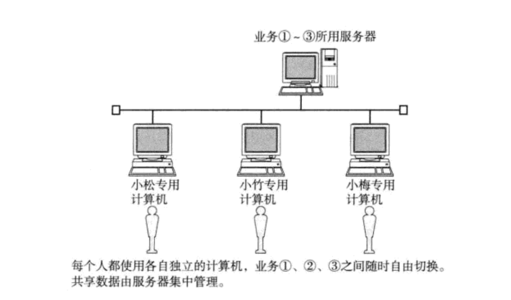

- 局域网LAN：计算机数量更多了, 通过交换机和路由器连接在一起;  

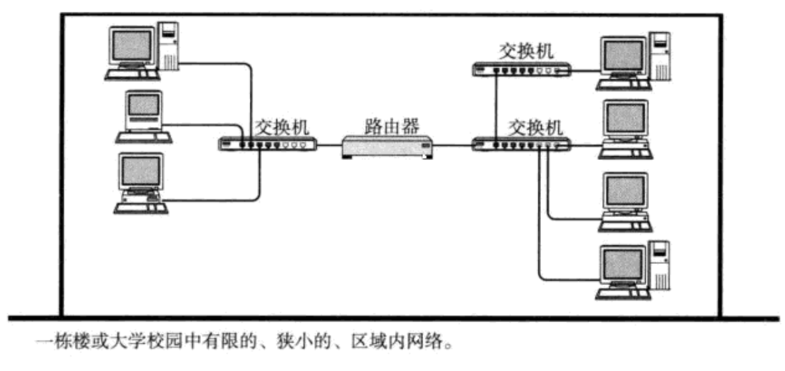

- 广域网WAN:将远隔千里的计算机都连在一起 ;

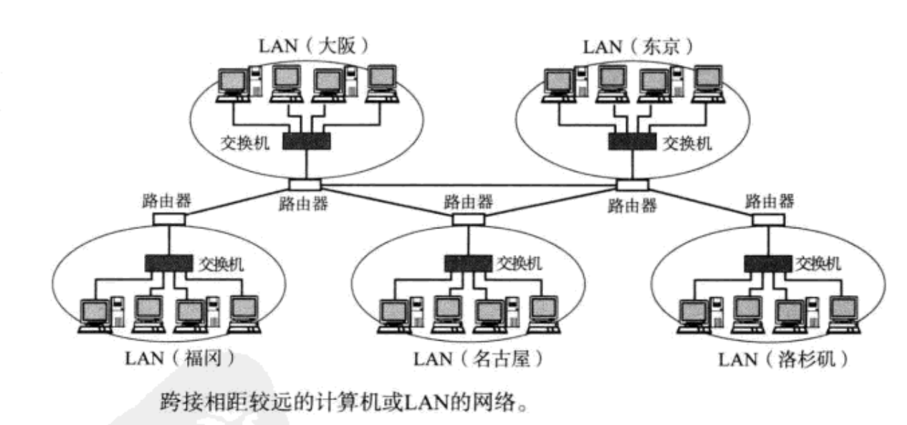

## 2.认识协议

"协议"就是一种约定。

计算机之间的传输媒介是光信号和电信号. 通过 "频率" 和 "强弱" 来表示 0 和 1 这样的信息. 要想传递各种不同的信息, 就需要约定好双方的数据格式 。

> - 计算机生产厂商有很多;  
> - 计算机操作系统, 也有很多;  
> - 计算机网络硬件设备, 还是有很多 ；
> - 如何让这些不同厂商之间生产的计算机能够相互顺畅的通信? 就需要有人站出来, 约定一个共同的标准,大家都来遵守, 这就是 **网络协议**;  

### 2.1协议分层

软件分层以后，每一层只关注自己同层的功能，只使用下层的接口，任何一层出现问题，都不会直接影响另一层，减少后期开发者的维护成本。

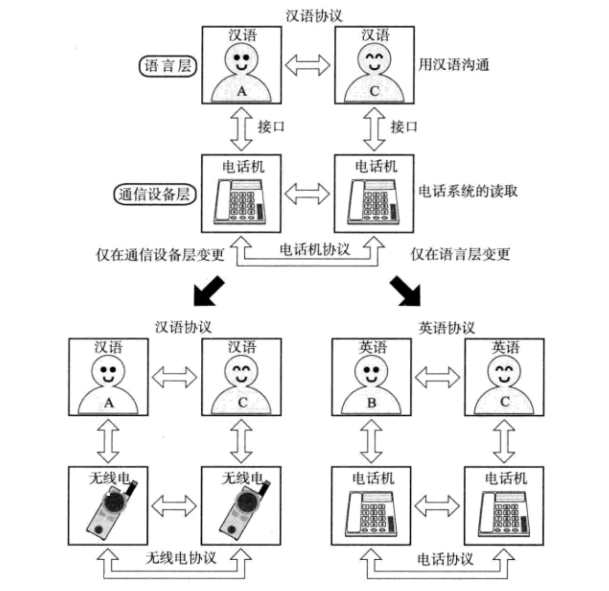

### 2.2OSI的七层模型

> - OSI（Open System Interconnection，开放系统互连）七层网络模型称为开放式系统互联参考模型，是一个逻辑上的定义和规范； 
> - 把网络从逻辑上分为了7层. 每一层都有相关、相对应的物理设备，比如路由器，交换机 ；
> - OSI 七层模型是一种框架性的设计方法，其最主要的功能使就是帮助不同类型的主机实现数据传输；
> - 它的最大优点是将**服务**、**接口**和**协议**这三个概念明确地区分开来，概念清楚，理论也比较完整. 通过七个层次化的结构模型使不同的系统不同的网络之间实现可靠的通讯  
> - 但是, 它既复杂又不实用; 所以我们按照TCP/IP四层模型来讲解  

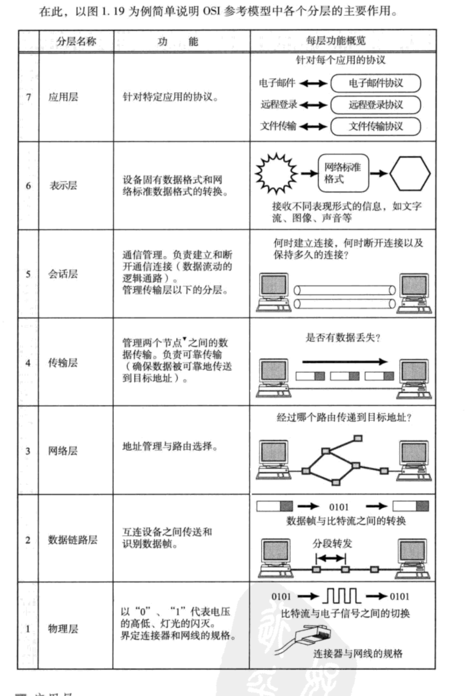

### 2.3TCP/IP五层(或四层)模型

TCP/IP是一组协议的代名词，它还包括许多协议，组成了TCP/IP协议簇.
TCP/IP通讯协议采用了5层的层级结构，**每一层都呼叫它的下一层所提供的网络来完成自己的需求**  

> - **物理层:** 负责光/电信号的传递方式. 比如现在以太网通用的网线(**双绞线**)、早期以太网采用的的**同轴电缆**(现在主要用于有线电视)、**光纤**, 现在的`wifi`无线网使用电磁波等都属于物理层的概念。物理层的能力决定了最大传输速率、传输距离、抗干扰性等. 集线器(Hub)工作在物理层。
> - **数据链路层：**负责**设备之间的数据帧的传送和识别**. 例如网卡设备的驱动、帧同步(就是说从网线上检测到什么信号算作新帧的开始)、冲突检测(如果检测到冲突就自动重发)、数据差错校验等工作. 有以太网、令牌环网, 无线LAN等标准. 交换机(Switch)工作在数据链路层。
> - **网络层:** 负责**地址管理和路由选择**. 例如在IP协议中, 通过`IP地址`来标识一台主机, 并通过路由表的方式规划出两台主机之间的数据传输的线路(路由). 路由器(Router)工作在网路层  
> - **传输层:** 负责**两台主机之间的数据传输**. 如传输控制协议 (TCP), 能够确保数据可靠的从源主机发送到目标主机 
> - **应用层:** 负责**应用程序间沟通**，如简单电子邮件传输（SMTP）、文件传输协议（FTP）、网络远程访问协议（Telnet）等. 我们的网络编程主要就是针对应用层  

其中这里的应用层是将OSI七层模型中的**应用层，表示层，会话层**。

物理层我们考虑的比较少. 因此很多时候也可以称为 TCP/IP四层模型 

那么这个协议栈在哪里？和OS有什么关系？

一般而言：

> - 对于一台主机, 它的操作系统内核实现了从传输层到物理层的内容;  
> - 对于一台路由器, 它实现了从网络层到物理层; 
> - 对于一台交换机, 它实现了从数据链路层到物理层;  
> - 对于集线器, 它只实现了物理层;  

但是也并不绝对，很多交换机也实现了网络层的转发；很多路由器也实现了部分传输层的内容(比如端口转发)；

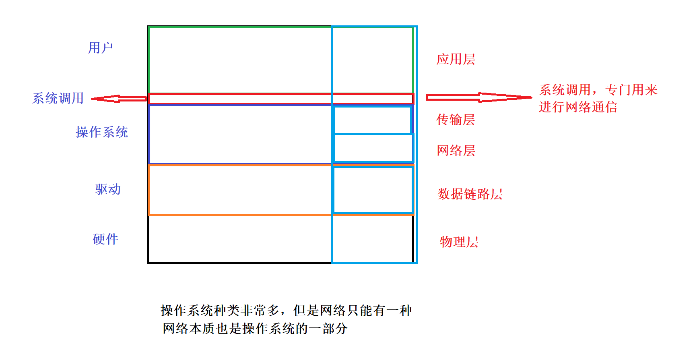

### 2.4网路传输基本流程

#### 2.4.1网路传输流程

①同一个网段内的两台主机进行文件传输

两个主机通信的本质，是两个主机的OS与网络协议栈在通信

每一层协议 ：各自的协议报头(可以暂时感性认知为我们的快递包裹上的条形码) + 有效载荷

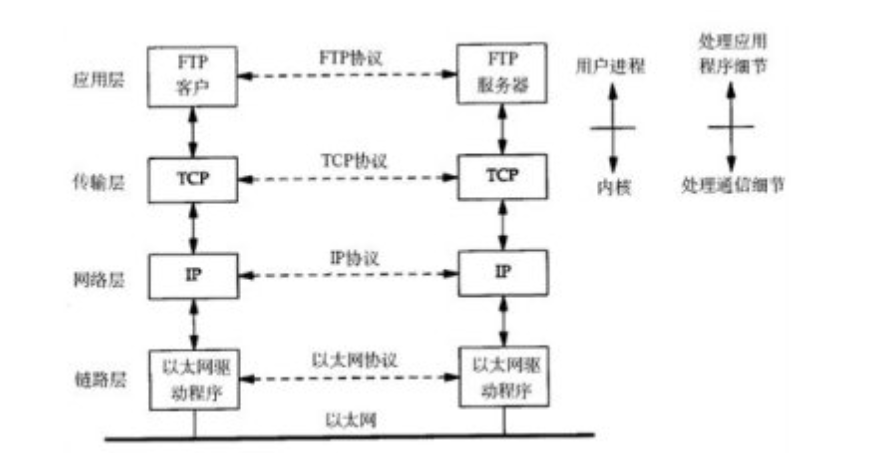

发送数据从发送端到物理层的过程称为封装，从物理层到接收端的过程被称为解包+分用

在局域网中，任何时刻，只允许一个人在向局域网中发送消息

任何人要通信，需要有唯一的一个标识符，对于极其也是如此，对于计算机，每台计算机都配有网卡，网卡在出厂的时候，就在网卡内部写入了网卡的sn号，MAC地址，全球唯一。

细节：

> - 每一层，都会把上层交付给自己的数据，作为自己的有效载荷
>
> - 每一层，都有自己的协议报头
>
> - 对应的层，报头+有效载荷 = 自己要发送的报文 ---> 封装
>
> - 在逻辑上，同层协议，都认为自己在和对方的同层协议在通信
>
> - 同层协议，能够互相认识对方的报头
>
> - 能做到
>
>   a.将报头和有效载荷进行分离
>
>   b.将有效载荷交付给上层的哪一个具体协议
>
> - 几乎每层协议都要有以上ab这两个功能，未来，任何协议，都要有这两个基本功能；

②跨一个路由器的两个子网

其中路由器包含了：物理层，链路层，网络层

其中在从物理层阶段数据包含：MAC地址和IP地址，那么这个MAC地址是需要随着下一个目的地变化的，IP地址对应数据最终的目的地。感性来讲，这里的MAC地址相当于唐僧在取经路上的下一个节点要到达的地址，而IP地址就对应的是西天。

这里数据通过路由器的时候：要先进行解包到网络层，再封装到物理层。

IP是全球网络的底层基础，IP协议及其以上的协议没有看到，任何网络方便的差异，原因是IP地址屏蔽了底层子网机制的差异。IP协议向下，网络可以具有明显的差异。

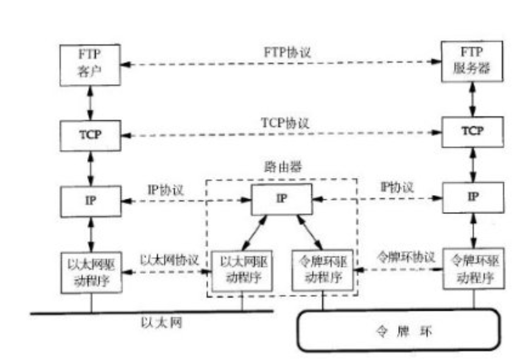

### 2.5封装和分用

> - 不同的协议层对数据包有不同的称谓,在传输层叫做段(segment),在网络层叫做数据报 (datagram),在链路层叫做帧(frame)  
> - 应用层数据通过协议栈发到网络上时,每层协议都要加上一个数据首部(header),称为封装
>   (Encapsulation)  
> - 首部信息中包含了一些类似于首部有多长, 载荷(payload)有多长, 上层协议是什么等信息  
> - 数据封装成帧后发到传输介质上,到达目的主机后每层协议再剥掉相应的首部, 根据首部中的 "上层协议字段" 将数据交给对应的上层协议处理 

 数据封装过程

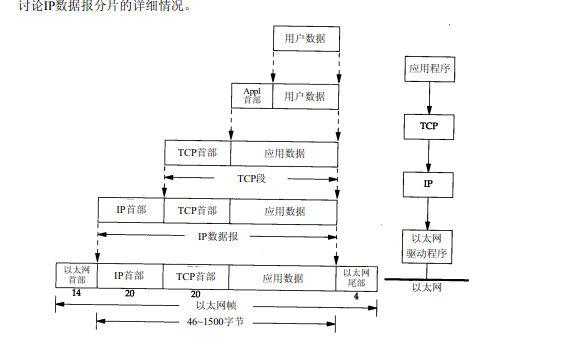

数据分用过程

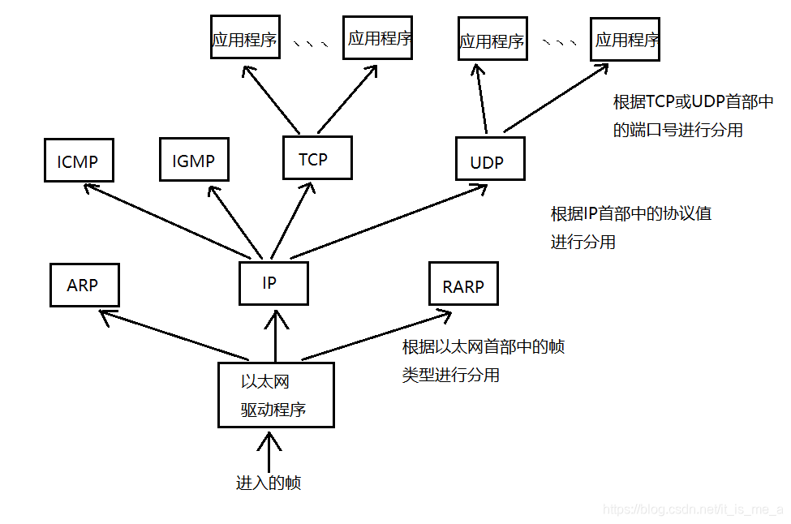

### 2.6网络中的地址管理

#### 2.6.1认识IP地址

IP协议有两个版本, IPv4和IPv6. 我们整个的课程, 凡是提到IP协议, 没有特殊说明的, 默认都是指IPv4  

> - IP地址是在IP协议中, 用来标识网络中不同主机的地址;  
> - 对于IPv4来说, IP地址是一个4字节, 32位的整数;  
> - 我们通常也使用 "点分十进制" 的字符串表示IP地址, 例如 192.168.0.1 ; 用点分割的每一个数字表示一个字节, 范围是 0 - 255;  

#### 2.6.2认识MAC地址  

> - MAC地址用来识别数据链路层中相连的节点  
> - 长度为48位, 及6个字节. 一般用16进制数字加上冒号的形式来表示(例如: 08:00:27:03:fb:19)  
> - 在网卡出厂时就确定了, 不能修改. mac地址通常是唯一的(虚拟机中的mac地址不是真实的mac地址, 可能会冲突; 也有些网卡支持用户配置mac地址)  