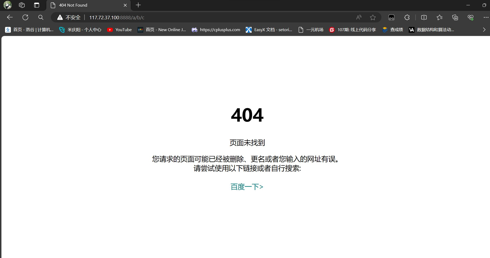

# http协议

虽然我们说, 应用层协议是我们程序猿自己定的.
但实际上, 已经有大佬们定义了一些现成的, 又非常好用的应用层协议, 供我们直接参考使用. HTTP(超文本传输协议)
就是其中之一 .

## 1.认识URL

> URL（Uniform Resource Locator，统一资源定位器）是互联网上用于定位资源的地址。它帮助你在互联网上找到文件、图片、视频等资源的确切位置。一个URL可以分为几个部分，每一部分提供了寻找资源所需要的特定信息。一个典型的URL包括以下几个部分：
>
> 1. **协议**：指的是网页使用的协议，比如`http`或`https`。这告诉浏览器如何与服务器进行通信。
> 2. **域名**：是互联网上某个网站的名称，如`example.com`。它通常代替IP地址，因为域名更容易记忆。
> 3. **端口**：虽然通常在URL中看不到，但它指明了服务器上特定的通信端口。如果省略，浏览器会使用默认端口（例如，HTTP的默认端口是80，HTTPS的是443）。
> 4. **路径**：指向服务器上的一个特定位置，通常是一个文件或者一个目录的路径。(Web根目录)
> 5. **查询字符串**：以`?`开头，可以包含一个或多个参数，用于向服务器发送额外信息。例如，`?search=query`。
> 6. **片段**：以`#`开头，它指向网页中的一个特定部分，通常是为了直接定位到页面的某个锚点。
>
> 例如，一个典型的URL看起来可能是这样的：
>
> ```bash
> https://www.example.com:443/path/to/file?query=keyword#section
> ```
>
> - `https`是协议，
> - `www.example.com`是域名，
> - `443`是端口（虽然这个端口通常不显示，因为它是HTTPS协议的默认端口），
> - `/path/to/file`是路径，
> - `?query=keyword`是查询字符串，
> - `#section`是片段标识符，指向页面中的一个特定部分。

**拓展知识**

> 1. **URL编码**：有时候URL中需要包含特殊字符，但是URL只允许一部分 ASCII 字符（数字、字母和部分符号），因此需要对其进行编码。常见的编码方式是使用百分号编码（Percent Encoding），将特殊字符转换为%加上两位十六进制数的形式。例如，空格被编码为%20。
> 2. **相对URL vs 绝对URL**：绝对URL包含了完整的信息，包括协议、域名和路径等，而相对URL则相对于当前页面的URL进行解析。相对URL常用于在同一网站内部进行链接，减少重复信息。
> 3. **URL重定向**：当一个URL请求被服务器接收后，服务器可能会发送一个重定向响应，指示浏览器使用另一个URL来访问资源。这在网站重构、更改URL结构或者简化URL时非常常见。
> 4. **URL短链接**：URL短链接是对长URL进行缩短的服务，通常用于分享链接时节省字符数或提高美观性。这些服务会将长URL映射到一个较短的URL上。
> 5. **URL安全性**：在处理URL时，需要注意安全性问题，特别是在处理用户输入的URL时。恶意用户可能会尝试利用恶意构造的URL进行攻击，比如跨站脚本（XSS）攻击、跨站请求伪造（CSRF）攻击等。
> 6. **URL规范化**：为了提高搜索引擎优化（SEO）和用户体验，有时候需要对URL进行规范化处理，包括统一使用小写字母、去除多余的斜杠、移除URL中的参数等。

## 2.urlencode和urldecode

> - **urlencode：**
>
> urlencode 是将 URL 中的特殊字符转换为%加上两位十六进制数的形式。它通常用于将用户提供的数据编码成一个安全的字符串，可以安全地在 URL 中传输。urlencode 通常用于处理 URL 参数。
>
> 例如，如果我们有一个包含特殊字符的字符串：
>
> ```
> Hello World! How are you?
> ```
>
> 经过 urlencode 编码后，会变成：
>
> ```
> Hello%20World%21%20How%20are%20you%3F
> ```
>
> 在这个编码后的字符串中，空格被转换成 `%20`，感叹号变成 `%21`，问号变成 `%3F`，以此类推。
>
> - **urldecode：**
>
> urldecode 是将已经被编码的 URL 字符串解码为原始的字符串。它通常用于从 URL 中获取数据后进行解码，以便进一步处理或显示给用户。
>
> 例如，如果我们有一个被编码的字符串：
>
> ```
> Hello%20World%21%20How%20are%20you%3F
> ```
>
> 经过 urldecode 解码后，会还原为原始的字符串：
>
> ```
> Hello World! How are you?
> ```
>
> urldecode 解码了 `%20` 为空格，`%21` 为感叹号，`%3F` 为问号，以此类推。

**pity：**

在 C++ 中，标准库中没有直接提供` urlencode `和 `urldecode` 的函数。但你可以使用一些库来实现这些功能，或者编写自己的函数来处理 URL 编码和解码。例如，你可以使用 Boost 库中的 `boost::network::uri::encode` 和 `boost::network::uri::decode` 函数来进行 URL 编码和解码。

## 3.HTTP协议格式  

### 3.1宏观认识


> 1. **请求方法（HTTP Methods）**：HTTP定义了几种请求方法，其中最常见的包括：
>    - GET：请求指定的资源。
>    - POST：向指定资源提交数据进行处理请求（例如提交表单或上传文件）。
>    - PUT：上传文件到指定的URI，或者创建一个指定URI的资源。
>    - DELETE：请求服务器删除指定的资源。
>    - HEAD：类似于GET请求，但只返回HTTP头部信息，不返回实际内容。
>    - OPTIONS：请求服务器告知支持的HTTP方法。
>    - PATCH：对资源进行部分修改。
> 2. **请求头（Request Headers）**：包含了关于请求、客户端、服务器等的信息，例如User-Agent、Accept、Content-Type等。
> 3. **请求体（Request Body）**：在POST请求中包含了要发送给服务器的数据，通常以表单数据或JSON格式发送。
> 4. **URI（Uniform Resource Identifier）**：标识请求的资源，包括URL（Uniform Resource Locator）和URN（Uniform Resource Name）。
> 5. **HTTP版本（HTTP Version）**：目前最常见的版本是HTTP/1.1和HTTP/2，HTTP/3也在逐渐推广中。
> 6. **状态行（Status Line）**：包含了HTTP协议版本、状态码和状态消息。状态码表示服务器对请求的处理结果，如200表示成功，404表示未找到资源，500表示服务器内部错误等。
> 7. **Cookie和Session**：通过Cookie和Session来维持客户端与服务器之间的会话状态。
> 8. **安全性和身份验证**：HTTPS通过加密数据传输来增强安全性，并支持各种身份验证方式，如基本身份验证、摘要身份验证、OAuth等。
> 9. **缓存控制**：HTTP请求和响应头中包含了各种控制缓存的指令，如Cache-Control、Expires、Last-Modified等，用于优化网络传输和提高性能。
> 10. **代理和网关**：HTTP请求可以通过代理服务器或网关转发到目标服务器，以实现更复杂的网络拓扑结构和安全策略。

**HTTP请求中的报头（Headers）和报体（Body）可以通过不同的方式来处理和分离：**

> 1. **分离报头和报体**：
>    - 在HTTP请求中，报头和报体是通过一个空行来分隔的。这个空行之前是报头，之后是报体。
>    - 服务器和客户端在接收到完整的HTTP请求后，可以通过查找空行来分离报头和报体。
> 2. **处理报头信息**：
>    - 报头包含了很多关于请求的元数据，如User-Agent、Content-Type、Accept等，以及关于服务器的元数据，如Server、Date等。
>    - 服务器可以解析报头来获取关于请求的信息，以便做出适当的响应。例如，通过Content-Type来确定请求中包含的数据类型，或者通过User-Agent来了解客户端的类型和版本。
> 3. **处理报体信息**：
>    - 报体包含了实际的请求数据，例如POST请求中的表单数据或JSON数据。
>    - 服务器需要解析报体来获取请求中传递的具体数据，并做出相应的处理。例如，对表单数据进行解析以获取用户输入，或者对JSON数据进行解析以获取客户端传递的参数。
> 4. **使用HTTP库处理**：
>    - 在实际开发中，通常会使用HTTP库（如Python中的requests库、Java中的HttpURLConnection等）来处理HTTP请求和响应。
>    - 这些库通常提供了方便的方法来解析报头和报体，以及构建、发送和接收HTTP请求。

```bash
GET / HTTP/1.1
Host: 117.72.37.100:8888
Connection: keep-alive
Cache-Control: max-age=0
Upgrade-Insecure-Requests: 1
User-Agent: Mozilla/5.0 (Windows NT 10.0; Win64; x64) AppleWebKit/537.36 (KHTML, like Gecko) Chrome/122.0.0.0 Safari/537.36 Edg/122.0.0.0
Accept: text/html,application/xhtml+xml,application/xml;q=0.9,image/avif,image/webp,image/apng,*/*;q=0.8,application/signed-exchange;v=b3;q=0.7
Accept-Encoding: gzip, deflate
Accept-Language: zh-CN,zh;q=0.9,en;q=0.8,en-GB;q=0.7,en-US;q=0.6
```

> - `GET / HTTP/1.1`: 这是HTTP请求行，指示服务器使用GET方法请求根路径("/")，并使用HTTP/1.1版本协议。
> - `Host: 117.72.37.100:8888`: 这是指定主机的头部信息，告诉服务器请求的主机是IP地址为117.72.37.100，端口为8888。
> - `Connection: keep-alive`: 这是一个连接头部字段，指示客户端想要保持持久连接。
> - `Cache-Control: max-age=0`: 这是缓存控制头部字段，表示客户端不希望使用缓存，max-age=0表示缓存已经过期。
> - `Upgrade-Insecure-Requests: 1`: 这是一个请求头部字段，指示客户端愿意升级不安全的请求（如HTTP）到安全的请求（如HTTPS）。
> - `User-Agent`: 这是一个请求头部字段，包含了发起请求的用户代理的信息，包括操作系统和浏览器的版本信息。
> - `Accept`: 这是一个请求头部字段，指示客户端能够接受的响应内容类型及优先级。
> - `Accept-Encoding`: 这是一个请求头部字段，指示客户端能够接受的内容编码方式，如gzip、deflate等。
> - `Accept-Language`: 这是一个请求头部字段，指示客户端能够接受的自然语言。 

### 3.2简单实现

#### 3.2.1httpserver类

> 1. `HttpServer` 类：表示一个简单的 HTTP 服务器。
>    - 成员变量包括函数指针 `func_`（用于处理 HTTP 请求的回调函数）、端口号 `port_` 和一个 `Sock` 类对象 `ListenSock_`（用于监听连接）。
>    - 公有成员函数包括构造函数 `HttpServer(func_t func, uint16_t port = defaultport)`、初始化服务器的方法 `InitServer()`、处理 HTTP 请求的方法 `HanderHttpRequest(int sock)`、以及启动服务器的方法 `Start()`。
>    - 静态成员函数 `ThreadRoutine` 作为线程的入口函数，接受一个 `void*` 参数并转换为 `ThreadData` 指针，然后调用 `HttpServer` 对象的 `HanderHttpRequest` 方法处理请求，并在处理完成后关闭套接字。
>    - 析构函数用于清理资源。
> 2. `HttpServer` 类的成员函数实现包括初始化服务器、处理 HTTP 请求和启动服务器。
>    - `InitServer()` 方法创建一个套接字并绑定到指定的端口上，并开始监听连接请求。
>    - `HanderHttpRequest(int sock)` 方法接收客户端发送的请求，并调用回调函数处理请求，并将处理结果返回给客户端。
>    - `Start()` 方法启动服务器，不断地接受客户端连接，为每个连接创建一个线程来处理请求。

```cpp
#pragma once

#include<iostream>
#include<string>
#include<pthread.h>
#include<functional>

#include"err.hpp" // 错误处理相关的头文件
#include"log.hpp" // 日志相关的头文件
#include"Sock.hpp" // Socket 相关的头文件

static const uint16_t defaultport = 8888; // 默认端口号

using namespace std;

using func_t = function<string(string&)>; // 定义函数类型，接受一个字符串参数并返回一个字符串

class HttpServer;

class ThreadData
{
public:
    ThreadData(int sock, const string& ip, const uint16_t& port, HttpServer *tsvrp) 
    : _sock(sock), _ip(ip), _port(port), _tsvrp(tsvrp)
    {
    }
    ~ThreadData()
    {
    }

public:
    int _sock; // 客户端套接字
    string _ip; // 客户端 IP 地址
    uint16_t _port; // 客户端端口号
    HttpServer *_tsvrp; // 指向 HTTP 服务器对象的指针
};

class HttpServer
{
public:
    HttpServer(func_t func, uint16_t port = defaultport):func_(func),port_(port)
    {}

    void InitServer()
    {
        ListenSock_.Socket(); // 创建监听套接字
        ListenSock_.Bind(port_); // 绑定监听套接字到指定端口
        ListenSock_.Listen(); // 开始监听端口
    }

    void HanderHttpRequest(int sock)
    {
        char buffer[1024];
        string request;
        int s = recv(sock, buffer, sizeof(buffer), 0); // 接收客户端请求
        if (s > 0)
        {
            buffer[s] = 0;
            request = buffer;
            string response = func_(request); // 处理客户端请求并生成响应
            send(sock, response.c_str(), response.size(), 0); // 发送响应给客户端
        }
        else if (s < 0)
        {
            LogMessage(Info, "Client quit..."); // 如果接收失败，记录日志
        }

    }

    static void* ThreadRoutine(void* args)
    {
        pthread_detach(pthread_self()); // 分离线程

        ThreadData* td = static_cast<ThreadData*>(args); // 将参数转换为 ThreadData 对象指针

        td->_tsvrp->HanderHttpRequest(td->_sock); // 调用 HTTP 服务器对象的处理请求方法
        close(td->_sock); // 关闭客户端套接字

        delete td; // 释放线程数据对象内存

        return nullptr;
    }

    void Start()
    {
        for( ;; )
        {
            string clientip;
            uint16_t clientport;
            int sock = ListenSock_.Accept(&clientip, &clientport); // 接受客户端连接
            if (sock < 0)
                continue;
                
            pthread_t tid;
            ThreadData* td = new ThreadData(sock, clientip, clientport, this); // 创建线程数据对象
            pthread_create(&tid, nullptr, &ThreadRoutine, td); // 创建线程处理客户端请求
        }

    }

    ~HttpServer()
    {}

private:
    uint16_t port_; // 服务器端口号
    Sock ListenSock_; // 监听套接字对象
    func_t func_; // 处理请求的函数对象
};

```

#### 3.2.2主函数

> 1. 包含头文件：包含了 `<memory>`、`<vector>` 以及自定义的头文件 `"Http_server.hpp"` 和 `"Util.hpp"`。
> 2. 全局常量定义：定义了常量 `SEP` 表示换行符，`defaultHomePage` 表示默认首页文件名，`webRoot` 表示网站根目录。
> 3. `HttpRequest` 类：表示一个 HTTP 请求对象，包含请求的方法、URL、协议版本、请求体、路径和文件后缀等信息。提供了打印请求信息的方法 `Print()`。
> 4. `GetContentType` 函数：根据文件后缀获取对应的 MIME 类型，用于设置 HTTP 响应头中的 Content-Type。
> 5. `Deserialize` 函数：将收到的 HTTP 请求消息反序列化为 `HttpRequest` 对象，解析请求行和请求体，并处理请求的路径和文件后缀。
> 6. `HanderHttp` 函数：处理 HTTP 请求的回调函数，接收请求消息并返回响应消息。在内部调用 `Deserialize` 函数解析请求，根据请求路径读取相应的文件内容，并构造 HTTP 响应消息。
> 7. `main` 函数：程序的入口函数，从命令行参数中获取服务器端口号，创建一个 `HttpServer` 对象，并将 `HanderHttp` 函数作为处理函数传入。初始化服务器并启动

```cpp
#include <memory>
#include <vector>

#include"Http_server.hpp"
#include"Util.hpp"


const string SEP = "\r\n";
const string defaultHomePage = "index.html";
const string webRoot = "./wwwroot";


using namespace std;


class HttpRequest
{
public:
    HttpRequest():path_(webRoot)
    {}
    ~HttpRequest()
    {}

    void Print()
    {
        LogMessage(Debug, "method: %s, url: %s, version: %s", method_.c_str(),
                   url_.c_str(), httpVersion_.c_str());
        LogMessage(Debug, "path: %s", path_.c_str());    
    }
public:
    string method_;  //请求方法
    string url_; //请求资源
    string httpVersion_; //协议版本
    vector<string> body_;
    string path_;  //url路径
    string suffix_; //文件后缀，用于判断文件类型
};

string GetContentType(const string& suffix)
{
    string content_type = "Content-Type:";
    if(suffix == ".html" || suffix == ".htm") content_type += "text/html";
    else if(suffix == ".css") content_type += "text/css";
    else if(suffix == ".js") content_type += "application/x-javascript";
    else if(suffix == ".png") content_type += "image/png";
    else if(suffix == ".jpg") content_type += "image/jpeg";
    else
    {}

    return content_type + SEP;
}


HttpRequest Deserialize(string& message)
{
    HttpRequest req;
    string line = ReadOneLine(message, SEP);
    PraseRequestLine(line, &req.method_, &req.url_, &req.httpVersion_);

    while(!message.empty())
    {
        line = ReadOneLine(message, SEP);
        req.body_.push_back(line);
    }

    req.path_ += req.url_;
    //添加默认的页面
    if(req.path_[req.path_.size() - 1] == '/') req.path_ += defaultHomePage;

    auto pos = req.path_.rfind(".");
    if(pos == string::npos) req.suffix_ = ".html";
    else req.suffix_ = req.path_.substr(pos);

    return req;
}


string HanderHttp(string & message)
{
    //1.读取请求
    //确信httpRequest 是一个完整的http报文
    //给客户端返回一个完整的response
    cout << "-------------------------------------" << endl;
    //cout << message << endl;

    //2.反序列化和请求
    HttpRequest req = Deserialize(message);

    //3.使用请求

    req.Print();

    string body;
    ReadFile(req.path_, &body);
    string response = "HTTP/1.0 200 OK" + SEP;
    response += "Content-Length:" + to_string(body.size()) + SEP;
    response += GetContentType(req.suffix_);
    response += SEP;
    response += body;
    return response;
}


int main(int argc, char* argv[])
{
    if(argc != 2)
    {
        return 0;
    }
    uint16_t port = atoi(argv[1]);
    unique_ptr<HttpServer> tsvr(new HttpServer(HanderHttp,port));

    tsvr->InitServer();
    tsvr->Start();


    return 0;
}
```

## 4.超链接

超链接（Hyperlink）是指在网络上连接不同资源的元素。通常以文字、图片或其他媒体形式呈现，用户点击超链接时可以跳转到目标资源，这个目标资源可以是另一个网页、文件、图像、视频等。超链接是网页互联的基础，使得用户可以方便地浏览和访问不同的信息资源。在HTML（超文本标记语言）中，超链接通过`<a>`标签来创建，其中包括目标资源的地址（URL）以及用户点击后所显示的文本内容。

> ### 内部文件的超链接
>
> 内部文件的超链接是指链接到同一网站或同一文档内部的其他部分的链接。这通常在网站或文档中用于导航和跳转。在 HTML 网页中，内部超链接使用锚点（anchor）来实现，常见的形式是 `<a>` 标签加上 `href` 属性。例如：
>
> ```html
> <a href="#section2">跳转到第二部分</a>
> html复制代码
> ```
>
> 在这个例子中，用户点击这个链接时会跳转到文档中 ID 为 "section2" 的部分。
>
> ### 外部网站的超链接
>
> 外部网站的超链接是指链接到其他网站的链接，用户点击这些链接会跳转到其他网站的页面。同样，在 HTML 中，使用 `<a>` 标签和 `href` 属性来创建外部超链接。例如：
>
> ```html
> <a href="https://www.example.com">访问示例网站</a>
> html复制代码
> ```
>
> 这个链接会将用户导航到 "[https://www.example.com](https://www.example.com/)" 网站。
>
> ### 区别
>
> - **内部超链接**链接到同一文档或网站内部的不同部分，通常用于页面内导航和跳转。
> - **外部超链接**链接到其他网站，使用户可以跳转到不同的网站。

例子：

```html
<!DOCTYPE html>
<html lang="en">
<head>
    <meta charset="UTF-8">
    <meta name="viewport" content="width=device-width, initial-scale=1.0">
    <title>Document</title>
</head>
<body>

    <h1>this is a test</h1>
    <h1>this is a test</h1>
    <h1>this is a test</h1>
    <h1>this is a test</h1>
    <h1>this is a test</h1>
    <h1>this is a test</h1>

    </br>
    <p><a href="https://www.baidu.com/">百度主页</a></p>
    <a href="./file1.html">file1</a></br>
    <a href="./file2.html">file2</a></br>
</body>

</html>
```

## 5.请求方法

| 请求方法 | 作用                              |
| -------- | --------------------------------- |
| GET      | 从服务器获取资源                  |
| POST     | 向服务器提交数据，创建或修改资源  |
| PUT      | 向服务器提交数据，更新指定资源    |
| DELETE   | 请求服务器删除指定资源            |
| PATCH    | 向服务器提交局部更新的数据        |
| HEAD     | 请求获取与 GET 请求相应的头部信息 |
| OPTIONS  | 请求获取目标资源支持的通信选项    |

### GET 方法

- **意义**：
  - GET 方法用于从服务器获取资源，通常用于请求服务器发送某个资源的副本。
- **特点**：
  - GET 请求将参数附加在 URL 上，因此在浏览器中可以直接看到请求的内容，不安全。
  - GET 请求是幂等的，即多次请求同一个资源的结果是相同的，不会改变服务器状态。
  - GET 请求可以被缓存，通常用于请求无副作用的数据，如网页、图片等。
- **应用场景**：
  - 获取资源：用于请求数据，如获取网页、图片、视频等静态资源。
  - 传递少量非敏感数据：适合传递少量的查询参数，如搜索关键词、页面筛选条件等。

### POST 方法

- **意义**：
  - POST 方法用于向服务器提交数据，通常用于在服务器上创建、更新资源，或执行需要改变服务器状态的操作。
- **特点**：
  - POST 请求将参数包含在请求体中，相对于 GET 请求更安全，因为参数不会暴露在 URL 中。
  - POST 请求不是幂等的，多次请求可能会产生不同的结果，可能会改变服务器状态。
  - POST 请求不会被缓存。
- **应用场景**：
  - 提交表单数据：当用户填写表单提交数据时，通常使用 POST 请求将表单数据发送到服务器。
  - 创建资源：用于在服务器上创建新的资源，比如提交订单、发布文章等。
  - 修改服务器状态：用于执行需要改变服务器状态的操作，如更新用户信息、上传文件等。

### GET和POST的区别与总结

- **参数传递方式**：
  - GET 请求将参数附加在 URL 上，而 POST 请求将参数包含在请求体中。
- **安全性**：
  - POST 请求相对于 GET 请求更安全，因为参数不会暴露在 URL 中。
- **幂等性**：
  - GET 请求是幂等的，而 POST 请求不是幂等的，可能会改变服务器状态。
- **缓存**：
  - GET 请求可以被缓存，而 POST 请求不会被缓存。

## 6.HTTP状态码

| 状态码 | 含义                                   |
| ------ | -------------------------------------- |
| 200    | OK - 请求成功                          |
| 201    | Created - 已创建                       |
| 204    | No Content - 无内容返回                |
| 301    | Moved Permanently - 永久重定向         |
| 302    | Found - 临时重定向                     |
| 400    | Bad Request - 客户端请求错误           |
| 401    | Unauthorized - 未授权                  |
| 403    | Forbidden - 禁止访问                   |
| 404    | Not Found - 资源未找到                 |
| 405    | Method Not Allowed - 方法不允许        |
| 500    | Internal Server Error - 服务器内部错误 |
| 502    | Bad Gateway - 网关错误                 |
| 503    | Service Unavailable - 服务不可用       |

> ### 4xx 状态码
>
> - **共性**：
>   - 4xx 开头的状态码表示客户端发送的请求有错误，服务器无法处理。
>   - 这类状态码通常指示客户端需要采取一些措施，例如修正请求后再次发送。
> - **代表状态码**：
>   - **400 Bad Request**：客户端发送的请求有错误，服务器无法理解。
>   - **401 Unauthorized**：请求未经授权，需要进行身份验证。
>   - **403 Forbidden**：服务器拒绝执行请求，通常是因为客户端没有权限访问资源。
>   - **404 Not Found**：请求的资源未找到，服务器无法找到请求的资源。
>   - **405 Method Not Allowed**：请求中使用了服务器不支持的 HTTP 方法。
>
> ### 5xx 状态码
>
> - **共性**：
>   - 5xx 开头的状态码表示服务器在处理请求时发生了错误。
>   - 这类状态码通常指示客户端无法直接解决问题，而是由服务器端出现了错误。
> - **代表状态码**：
>   - **500 Internal Server Error**：服务器内部错误，导致无法完成请求。
>   - **502 Bad Gateway**：作为网关或代理服务器的服务器从上游服务器接收到无效的响应。
>   - **503 Service Unavailable**：服务器暂时无法处理请求，通常是由于服务器过载或维护导致。
>
> 总的来说，**4xx 状态码表示客户端错误，而 5xx 状态码表示服务器错误**。它们都是指示请求出现问题的方式，但是问题的根源在于不同的地方，需要不同的处理方式。

### 6.1临时重定向和永久重定向

> ### 临时重定向
>
> 临时重定向使用状态码 `302 Found` 或 `307 Temporary Redirect` 来表示。它指示客户端请求的资源已被临时移动到了另一个位置，并且客户端应该使用重定向后的 URL 重新发起请求。重定向后的请求不会自动转换为新的请求方法。
>
> **示例**：
>
> 假设你在浏览器中访问了一个网站上的页面，但是该页面暂时不可用，而服务器决定将你重定向到另一个页面来处理这个请求。如果服务器发送了一个临时重定向的响应，你的浏览器会根据响应中的重定向地址重新请求，但这不意味着你的书签或链接需要更改。这意味着这个重定向只是暂时的，原始 URL 可能在未来会重新生效。
>
> ### 永久重定向
>
> 永久重定向使用状态码 `301 Moved Permanently` 或 `308 Permanent Redirect` 来表示。它指示客户端请求的资源已经永久移动到了一个新的位置，并且客户端应该在今后的请求中使用新的 URL。重定向后的请求会自动转换为 GET 请求方法。
>
> **示例**：
>
> 假设你的网站中有一个页面更改了 URL，并且你希望搜索引擎和用户将旧的 URL 自动重定向到新的 URL。在这种情况下，你会使用永久重定向。当用户访问旧的 URL 时，他们会自动被重定向到新的 URL，而且这种重定向是永久性的，所以搜索引擎会将新的 URL 作为原始 URL 的替代。
>
> 总的来说，临时重定向适用于暂时性的情况，而永久重定向则适用于永久性的重定向。在选择哪种重定向类型时，要考虑被重定向的资源是否永久性地移动了位置。

永久重定向的例子：

```cpp

string HanderHttp(string & message)
{
    //1.读取请求
    //确信httpRequest 是一个完整的http报文
    //给客户端返回一个完整的response
    cout << "-------------------------------------" << endl;
    //cout << message << endl;

    //2.反序列化和请求
    HttpRequest req = Deserialize(message);

    //3.使用请求

    req.Print();

    string body;
    //5.永久重定向实验
    string response;
    response = "HTTP/1.0 301 Move Permanently" + SEP;
    response += "Location: https://www.baidu.com/" + SEP;
    response += SEP;
    return response;
}
```

### 6.2模拟实现一个404页面

> 我们只需要在处理客户端请求的函数中，做一个判断查看客户端请求的页面是否存在，如果不存在就向用户返回一个404网页。

```cpp
string HanderHttp(string & message)
{
    //1.读取请求
    //确信httpRequest 是一个完整的http报文
    //给客户端返回一个完整的response
    cout << "-------------------------------------" << endl;
    //cout << message << endl;

    //2.反序列化和请求
    HttpRequest req = Deserialize(message);

    //3.使用请求

    req.Print();

    string body;
    string response;
    if(true == ReadFile(req.path_, &body))
    {
        response = "HTTP/1.0 200 OK" + SEP;
        response += "Content-Length:" + to_string(body.size()) + SEP;
        response += GetContentType(req.suffix_);
        response += SEP;
        response += body;
    }
    else
    {
        response = "HTTP/1.0 404 Not Found" + SEP;
        ReadFile(page_404, &body);
        response += "Content-Length:" + to_string(body.size()) + SEP;
        response += GetContentType(".html");
        response += SEP;
        response += body;
    }
    return response;
}
```

如下的效果：我们请求`a/b/c`这个不存在的目录



## 7.cookie和session

> 当你访问一个网站时，网站可能会将一小段数据存储在你的浏览器中，这个数据被称为 Cookie。Cookie 是用来跟踪用户在网站上的活动并存储用户的信息的一种机制。它可以包含诸如用户偏好、登录状态、购物车内容等信息。Cookie 由服务器发送到浏览器，并在之后的请求中由浏览器发送回服务器，以便服务器能够识别用户。
>
> ### Cookie 的发展
>
> Cookie 最初由 Netscape 公司在 1994 年引入，用作跟踪网站访问者的状态信息。最早的 Cookie 仅包含基本的用户信息，如用户的唯一标识符和访问时间。随着互联网的发展，Cookie 的功能不断扩展，可以存储更多的数据和复杂的信息。
>
> ### Cookie 和 Session
>
> Cookie 和 Session 是两种常用的用户跟踪机制，它们通常一起使用。
>
> - **Cookie**：存储在用户浏览器中的小段数据，会在每次请求时发送到服务器。
> - **Session**：在服务器端维护的用户会话信息，通常以一个唯一的会话标识符来进行管理。
>
> 通常情况下，服务器使用 Cookie 中的唯一标识符来关联用户的会话信息。用户在登录时，服务器会创建一个新的会话，并在 Cookie 中存储会话标识符。之后的每个请求都会带上这个 Cookie，服务器通过 Cookie 中的标识符找到对应的会话，并根据需要更新会话状态。
>
> 总的来说，Cookie 是一种在用户端存储信息的机制，而 Session 则是在服务器端维护用户状态的一种方式。它们一起工作，帮助网站跟踪用户的状态和活动，并提供个性化的服务。
