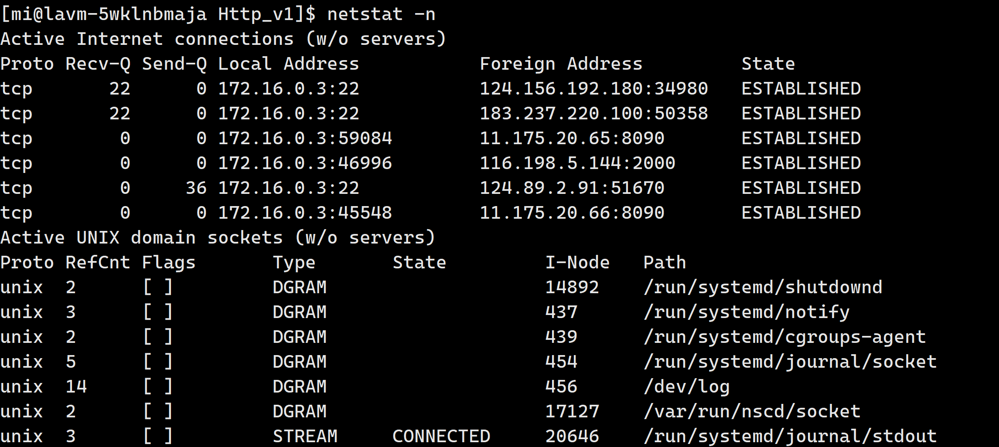

# 传输层

## 1.再谈端口号

端口号(Port)标识了一个主机上进行通信的不同的应用程序;  

**一个进程可以对应多个端口号，但是一个端口号只能对应一个进程。**

在TCP/IP协议中, 用 "源IP", "源端口号", "目的IP", "目的端口号", "协议号" 这样一个五元组来标识一个通信(可以通过**netstat -n**查看);  



### 1.1端口号的范围划分

> - 0 - 1023: 知名端口号, HTTP, FTP, SSH等这些广为使用的应用层协议, 他们的端口号都是固定的  
> - 1024 - 65535: 操作系统动态分配的端口号. 客户端程序的端口号, 就是由操作系统从这个范围分配的  

### 1.2认识知名端口号

有些服务器是非常常用的, 为了使用方便, 人们约定一些常用的服务器, 都是用以下这些固定的端口号:  

> - ssh服务器, 使用22端口
> - ftp服务器, 使用21端口
> - telnet服务器, 使用23端口
> - http服务器, 使用80端口
> - https服务器, 使用443 

执行下面的命令, 可以看到知名端口号  

```bash
cat /etc/services
```


我们自己写一个程序使用端口号时, 要避开这些知名端口号

### 1.3两个网络相关的命令

**netstat**

> netstat是一个用来查看网络状态的重要工具.
> **语法： netstat [选项]**
> 功能：查看网络状态
> 常用选项：
>
> - n 拒绝显示别名，能显示数字的全部转化成数字
> - l 仅列出有在 Listen (监听) 的服務状态
> - p 显示建立相关链接的程序名
> - t (tcp)仅显示tcp相关选项
> - u (udp)仅显示udp相关选项
> - a (all)显示所有选项，默认不显示LISTEN相关  

**pidof**

> 在查看服务器的进程id时非常方便.
> 语法： pidof [进程名]
> 功能：通过进程名, 查看进程id  

## 2.UDP协议

### 2.1UDP协议格式


> - 16位UDP长度, 表示整个数据报(UDP首部+UDP数据)的最大长度;
> - 如果校验和出错, 就会直接丢弃;  

### 2.2UDP的特点

**UDP传输的过程类似于寄信**

> - 无连接: 知道对端的IP和端口号就直接进行传输, 不需要建立连接;
> - 不可靠: 没有确认机制, 没有重传机制; 如果因为网络故障该段无法发到对方, UDP协议层也不会给应用层返回任何错误信息;
> - 面向数据报: 不能够灵活的控制读写数据的次数和数量;  

**面向数据包**

应用层交给UDP多长的报文, UDP原样发送, 既不会拆分, 也不会合并;
用UDP传输100个字节的数据:  

> - 如果发送端调用一次sendto, 发送100个字节, 那么接收端也必须调用对应的一次recvfrom, 接收100个字节; 而不能循环调用10次recvfrom, 每次接收10个字节;  

### 2.3UDP的缓冲区

> - UDP没有真正意义上的 发送缓冲区. 调用sendto会直接交给内核, 由内核将数据传给网络层协议进行后续的传输动作;
> - UDP具有接收缓冲区. 但是这个接收缓冲区不能保证收到的UDP报的顺序和发送UDP报的顺序一致; 如果缓冲区满了, 再到达的UDP数据就会被丢弃;  

UDP的socket既能读, 也能写, 这个概念叫做 **全双工**  

**UDP的注意事项**

我们注意到, UDP协议首部中有一个16位的最大长度. 也就是说一个UDP能传输的数据最大长度是64K(包含UDP首部).
然而64K在当今的互联网环境下, 是一个非常小的数字.
如果我们需要传输的数据超过64K, 就需要在应用层手动的分包, 多次发送, 并在接收端手动拼装  

## 3.TCP协议

TCP全称为 "传输控制协议(Transmission Control Protocol"). 人如其名, 要对数据的传输进行一个详细的控制;  

