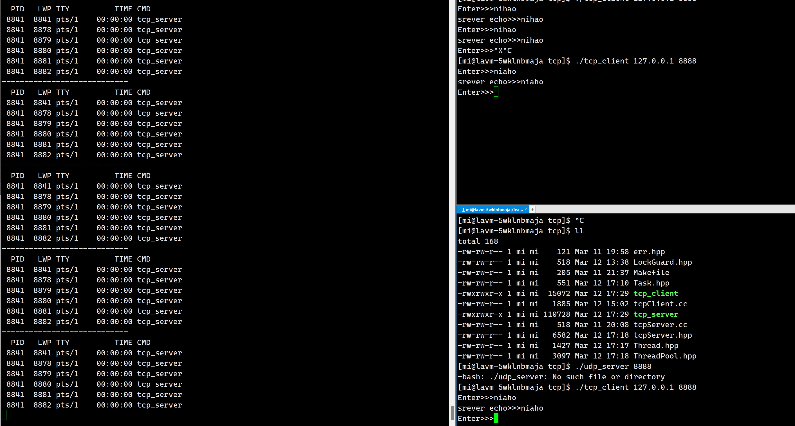

# 网络套接字2

## 1.实现一个例子

我们实现一个例子来感受tcp和udp的区别和相同之处

> TCP：
>
> 1. 创建socket: `socket(AF_INET, SOCK_STREAM, 0)`
> 2. 绑定socket: `bind()`
> 3. 开始监听: `listen()`
> 4. 接受新的连接: `accept()`
> 5. 发送和接收数据: `send(), recv()`
> 6. 关闭socket: `close()`
>
> UDP：
>
> 1. 创建socket: `socket(AF_INET, SOCK_DGRAM, 0)`
> 2. 绑定socket: `bind()`
> 3. 发送和接收数据: `sendto(), recvfrom()`
> 4. 关闭socket: `close()`

我们发现udp相比较tcp减少了两步监听和建立连接两步：这也对应了tcp和udp的特性！

### 1.1V1版本

这个版本只是简单的实现整个过程。

我们实现简单案例的源码：

```cpp
//tcpServer.hpp

#pragma once

#include"err.hpp"

#include<iostream>
#include<memory>
#include<cstdlib>
#include<cstring>
#include<unistd.h>
#include <sys/types.h>
#include <sys/socket.h>
#include <netinet/in.h>
#include <arpa/inet.h>

namespace ns_server
{
    static const uint16_t defaultport = 8081; 
    static const int backlog = 32; 
    using func_t = std::function<std::string(const std::string&)>; 
    class TcpServer
    {
    public:
        TcpServer(func_t func, uint16_t port = defaultport):func_(func), port_(port), quit_(true)
        {
        }
        
        void Initserver()
        {   
            //1.创建socket文件
            listen_socket_ = socket(AF_INET, SOCK_STREAM, 0);
            if(listen_socket_ < 0)
            {
                std::cerr<< "create socket error" << std::endl;
                exit(SOCKET_ERR);
            }

            //2.创建对应的socket结构体,并bind
            struct sockaddr_in local;
            
            memset(&local, 0,sizeof(local));

            local.sin_family = AF_INET; 
            local.sin_port = htons(port_);
            local.sin_addr.s_addr = htonl(INADDR_ANY);

            if(bind(listen_socket_, (struct sockaddr*)&local, sizeof(local)) < 0)
            {
                std::cerr<< "bind socket error" << std::endl;
                exit(BIND_ERR);               
            }
            
            //3.监听
            if(listen(listen_socket_, backlog) < 0)
            {
                std::cerr<< "listen error" << std::endl;
                exit(LISTEN_ERR);                    
            }
        }
        void start()
        {   
            quit_ = false;
            while(true)
            {
                //4.获取连接
                struct sockaddr_in client;
                socklen_t len = sizeof(client);

                std::cout << "我正在等待连接" << std::endl;
                int sock = accept(listen_socket_, (struct sockaddr*)&client, &len);
                if(sock < 0)
                {
                    std::cerr << "accept error" << std::endl;   
                    continue;
                }

                //5.获取新连接成功,开始进行业务处理
                std::cout << "获取新连接成功" << sock << "from" << listen_socket_ << std::endl;

                service(sock);
            }
        }

        void service(int sock)
        {
            char buffer[1024];
            while(true)
            {
                ssize_t s = read(sock, buffer, sizeof(buffer) - 1);
                if(s > 0)
                {
                    buffer[s] = 0;
                    //执行回调函数
                    std::string res = func_(buffer);
                    std::cout << res << std::endl; 

                    write(sock, res.c_str(), res.size());
                }
                else if(s == 0)
                {
                    //表示对应的远端关闭了通信
                    close(sock);
                    std::cout << "quit" << std::endl;
                    break;
                }
                else // s < 0 
                {   
                    close(sock);
                    std::cerr << "read error" << std::endl;   
                    break;
                }
            }
        }


        ~TcpServer()
        {

        }
    private:
        uint16_t port_;
        int listen_socket_;
        bool quit_; //表示当前服务器是否运行
        func_t func_;
    };
}

//tcpServer.cc
#include"tcpServer.hpp"
using namespace std;
using namespace ns_server;

static void usage(string proc)
{   
    std::cout << "Usage:\n\t" << proc <<"port\n"<< std::endl;
}


std::string echo (const std::string& message)
{
    return message;
}

int main(int argc, char* argv[])
{
    if(argc != 2)
    {
        usage(argv[1]);
        exit(USAGE_ERR);
    }

    uint16_t port = atoi(argv[1]);
    unique_ptr<TcpServer> tsvr(new TcpServer(echo, port));

    tsvr->Initserver();
    tsvr->start();
    return 0;
}

//tcpClient.cc
#include"err.hpp"


#include<iostream>
#include<cstring>
#include<unistd.h>
#include <sys/types.h>
#include <sys/socket.h>
#include <netinet/in.h>
#include <arpa/inet.h>

using namespace std;

static void Usage(string proc)
{
    cout << "Usage:\n\t" << proc << "serverip  serverport  "<< "port\n" << endl;
}


int main(int argc, char* argv[])
{
    if(argc != 3)
    {
        Usage(argv[0]);
        exit(USAGE_ERR);
    }

    string serverip = argv[1];
    uint16_t serverport = atoi(argv[2]);


    //1.create sock
    int sock = socket(AF_INET, SOCK_STREAM, 0);
    if(sock < 0)
    {
        std::cerr << "socket error:" << strerror(errno) << std::endl;
        exit(SOCKET_ERR); 
    }

    //2.connect
    struct sockaddr_in server;
    memset(&server, 0, sizeof(server));
    server.sin_port = htons(serverport);
    server.sin_family = AF_INET;
    inet_aton(serverip.c_str(), &(server.sin_addr));

    int cnt = 5;
    while(connect(sock, (struct sockaddr*)& server, sizeof(server)) != 0)
    {
        sleep(1);
        cout << "正在尝试重连, 重连次数还有" << cnt-- << "次" << endl;
        if(cnt <= 0) break;
    }

    if(cnt <= 0)
    {
        //连接失败
        std::cerr << "connect error" << endl;
        exit(CONNECT_ERR);
    }

    char buffer[1024];
    while(true)
    {
        string line;
        cout << "Enter>>>";
        getline(cin, line);

        write(sock, line.c_str(), line.size());

        ssize_t s = read(sock, buffer, sizeof(buffer) - 1);
        if(s > 0)
        {
            buffer[s] = 0;
            cout << "srever echo>>>" << buffer << endl;
        }
        else if(s == 0)
        {
            cerr << "server quit" << endl;
            break;
        }
        else 
        {
            cerr <<"read error: "  << strerror(errno) << endl;
            break;
        }
    }

    close(sock);

    return 0;
}
```

### 1.2V2版本

实现一个多进程版本，因为我们的上一个版本，连接的时候会阻塞在那里，非常的不好。

我们让子进程帮我们去执行对应service服务：

细节：

- 进程等待问题：a.使用孤儿进程 b.使用信号让父进程忽略等待
- 文件描述符的问题：父进程及时关闭不需要的文件描述符，提高文件描述符的利用率

```cpp
//tcpServer.hpp
#pragma once

#include"err.hpp"

#include<iostream>
#include<memory>
#include<cstdlib>
#include<cstring>
#include<unistd.h>
#include <sys/types.h>
#include <sys/socket.h>
#include <netinet/in.h>
#include <arpa/inet.h>

namespace ns_server
{
    // signal(SIGCHLD, SIG_IGN); // 我最推荐的

    static const uint16_t defaultport = 8081; 
    static const int backlog = 32; 
    using func_t = std::function<std::string(const std::string&)>; 
    class TcpServer
    {
    public:
        TcpServer(func_t func, uint16_t port = defaultport):func_(func), port_(port), quit_(true)
        {

        }
        
        void Initserver()
        {   
            //1.创建socket文件
            listen_socket_ = socket(AF_INET, SOCK_STREAM, 0);
            if(listen_socket_ < 0)
            {
                std::cerr<< "create socket error" << std::endl;
                exit(SOCKET_ERR);
            }

            //2.创建对应的socket结构体,并bind
            struct sockaddr_in local;
            
            memset(&local, 0,sizeof(local));

            local.sin_family = AF_INET; 
            local.sin_port = htons(port_);
            local.sin_addr.s_addr = htonl(INADDR_ANY);

            if(bind(listen_socket_, (struct sockaddr*)&local, sizeof(local)) < 0)
            {
                std::cerr<< "bind socket error" << std::endl;
                exit(BIND_ERR);               
            }
            
            //3.监听
            if(listen(listen_socket_, backlog) < 0)
            {
                std::cerr<< "listen error" << std::endl;
                exit(LISTEN_ERR);                    
            }
        }
        void start()
        {   
            quit_ = false;
            while(true)
            {
                //4.获取连接
                struct sockaddr_in client;
                socklen_t len = sizeof(client);

                std::cout << "我正在等待连接" << std::endl;
                int sock = accept(listen_socket_, (struct sockaddr*)&client, &len);
                if(sock < 0)
                {
                    std::cerr << "accept error" << std::endl;   
                    continue;
                }

                std::string clientip = inet_ntoa(client.sin_addr);
                uint16_t clientport = ntohs(client.sin_port);

                //5.获取新连接成功,开始进行业务处理
                std::cout << "获取新连接成功" << sock << "from" << listen_socket_ << std::endl;
                
                //v1
                //service(sock, clientip, clientport);

                //v2:多线程版本
                pid_t id = fork();
                if(id < 0)  //父进程
                { 
                    //这里因为子进程继承去了父进程的文件描述符表之后，我们这里的sock就没必要了
                    //所以我们直接关闭，也可以提高文件描述符的利用率
                    close(sock);
                    continue;
                }
                else if(id == 0) //child, 父进程的fd, 会被child继承吗?会。 父子会用同一张文件描述符表吗？不会，子进程拷贝继承父进程的fd table;
                {
                    //建议关闭掉不需要的fd
                    close(listen_socket_); 
                    if(fork() > 0) exit(0); 
                    //这里直接在创建一个子进程，也就是说子进程创建了一个进程，然后自己推出掉
                    //那么这时候，就形成了孤儿进程，那么孤儿进程是会被操作系统领养的，而不是留给父进程去等待了
                    //或者我们也可以直接忽略等待子进程，signal(SIGCHLD, SIG_IGN); // 我最推荐的

                    service(sock, clientip, clientport);
                    exit(0);
                }

                close(sock);
            }
        }

        void service(int sock, std::string ip, uint16_t port)
        {
            std::string who = ip + "-" + std::to_string(port);

            char buffer[1024];
            while(true)
            {
                ssize_t s = read(sock, buffer, sizeof(buffer) - 1);
                if(s > 0)
                {
                    buffer[s] = 0;
                    //执行回调函数
                    std::string res = func_(buffer);
                    std::cout << who << ">>" << res << std::endl; 
                    write(sock, res.c_str(), res.size());
                }
                else if(s == 0)
                {
                    //表示对应的远端关闭了通信
                    close(sock);
                    std::cout << "quit" << std::endl;
                    break;
                }
                else // s < 0 
                {   
                    close(sock);
                    std::cerr << "read error" << std::endl;   
                    break;
                }
            }
        }


        ~TcpServer()
        {

        }
    private:
        uint16_t port_;
        int listen_socket_;
        bool quit_; //表示当前服务器是否运行
        func_t func_;
    };
}
```

### 1.3V3版本

采用多线程的思路。

```cpp
#pragma once

#include"err.hpp"

#include<iostream>
#include<memory>
#include<cstdlib>
#include<cstring>
#include<unistd.h>
#include <sys/types.h>
#include <sys/socket.h>
#include <netinet/in.h>
#include <arpa/inet.h>

namespace ns_server
{
    // signal(SIGCHLD, SIG_IGN); // 我最推荐的

    static const uint16_t defaultport = 8081; 
    static const int backlog = 32; 
    using func_t = std::function<std::string(const std::string&)>; 

    class TcpServer;

    class ThreadData
    {
    public:
        ThreadData(int fd, const std::string &ip, const uint16_t &port, TcpServer* ts):
        sock(fd),
        clientip(ip),
        clientport(port),
        current(ts)
        {}

    public:
        int sock;
        std::string clientip;
        uint16_t clientport;
        TcpServer* current;
    };


    class TcpServer
    {
    public:
        TcpServer(func_t func, uint16_t port = defaultport):func_(func), port_(port), quit_(true)
        {

        }
        
        void Initserver()
        {   
            //1.创建socket文件
            listen_socket_ = socket(AF_INET, SOCK_STREAM, 0);
            if(listen_socket_ < 0)
            {
                std::cerr<< "create socket error" << std::endl;
                exit(SOCKET_ERR);
            }

            //2.创建对应的socket结构体,并bind
            struct sockaddr_in local;
            
            memset(&local, 0,sizeof(local));

            local.sin_family = AF_INET; 
            local.sin_port = htons(port_);
            local.sin_addr.s_addr = htonl(INADDR_ANY);

            if(bind(listen_socket_, (struct sockaddr*)&local, sizeof(local)) < 0)
            {
                std::cerr<< "bind socket error" << std::endl;
                exit(BIND_ERR);               
            }
            
            //3.监听
            if(listen(listen_socket_, backlog) < 0)
            {
                std::cerr<< "listen error" << std::endl;
                exit(LISTEN_ERR);                    
            }
        }
        void start()
        {   
            quit_ = false;
            while(true)
            {
                //4.获取连接
                struct sockaddr_in client;
                socklen_t len = sizeof(client);

                std::cout << "我正在等待连接" << std::endl;
                int sock = accept(listen_socket_, (struct sockaddr*)&client, &len);
                if(sock < 0)
                {
                    std::cerr << "accept error" << std::endl;   
                    continue;
                }

                std::string clientip = inet_ntoa(client.sin_addr);
                uint16_t clientport = ntohs(client.sin_port);

                //5.获取新连接成功,开始进行业务处理
                std::cout << "获取新连接成功" << sock << "from" << listen_socket_ << std::endl;

                //v3多线程
                pthread_t tid;
                ThreadData* td = new ThreadData(sock, clientip, clientport, this);
                pthread_create(&tid, nullptr, threadRoutine, td);

            }
        }


        static void* threadRoutine(void* args)
        {
            //分离线程，防止主进程阻塞的情况
            pthread_detach(pthread_self());

            ThreadData* td = static_cast<ThreadData*>(args);
            td->current->service(td->sock, td->clientip, td->clientport);

            delete td;
            return nullptr;
        }

        void service(int sock, std::string ip, uint16_t port)
        {
            std::string who = ip + "-" + std::to_string(port);

            char buffer[1024];
            while(true)
            {
                ssize_t s = read(sock, buffer, sizeof(buffer) - 1);
                if(s > 0)
                {
                    buffer[s] = 0;
                    //执行回调函数
                    std::string res = func_(buffer);
                    std::cout << who << ">>" << res << std::endl; 
                    write(sock, res.c_str(), res.size());
                }
                else if(s == 0)
                {
                    //表示对应的远端关闭了通信
                    close(sock);
                    std::cout << "quit" << std::endl;
                    break;
                }
                else // s < 0 
                {   
                    close(sock);
                    std::cerr << "read error" << std::endl;   
                    break;
                }
            }
        }


        ~TcpServer()
        {

        }
    private:
        uint16_t port_;
        int listen_socket_;
        bool quit_; //表示当前服务器是否运行
        func_t func_;
    };
}
```

### 1.4V4版本

使用线程池的思路实现+单例模式的实现

思路：我们引入之前实现的线程池，Task类，Thread类和LockGuard类；

首先我们构造一个Task类的实例对象，传入我们需要的参数(也就是service函数需要的参数);

细节：在传入的过程中我们需要绑定一个参数就是this指针。

之后将Task的实例放入到线程池中，让线程去执行即可。

但是因为我们的service函数内部是死循环，所以我们只有一个有限的线程来提供有限的服务，换句话说就是当我们的进程数等于当前的用户访问量时，那么之后进来的用户就会连接失败或者，服务不会被响应，所以我们可以将每一次的响应变成不是死循环，而是每次相应完成就退出。

执行效果：



代码：

```cpp
//tcp_server.hpp
#pragma once


using namespace std;

#include<iostream>
#include<memory>
#include<cstdlib>
#include<cstring>
#include<unistd.h>
#include<string>

#include <sys/types.h>
#include <sys/socket.h>
#include <netinet/in.h>
#include <arpa/inet.h>

#include"Thread.hpp"
#include"LockGuard.hpp"
#include"err.hpp"
#include"Task.hpp"
#include"ThreadPool.hpp"

namespace ns_server
{
    // signal(SIGCHLD, SIG_IGN); // 我最推荐的

    static const uint16_t defaultport = 8081; 
    static const int backlog = 32; 
    using func_t = std::function<std::string(const std::string&)>; 

    class TcpServer;

    class ThreadData
    {
    public:
        ThreadData(int fd, const std::string &ip, const uint16_t &port, TcpServer* ts):
        sock(fd),
        clientip(ip),
        clientport(port),
        current(ts)
        {}

    public:
        int sock;
        std::string clientip;
        uint16_t clientport;
        TcpServer* current;
    };


    class TcpServer
    {
    public:
        TcpServer(func_t func, uint16_t port = defaultport):func_(func), port_(port), quit_(true)
        {

        }
        
        void Initserver()
        {   
            //1.创建socket文件
            listen_socket_ = socket(AF_INET, SOCK_STREAM, 0);
            if(listen_socket_ < 0)
            {
                std::cerr<< "create socket error" << std::endl;
                exit(SOCKET_ERR);
            }

            //2.创建对应的socket结构体,并bind
            struct sockaddr_in local;
            
            memset(&local, 0,sizeof(local));

            local.sin_family = AF_INET; 
            local.sin_port = htons(port_);
            local.sin_addr.s_addr = htonl(INADDR_ANY);

            if(bind(listen_socket_, (struct sockaddr*)&local, sizeof(local)) < 0)
            {
                std::cerr<< "bind socket error" << std::endl;
                exit(BIND_ERR);               
            }
            
            //3.监听
            if(listen(listen_socket_, backlog) < 0)
            {
                std::cerr<< "listen error" << std::endl;
                exit(LISTEN_ERR);                    
            }
        }
        void start()
        {   
            quit_ = false;
            while(true)
            {
                //4.获取连接
                struct sockaddr_in client;
                socklen_t len = sizeof(client);

                std::cout << "我正在等待连接" << std::endl;
                int sock = accept(listen_socket_, (struct sockaddr*)&client, &len);
                if(sock < 0)
                {
                    std::cerr << "accept error" << std::endl;   
                    continue;
                }

                std::string clientip = inet_ntoa(client.sin_addr);
                uint16_t clientport = ntohs(client.sin_port);

                //5.获取新连接成功,开始进行业务处理
                std::cout << "获取新连接成功" << sock << "from" << listen_socket_ << std::endl;
                

                //v4线程池
                Task t(sock, clientip, clientport, std::bind(&TcpServer::service, this, std::placeholders::_1, std::placeholders::_2,
                std::placeholders::_3));
                ThreadPool<Task>::Getinstance()->TaskPush(t);
            }
        }


        static void* threadRoutine(void* args)
        {
            //分离线程，防止主进程阻塞的情况
            pthread_detach(pthread_self());

            ThreadData* td = static_cast<ThreadData*>(args);
            td->current->service(td->sock, td->clientip, td->clientport);

            delete td;
            return nullptr;
        }

        void service(int sock, std::string ip, uint16_t port)
        {
            std::string who = ip + "-" + std::to_string(port);

            char buffer[1024];
            while(true)
            {
                ssize_t s = read(sock, buffer, sizeof(buffer) - 1);
                if(s > 0)
                {
                    buffer[s] = 0;
                    //执行回调函数
                    std::string res = func_(buffer);
                    std::cout << who << ">>" << res << std::endl; 
                    write(sock, res.c_str(), res.size());
                }
                else if(s == 0)
                {
                    //表示对应的远端关闭了通信
                    close(sock);
                    std::cout << "quit" << std::endl;
                    break;
                }
                else // s < 0 
                {   
                    close(sock);
                    std::cerr << "read error" << std::endl;   
                    break;
                }
            }
        }


        ~TcpServer()
        {

        }
    private:
        uint16_t port_;
        int listen_socket_;
        bool quit_; //表示当前服务器是否运行
        func_t func_;
    };
}
```

改进：为了服务更多的用户

```cpp
#pragma once


using namespace std;

#include<iostream>
#include<memory>
#include<cstdlib>
#include<cstring>
#include<unistd.h>
#include<string>

#include <sys/types.h>
#include <sys/socket.h>
#include <netinet/in.h>
#include <arpa/inet.h>

#include"Thread.hpp"
#include"LockGuard.hpp"
#include"err.hpp"
#include"Task.hpp"
#include"ThreadPool.hpp"

namespace ns_server
{
    // signal(SIGCHLD, SIG_IGN); // 我最推荐的

    static const uint16_t defaultport = 8081; 
    static const int backlog = 32; 
    using func_t = std::function<std::string(const std::string&)>; 

    class TcpServer;

    class ThreadData
    {
    public:
        ThreadData(int fd, const std::string &ip, const uint16_t &port, TcpServer* ts):
        sock(fd),
        clientip(ip),
        clientport(port),
        current(ts)
        {}

    public:
        int sock;
        std::string clientip;
        uint16_t clientport;
        TcpServer* current;
    };


    class TcpServer
    {
    public:
        TcpServer(func_t func, uint16_t port = defaultport):func_(func), port_(port), quit_(true)
        {

        }
        
        void Initserver()
        {   
            //1.创建socket文件
            listen_socket_ = socket(AF_INET, SOCK_STREAM, 0);
            if(listen_socket_ < 0)
            {
                std::cerr<< "create socket error" << std::endl;
                exit(SOCKET_ERR);
            }

            //2.创建对应的socket结构体,并bind
            struct sockaddr_in local;
            
            memset(&local, 0,sizeof(local));

            local.sin_family = AF_INET; 
            local.sin_port = htons(port_);
            local.sin_addr.s_addr = htonl(INADDR_ANY);

            if(bind(listen_socket_, (struct sockaddr*)&local, sizeof(local)) < 0)
            {
                std::cerr<< "bind socket error" << std::endl;
                exit(BIND_ERR);               
            }
            
            //3.监听
            if(listen(listen_socket_, backlog) < 0)
            {
                std::cerr<< "listen error" << std::endl;
                exit(LISTEN_ERR);                    
            }
        }
        void start()
        {   
            quit_ = false;
            while(true)
            {
                //4.获取连接
                struct sockaddr_in client;
                socklen_t len = sizeof(client);

                std::cout << "我正在等待连接" << std::endl;
                int sock = accept(listen_socket_, (struct sockaddr*)&client, &len);
                if(sock < 0)
                {
                    std::cerr << "accept error" << std::endl;   
                    continue;
                }

                std::string clientip = inet_ntoa(client.sin_addr);
                uint16_t clientport = ntohs(client.sin_port);

                //5.获取新连接成功,开始进行业务处理
                std::cout << "获取新连接成功" << sock << "from" << listen_socket_ << std::endl;

                //v4线程池
                Task t(sock, clientip, clientport, std::bind(&TcpServer::service, this, std::placeholders::_1, std::placeholders::_2,
                std::placeholders::_3));
                ThreadPool<Task>::Getinstance()->TaskPush(t);
            }
        }


        static void* threadRoutine(void* args)
        {
            //分离线程，防止主进程阻塞的情况
            pthread_detach(pthread_self());

            ThreadData* td = static_cast<ThreadData*>(args);
            td->current->service(td->sock, td->clientip, td->clientport);

            delete td;
            return nullptr;
        }

        void service(int sock, std::string ip, uint16_t port)
        {
            std::string who = ip + "-" + std::to_string(port);

            char buffer[1024];

            ssize_t s = read(sock, buffer, sizeof(buffer) - 1);
            if (s > 0)
            {
                buffer[s] = 0;
                // 执行回调函数
                std::string res = func_(buffer);
                std::cout << who << ">>" << res << std::endl;
                write(sock, res.c_str(), res.size());
            }
            else if (s == 0)
            {
                // 表示对应的远端关闭了通信
                std::cout << "quit" << std::endl;
            }
            else // s < 0
            {
                std::cerr << "read error" << std::endl;
            }

            close(sock);
        }


        ~TcpServer()
        {

        }
    private:
        uint16_t port_;
        int listen_socket_;
        bool quit_; //表示当前服务器是否运行
        func_t func_;
    };
}
```

### 1.5V5版本

加入一个简单的日志信息,我们尝试用这个函数去实现输出我们的错误信息或者其他信息。

```cpp
//log.hpp
#pragma once

#include<string>
#include<unistd.h>
#include<time.h>
#include<stdarg.h>
#include<stdio.h>

enum
{
    Debug = 0,
    Info,
    Warning,
    Error,
    Fatal,
    Uknown
};


std::string LogLevel(int level)
{
    switch(level)
    {
    case Debug:
        return "Debug";
    case Info:
        return "Info";
    case Warning:
        return "Warning";
    case Error:
        return "Error";
    case Fatal:
        return "Fatal";
    default:
        return "Uknown";
    }
}


std::string GetTime()
{
    time_t curr = time(nullptr);
    struct tm* tmp = localtime(&curr);
    char buffer[128];
    snprintf(buffer, sizeof(buffer), "%d-%d-%d %d:%d:%d", tmp->tm_year + 1900, tmp->tm_mon + 1, 
    tmp->tm_mday, tmp->tm_hour, tmp->tm_min, tmp->tm_sec);

    return buffer;
}

// 日志格式: 日志等级 时间 pid 消息体

void LogMessage(int level, const char* format, ...)
{
    //1.等级
    //2.时间
    //3.格式化
    //4.打印
    char Logleft[1024];
    std::string level_string = LogLevel(level);
    std::string cur_time = GetTime();
    snprintf(Logleft, sizeof Logleft, "[%s][%s][%d] ", level_string.c_str(), cur_time.c_str(), getpid());


    char Logright[1024];
    va_list p;
    va_start(p, format);
    vsnprintf(Logright, sizeof(Logright), format, p);
    va_end(p);


    printf("%s%s\n", Logleft, Logright);

```

实例代码：

```cpp
//server.hpp
#pragma once

using namespace std;

#include<iostream>
#include<memory>
#include<cstdlib>
#include<cstring>
#include<unistd.h>
#include<string>

#include <sys/types.h>
#include <sys/socket.h>
#include <netinet/in.h>
#include <arpa/inet.h>

#include"log.hpp"
#include"Thread.hpp"
#include"LockGuard.hpp"
#include"err.hpp"
#include"Task.hpp"
#include"ThreadPool.hpp"

namespace ns_server
{
    // signal(SIGCHLD, SIG_IGN); // 我最推荐的

    static const uint16_t defaultport = 8081; 
    static const int backlog = 32; 
    using func_t = std::function<std::string(const std::string&)>; 

    class TcpServer;

    class ThreadData
    {
    public:
        ThreadData(int fd, const std::string &ip, const uint16_t &port, TcpServer* ts):
        sock(fd),
        clientip(ip),
        clientport(port),
        current(ts)
        {}

    public:
        int sock;
        std::string clientip;
        uint16_t clientport;
        TcpServer* current;
    };

    class TcpServer
    {
    public:
        TcpServer(func_t func, uint16_t port = defaultport):func_(func), port_(port), quit_(true)
        {

        }
        
        void Initserver()
        {   
            //1.创建socket文件
            listen_socket_ = socket(AF_INET, SOCK_STREAM, 0);
            if(listen_socket_ < 0)
            {
                // std::cerr<< "create socket error" << std::endl;
                LogMessage(Error, "create socket error");
                exit(SOCKET_ERR);
            }

            //2.创建对应的socket结构体,并bind
            struct sockaddr_in local;
            
            memset(&local, 0,sizeof(local));

            local.sin_family = AF_INET; 
            local.sin_port = htons(port_);
            local.sin_addr.s_addr = htonl(INADDR_ANY);

            if(bind(listen_socket_, (struct sockaddr*)&local, sizeof(local)) < 0)
            {
                //std::cerr<< "bind socket error" << std::endl;
                LogMessage(Error, "bind socket error");                
                exit(BIND_ERR);               
            }
            
            //3.监听
            if(listen(listen_socket_, backlog) < 0)
            {
                //std::cerr<< "listen error" << std::endl;
                LogMessage(Error, "listen error");
                exit(LISTEN_ERR);                    
            }
        }
        void start()
        {   
            quit_ = false;
            while(true)
            {
                //4.获取连接
                struct sockaddr_in client;
                socklen_t len = sizeof(client);

                // std::cout << "我正在等待连接" << std::endl;
                LogMessage(Info, "我正在等待连接");

                int sock = accept(listen_socket_, (struct sockaddr*)&client, &len);
                if(sock < 0)
                {
                    // std::cerr << "accept error" << std::endl;  
                    LogMessage(Error, "accept error"); 
                    continue;
                }

                std::string clientip = inet_ntoa(client.sin_addr);
                uint16_t clientport = ntohs(client.sin_port);

                //v4线程池
                Task t(sock, clientip, clientport, std::bind(&TcpServer::service, this, std::placeholders::_1, std::placeholders::_2,
                std::placeholders::_3));
                ThreadPool<Task>::Getinstance()->TaskPush(t);
            }
        }


        static void* threadRoutine(void* args)
        {
            //分离线程，防止主进程阻塞的情况
            pthread_detach(pthread_self());

            ThreadData* td = static_cast<ThreadData*>(args);
            td->current->service(td->sock, td->clientip, td->clientport);

            delete td;
            return nullptr;
        }

        void service(int sock, std::string ip, uint16_t port)
        {
            std::string who = ip + "-" + std::to_string(port);

            char buffer[1024];

            ssize_t s = read(sock, buffer, sizeof(buffer) - 1);
            if (s > 0)
            {
                buffer[s] = 0;
                // 执行回调函数
                std::string res = func_(buffer);
                // std::cout << who << ">>" << res << std::endl;
                LogMessage(Info, "%s >>> %s", who.c_str(), res.c_str()); 
                write(sock, res.c_str(), res.size());
            }
            else if (s == 0)
            {
                // 表示对应的远端关闭了通信
                // std::cout << "quit" << std::endl;
                LogMessage(Info, "quit"); 
            }
            else // s < 0
            {
                // std::cerr << "read error" << std::endl;
                LogMessage(Error, "read error"); 

            }

            close(sock);
        }


        ~TcpServer()
        {

        }
    private:
        uint16_t port_;
        int listen_socket_;
        bool quit_; //表示当前服务器是否运行
        func_t func_;
    };
}
```

## 2.守护进程

### 2.1前置知识
