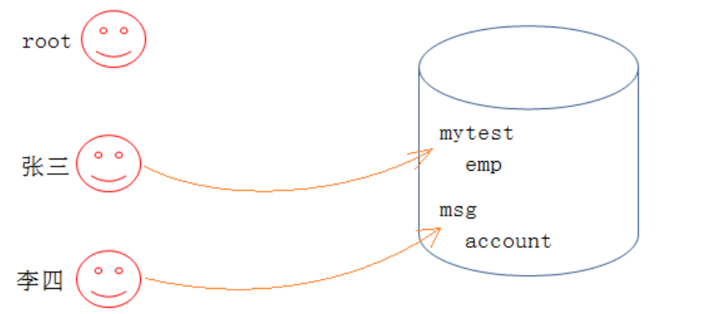

# MySQL用户管理

如果我们只能使用root用户，这样存在安全隐患。这时，就需要使用MySQL的用户管理  



张三只能操纵mytest这个库，李四只能操作msg这个库。如果给他们root账户，他们就可以操控所有的库，风险太大。

## 1.用户管理

### 1.1用户信息

MySQL中的用户，都存储在系统数据库mysql的user表中  

```mysql
mysql> use mysql;
Database changed
mysql> select host,user,authentication_string from user;
+-----------+---------------+-------------------------------------------+
| host | user | authentication_string |
+-----------+---------------+-------------------------------------------+
| localhost | root | *81F5E21E35407D884A6CD4A731AEBFB6AF209E1B |
| localhost | mysql.session | *THISISNOTAVALIDPASSWORDTHATCANBEUSEDHERE |
| localhost | mysql.sys | *THISISNOTAVALIDPASSWORDTHATCANBEUSEDHERE |
+-----------+---------------+-------------------------------------------+
--可以通过desc user初步查看一下表结构
```

字段解释：  

> - host： 表示这个用户可以从哪个主机登陆，如果是localhost，表示只能从本机登陆
> - user： 用户名
> - authentication_string： 用户密码通过password函数加密后的
> - *_priv： 用户拥有的权限  

### 1.2创建用户

语法：

```mysql
create user '用户名'@'登陆主机/ip' identified by '密码';
```

案例：

```mysql
mysql> create user 'mi'@'localhost' identified by 'Mi123456..';
Query OK, 0 rows affected (0.00 sec)

mysql> select host, user, authentication_string from user;
+-----------+---------------+-------------------------------------------+
| host      | user          | authentication_string                     |
+-----------+---------------+-------------------------------------------+
| localhost | root          | *6057AD50BC15C0C59F06C8F75159017F9C920E7B |
| localhost | mysql.session | *THISISNOTAVALIDPASSWORDTHATCANBEUSEDHERE |
| localhost | mysql.sys     | *THISISNOTAVALIDPASSWORDTHATCANBEUSEDHERE |
| localhost | mi            | *CA0B93D2D410FACC8F6BE4167673DB06C37838FD |
+-----------+---------------+-------------------------------------------+
4 rows in set (0.00 sec)
-- 此时便可以使用新账号新密码进行登陆啦
--备注：可能实际在设置密码的时候，因为mysql本身的认证等级比较高，一些简单的密码无法设置，会爆出
如下报错：
-- ERROR 1819 (HY000): Your password does not satisfy the current policy
requirements
-- 解决方案：https://blog.csdn.net/zhanaolu4821/article/details/93622812
--查看密码设置相关要求：SHOW VARIABLES LIKE 'validate_password%';
-- 这个大家下来自己玩玩
--关于新增用户这里，需要大家注意，不要轻易添加一个可以从任意地方登陆的user

```

### 1.3删除用户

语法：  

```mysql
drop user '用户名'@'主机名'
```

示例：

```mysql
mysql> select user, host , authentication_string from user;
+---------------+-----------+-------------------------------------------+
| user          | host      | authentication_string                     |
+---------------+-----------+-------------------------------------------+
| root          | localhost | *6057AD50BC15C0C59F06C8F75159017F9C920E7B |
| mysql.session | localhost | *THISISNOTAVALIDPASSWORDTHATCANBEUSEDHERE |
| mysql.sys     | localhost | *THISISNOTAVALIDPASSWORDTHATCANBEUSEDHERE |
| mi            | localhost | *CA0B93D2D410FACC8F6BE4167673DB06C37838FD |
+---------------+-----------+-------------------------------------------+
4 rows in set (0.00 sec)

mysql> drop user mi;
ERROR 1396 (HY000): Operation DROP USER failed for 'mi'@'%' -- <= 直接给个用户名，
不能删除，它默认是%，表示所有地方可以登陆的用户
mysql> drop user 'mi'@'localhost';
Query OK, 0 rows affected (0.00 sec)

mysql> select user, host , authentication_string from user;
+---------------+-----------+-------------------------------------------+
| user          | host      | authentication_string                     |
+---------------+-----------+-------------------------------------------+
| root          | localhost | *6057AD50BC15C0C59F06C8F75159017F9C920E7B |
| mysql.session | localhost | *THISISNOTAVALIDPASSWORDTHATCANBEUSEDHERE |
| mysql.sys     | localhost | *THISISNOTAVALIDPASSWORDTHATCANBEUSEDHERE |
+---------------+-----------+-------------------------------------------+
3 rows in set (0.00 sec)

```

### 1.4修改用户密码  

语法：

- 自己改自己密码  

  ```mysql
  set password=password('新的密码');
  ```

- root用户修改指定用户的密码  

  ```mysql
  set password for '用户名'@'主机名'=password('新的密码')；
  ```

  ```mysql
  mysql> select user, host , authentication_string from user;
  +---------------+-----------+-------------------------------------------+
  | user          | host      | authentication_string                     |
  +---------------+-----------+-------------------------------------------+
  | root          | localhost | *6057AD50BC15C0C59F06C8F75159017F9C920E7B |
  | mysql.session | localhost | *THISISNOTAVALIDPASSWORDTHATCANBEUSEDHERE |
  | mysql.sys     | localhost | *THISISNOTAVALIDPASSWORDTHATCANBEUSEDHERE |
  | mi            | localhost | *CA0B93D2D410FACC8F6BE4167673DB06C37838FD |
  +---------------+-----------+-------------------------------------------+
  4 rows in set (0.00 sec)
  
  mysql> set password for 'mi'@'localhost'=password('Mi123321..');
  Query OK, 0 rows affected, 1 warning (0.00 sec)
  
  mysql> select user, host , authentication_string from user;
  +---------------+-----------+-------------------------------------------+
  | user          | host      | authentication_string                     |
  +---------------+-----------+-------------------------------------------+
  | root          | localhost | *6057AD50BC15C0C59F06C8F75159017F9C920E7B |
  | mysql.session | localhost | *THISISNOTAVALIDPASSWORDTHATCANBEUSEDHERE |
  | mysql.sys     | localhost | *THISISNOTAVALIDPASSWORDTHATCANBEUSEDHERE |
  | mi            | localhost | *32E57CCDC98ED24C8026ACD86BCBD456CAC387A8 |
  +---------------+-----------+-------------------------------------------+
  4 rows in set (0.00 sec)
  
  ```

## 2.数据库的权限

MySQL数据库提供的权限列表： 

| 权限           | 描述                                                         |
| -------------- | ------------------------------------------------------------ |
| SELECT         | 允许用户查询（检索）表中的数据。                             |
| INSERT         | 允许用户向表中插入新行（记录）的权限。                       |
| UPDATE         | 允许用户更新表中现有行的权限。                               |
| DELETE         | 允许用户删除表中的行的权限。                                 |
| CREATE         | 允许用户创建新数据库或表的权限。                             |
| DROP           | 允许用户删除数据库或表的权限。                               |
| ALTER          | 允许用户修改数据库或表结构的权限，如添加、删除或修改列。     |
| GRANT OPTION   | 允许用户将自己拥有的权限授予其他用户的权限。                 |
| ALL PRIVILEGES | 授予用户对指定数据库或表的所有权限。                         |
| SHOW DATABASES | 允许用户查看数据库列表的权限。                               |
| CREATE USER    | 允许用户创建新用户的权限。                                   |
| RELOAD         | 允许用户重新加载服务器配置文件或刷新访问控制表的权限。       |
| SHUTDOWN       | 允许用户关闭服务器的权限。                                   |
| PROCESS        | 允许用户查看当前运行的进程列表的权限。                       |
| FILE           | 允许用户执行文件系统操作的权限，如导入和导出数据。           |
| SUPER          | 允许用户执行一些特殊的超级用户级别的操作，如更改服务器运行参数或执行特殊的维护任务。 |

### 2.1给用户授权  

刚创建的用户没有任何权限。需要给用户授权  

语法：

```mysql
grant 权限列表 on 库.对象名 to '用户名'@'登陆位置' [identified by '密码']
```

说明：

- 权限列表，多个权限用逗号分开  

  ```mysql
  grant select on ...
  grant select, delete, create on ....
  grant all [privileges] on ... -- 表示赋予该用户在该对象上的所有权限
  ```

- `*.*` : 代表本系统中的所有数据库的所有对象（表，视图，存储过程等）  

- `库.*` : 表示某个数据库中的所有数据对象(表，视图，存储过程等)  

- identified by可选。 如果用户存在，赋予权限的同时修改密码,如果该用户不存在，就是创建用户  

案例：

```mysql
C:\Users\jason>mysql -umi -h117.72.37.100 -P8080 -p
Enter password: **********
Welcome to the MySQL monitor.  Commands end with ; or \g.
Your MySQL connection id is 17
Server version: 5.7.44 MySQL Community Server (GPL)

Copyright (c) 2000, 2024, Oracle and/or its affiliates.

Oracle is a registered trademark of Oracle Corporation and/or its
affiliates. Other names may be trademarks of their respective
owners.

Type 'help;' or '\h' for help. Type '\c' to clear the current input statement.

mysql> show databases;
+--------------------+
| Database           |
+--------------------+
| information_schema |
+--------------------+
1 row in set (0.07 sec)

----给用户mi赋予test数据库下所有文件的select权限
mysql> grant select on test.* to 'mi'@'%';
Query OK, 0 rows affected (0.00 sec)

mysql> flush privileges;
Query OK, 0 rows affected (0.00 sec)


mysql> show databases;
+--------------------+
| Database           |
+--------------------+
| information_schema |
| test               |
+--------------------+
2 rows in set (0.09 sec)

//
mysql> use test;
Database changed
mysql> show tables;
+----------------+
| Tables_in_test |
+----------------+
| account        |
| student        |
| t1             |
| users          |
+----------------+
4 rows in set (0.07 sec)

mysql> select * from account;
+----+------+---------+
| id | name | blance  |
+----+------+---------+
|  3 | 王五 | 3332.40 |
|  5 | 田七 | 1234.10 |
+----+------+---------+
2 rows in set (0.08 sec)

--没有删除权限
mysql> delete from account;
ERROR 1142 (42000): DELETE command denied to user 'mi'@'113.135.244.144' for table 'account'


备注：特定用户现有查看权限
mysql> show grants for 'mi'@'%';
+--------------------------------------+
| Grants for mi@%                      |
+--------------------------------------+
| GRANT USAGE ON *.* TO 'mi'@'%'       |
| GRANT SELECT ON `test`.* TO 'mi'@'%' |
+--------------------------------------+
2 rows in set (0.00 sec)

mysql> show grants for 'root'@'localhost';
+---------------------------------------------------------------------+
| Grants for root@localhost                                           |
+---------------------------------------------------------------------+
| GRANT ALL PRIVILEGES ON *.* TO 'root'@'localhost' WITH GRANT OPTION |
| GRANT PROXY ON ''@'' TO 'root'@'localhost' WITH GRANT OPTION        |
+---------------------------------------------------------------------+
2 rows in set (0.00 sec)

```

> 注意：如果发现赋权限后，没有生效，执行如下指令：  

```mysql
flush privileges;
```

### 2.2回收权限

语法：

```mysql
revoke 权限列表 on 库.对象名 from '用户名'@'登陆位置';
```

示例：

```mysql
mysql> revoke all on test.* from 'mi'@'%';
Query OK, 0 rows affected (0.00 sec)

//终端b
mysql> show databases;
+--------------------+
| Database           |
+--------------------+
| information_schema |
+--------------------+
1 row in set (0.09 sec)
```

