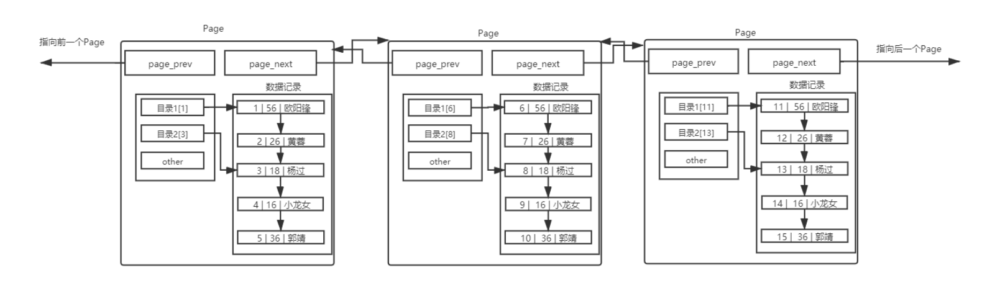
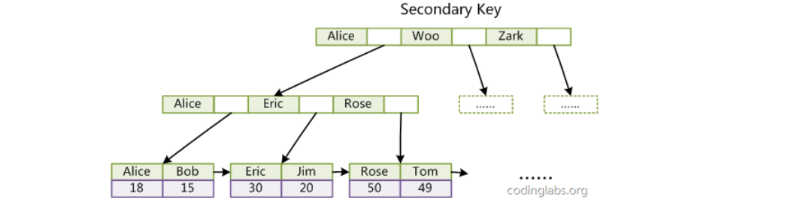

# MySQL索引

## 1.前置

> 索引：提高数据库的性能，索引是物美价廉的东西了。不用加内存，不用改程序，不用调sql，只要执行
> 正确的 `create index` ，查询速度就可能提高成百上千倍。但是天下没有免费的午餐，查询速度的提高
> 是以插入、更新、删除的速度为代价的，这些写操作，增加了大量的IO。所以它的价值，在于提高一个
> 海量数据的检索速度。  

**常见索引的分类：**

> 主键索引(primary key)
> 唯一索引(unique)
> 普通索引(index)
> 全文索引(fulltext)--解决中子文索引问题  

**如果没有索引会怎样：**

> 1. **查询性能下降：** 没有索引的情况下，数据库系统通常需要进行全表扫描来查找匹配的数据行。这会导致查询性能下降，特别是在大型数据集上。
>
> 2. **资源消耗增加：** 全表扫描需要更多的系统资源，包括CPU和内存。这可能会导致服务器负载增加，性能下降，并可能引发内存溢出等问题。
>
> 3. **数据一致性风险：** 没有索引可能导致数据一致性问题。如果查询没有快速地找到所需的数据，可能会导致应用程序获取到过时或不正确的数据。
>
> 4. **锁竞争增加：** 全表扫描可能导致更多的锁竞争，影响数据库的并发性能。在执行全表扫描时，可能会导致其他查询被阻塞，从而降低整体系统的响应速度。
>
> 5. **查询优化问题：** 数据库查询优化器通常会尝试使用索引来加速查询。如果没有适当的索引可用，查询优化器可能无法选择最有效的查询计划，从而导致性能下降。
>

## 2.数据库和磁盘的相关结论

> 我们现在已经能够在硬件层面定位，任何一个基本数据块了(扇区)。那么在系统软件上，就直接按照扇区
> (512字节，部分4096字节),进行IO交互吗？不是
>
> - 如果操作系统直接使用硬件提供的数据大小进行交互，那么系统的IO代码，就和硬件强相关，换言
>   之，如果硬件发生变化，系统必须跟着变化。
> - 从目前来看，单次IO 512字节，还是太小了。IO单位小，意味着读取同样的数据内容，需要进行多
>   次磁盘访问，会带来效率的降低。
> - 之前学习文件系统，就是在磁盘的基本结构下建立的，文件系统读取基本单位，就不是扇区，而是
>   数据块 (1k, 2k, 4k)。

故，系统读取磁盘，是以块为单位的，基本单位是 `4KB` .

**磁盘随机访问(Random Access)与连续访问(Sequential Access)**  

**随机访问：**本次IO所给出的扇区地址和上次IO给出扇区地址不连续，这样的话磁头在两次IO操作之间需要作比较大的移动动作才能重新开始读/写数据.

**连续访问：**如果当次IO给出的扇区地址与上次IO结束的扇区地址是连续的，那磁头就能很快的开始这次IO操作，这样的多个IO操作称为连续访问 .

因此尽管相邻的两次IO操作在同一时刻发出，但如果它们的请求的扇区地址相差很大的话也只能称为随机访问，而非连续访问  

磁盘是通过机械运动进行寻址的，随机访问不需要过多的定位，故效率比较高  

### 2.1数据库和磁盘交互的基本单位

而 `MySQL` 作为一款应用软件，可以想象成一种特殊的文件系统。它有着更高的IO场景，所以，为了提高基本的IO效率， `MySQL` 进行IO的基本单位是 16KB (后面统一使用 InnoDB 存储引擎讲解)  

```mysql
mysql> SHOW GLOBAL STATUS LIKE 'innodb_page_size';
+------------------+-------+
| Variable_name | Value |
+------------------+-------+
| Innodb_page_size | 16384 | -- 16*1024=16384
+------------------+-------+
1 row in set (0.01 sec)
```

也就是说，磁盘这个硬件设备的基本单位是 512 字节，而 MySQL InnoDB引擎 使用 16KB 进行IO交互。即， MySQL 和磁盘进行数据交互的基本单位是 16KB 。这个基本数据单元，在 MySQL 这里叫做**page**（注意和系统的page区分）  

### 2.2注解

> - `MySQL` 中的数据文件，是以**page**为单位保存在磁盘当中的。
> - `MySQL` 的 CURD 操作，都需要通过计算，找到对应的插入位置，或者找到对应要修改或者查询的数据。
> - 而只要涉及计算，就需要CPU参与，而为了便于CPU参与，一定要能够先将数据移动到内存当中。
> - 所以在特定时间内，数据一定是磁盘中有，内存中也有。后续操作完内存数据之后，以特定的刷新策略，刷新到磁盘。而这时，就涉及到磁盘和内存的数据交互，也就是IO了。而此时IO的基本单位就是Page。
> - 为了更好的进行上面的操作， MySQL 服务器在内存中运行的时候，在服务器内部，就申请了被称为 Buffer Pool 的的大内存空间，来进行各种缓存。其实就是很大的内存空间，来和磁盘数据进行IO交互。
> - 为何更高的效率，一定要尽可能的减少系统和磁盘IO的次数  

## 3.索引的理解

建立测试表  

```mysql
create table if not exists user (
id int primary key, --一定要添加主键哦，只有这样才会默认生成主键索引
age int not null,
name varchar(16) not null
);
mysql> show create table user \G
*************************** 1. row ***************************
Table: user
Create Table: CREATE TABLE `user` (
`id` int(11) NOT NULL,
`age` int(11) NOT NULL,
`name` varchar(16) NOT NULL,
PRIMARY KEY (`id`)
) ENGINE=InnoDB DEFAULT CHARSET=utf8 --默认就是InnoDB存储引擎
1 row in set (0.00 sec)
```

插入多条记录：

```mysql
--插入多条记录，注意，我们并没有按照主键的大小顺序插入哦
mysql> insert into user (id, age, name) values(3, 18, '杨过');
Query OK, 1 row affected (0.01 sec)
mysql> insert into user (id, age, name) values(4, 16, '小龙女');
Query OK, 1 row affected (0.00 sec)
mysql> insert into user (id, age, name) values(2, 26, '黄蓉');
Query OK, 1 row affected (0.01 sec)
mysql> insert into user (id, age, name) values(5, 36, '郭靖');
Query OK, 1 row affected (0.00 sec)
mysql> insert into user (id, age, name) values(1, 56, '欧阳锋');
Query OK, 1 row affected (0.00 sec)
```

**查看插入结果**

```mysql
mysql> select * from user;   -- 我们发现结果竟然是排好序的
+----+-----+-----------+
| id | age | name      |
+----+-----+-----------+
|  1 |  56 | 欧阳锋    |
|  2 |  26 | 黄蓉      |
|  3 |  18 | 杨过      |
|  4 |  16 | 小龙女    |
|  5 |  36 | 郭靖      |
+----+-----+-----------+
5 rows in set (0.00 sec)
```

 -- 为何IO交互是要以page为单位：

> - 为何MySQL和磁盘进行IO交互的时候，要采用Page的方案进行交互呢?用多少，加载多少不香吗?
> - 如上面的5条记录，如果MySQL要查找id=2的记录，第一次加载id=1，第二次加载id=2，一次一条记录，那
>   么就需要2次IO。如果要找id=5，那么就需要5次IO。
> - 但，如果这5条(或者更多)都被保存在一个Page中(16KB，能保存很多记录),那么第一次IO查找id=2的时候，整个Page会被加载到MySQL的Buffer Pool中，这里完成了一次IO。但是往后如果在查找id=1,3,4,5等，完全不需要进行IO了，而是直接在内存中进行了。所以，就在单Page里面，大大减少了IO的次数。
> - 你怎么保证，用户一定下次找的数据，就在这个Page里面？我们不能严格保证，但是有很大概率，因为有局部性原理。
> - 往往IO效率低下的最主要矛盾不是IO单次数据量的大小，而是IO的次数。  

**理解单个page**

`MySQL` 中要管理很多数据表文件，而要管理好这些文件，就需要 **先描述，在组织** ,我们目前可以简单理解成一个个独立文件是有一个或者多个Page构成的 .


不同的 Page ，在 MySQL 中，都是 16KB ，使用` prev `和 `next` 构成双向链表  

因为有主键的问题， MySQL 会默认按照主键给我们的数据进行排序，从上面的Page内数据记录可以看出，数据是有序且彼此关联的。 

```
为什么数据库在插入数据时要对其进行排序呢？我们按正常顺序插入数据不是也挺好的吗？
插入数据时排序的目的，就是优化查询的效率。
页内部存放数据的模块，实质上也是一个链表的结构，链表的特点也就是增删快，查询修改慢，所以优化查询
的效率是必须的。
正式因为有序，在查找的时候，从头到后都是有效查找，没有任何一个查找是浪费的，而且，如果运气好，是
可以提前结束查找过程的。
```

**理解多个Page**

> - 通过上面的分析，我们知道，上面页模式中，只有一个功能，就是在查询某条数据的时候直接将一整页的数据加载到内存中，以减少硬盘IO次数，从而提高性能。但是，我们也可以看到，现在的页模式内部，实际上是采用了链表的结构，前一条数据指向后一条数据，本质上还是通过数据的逐条比较来取出特定的数据。
> - 如果有1千万条数据，一定需要多个Page来保存1千万条数据，多个Page彼此使用双链表链接起来，而且每个Page内部的数据也是基于链表的。那么，查找特定一条记录，也一定是线性查找。这效率也太低了。



**页目录**

我们在看《谭浩强C程序设计》这本书的时候，如果我们要看<指针章节>，找到该章节有两种做法  

> - 从头逐页的向后翻，直到找到目标内容
> - 通过书提供的目录，发现指针章节在234页(假设)，那么我们便直接翻到234页。同时，查找目录的方案，可以顺序找，不过因为目录肯定少，所以可以快速提高定位
> - 本质上，书中的目录，是多花了纸张的，但是却提高了效率
> - 所以，目录，是一种“空间换时间的做法”  

**单页情况**

针对上面的单页Page，我们能否也引入目录呢？当然可以  


那么当前，在一个Page内部，我们引入了目录。比如，我们要查找id=4记录，之前必须线性遍历4次，才能拿到结果。现在直接通过目录2[3]，直接进行定位新的起始位置，提高了效率。现在我们可以再次正式回答上面的问题了，为何通过键值 MySQL 会自动排序？  ---->可以很方便引入目录 .

**多页情况**
MySQL 中每一页的大小只有 16KB ，单个Page大小固定，所以随着数据量不断增大， 16KB 不可能存下所有的数据，那么必定会有多个页来存储数据  .


在单表数据不断被插入的情况下， MySQL 会在容量不足的时候，自动开辟新的Page来保存新的数据，然后通过指针的方式，将所有的Page组织起来。 

需要注意，上面的图，是理想结构，大家也知道，目前要保证整体有序，那么新插入的数据，不一定会在新Page上面，这里仅仅做演示。
这样，我们就可以通过多个Page遍历，Page内部通过目录来快速定位数据。可是，貌似这样也有效率问题，在Page之间，也是需要 MySQL 遍历的，遍历意味着依旧需要进行大量的IO，将下一个Page加载到内存，进行线性检测。这样就显得我们之前的Page内部的目录，有点杯水车薪了。   

那么如何解决呢？解决方案，其实就是我们之前的思路，给Page也带上目录。

- 使用一个目录项来指向某一页，而这个目录项存放的就是将要指向的页中存放的最小数据的键值。
- 和页内目录不同的地方在于，这种目录管理的级别是页，而页内目录管理的级别是行。
- 其中，每个目录项的构成是：键值+指针。图中没有画全。  


存在一个目录页来管理页目录，目录页中的数据存放的就是指向的那一页中最小的数据。有数据，就可通过比较，找到该访问那个Page，进而通过指针，找到下一个Page .

其实目录页的本质也是页，普通页中存的数据是用户数据，而目录页中存的数据是普通页的地址。
可是，我们每次检索数据的时候，该从哪里开始呢？虽然顶层的目录页少了，但是还要遍历啊？不用担心，可以在加目录页.


这货就是传说中的B+树啊！没错，至此，我们已经给我们的表user构建完了主键索引。
随便找一个id=？我们发现，现在查找的Page数一定减少了，也就意味着IO次数减少了，那么效率也就提高了。

**复盘一下**    

- Page分为目录页和数据页。目录页只放各个下级Page的最小键值。
- 查找的时候，自定向下找，只需要加载部分目录页到内存，即可完成算法的整个查找过程，大大减少了IO次数。

  **`InnoDB` 在建立索引结构来管理数据的时候，其他数据结构为何不行？**  

- 查询速度
- 范围查找

> 1. **链表：** 链表的查询性能较差，因为在没有索引的情况下，需要遍历整个链表来查找目标数据，时间复杂度为O(n)，其中n是链表的长度。这种线性搜索方式在大型数据库中效率太低，无法满足快速检索的要求。
> 2. **二叉搜索树（BST）：** BST在理论上可以提供较快的查询性能（平均情况下为O(log n)），但在实际使用中存在问题。BST的性能高度依赖于树的平衡性，如果树严重不平衡，最坏情况下可能会退化为链表，导致查询性能下降。此外，BST没有直接支持范围查询的优势，需要进行额外的操作来处理范围查询。
> 3. **红黑树：** 红黑树是一种自平衡的二叉搜索树，相较于普通的BST，它能够更好地保持平衡，避免退化为链表的情况。虽然红黑树在理论上具有良好的性能，但在实际应用中，其节点的额外开销和维护平衡的复杂性可能会增加系统的负担。此外，红黑树也不直接支持范围查询。
> 4. **哈希表：** 哈希表通常用于快速查找和插入，其查询性能可以达到常数时间复杂度O(1)。然而，哈希表在范围查询和排序方面存在困难，因为哈希函数通常会将相邻的键映射到不同的哈希槽中，导致无法保持键的有序性。此外，哈希表的大小通常是固定的，当数据量增加时，可能需要重新调整哈希表的大小，这会引起额外的开销和系统维护的复杂性。

**B树？最值得比较的是 InnoDB 为何不用B树作为底层索引？**  

> 在讨论为何InnoDB不使用B树作为底层索引之前，让我们先了解一下B树和B+树的区别：
>
> 1. **B树（B-Tree）：** B树是一种自平衡的搜索树，它的每个节点可以拥有多个子节点。B树的节点通常存储有序的数据，并且保持平衡，这样可以确保在查找、插入和删除等操作中具有良好的性能。B树的每个节点通常存储大量的键值对。
>
> 2. **B+树（B+ Tree）：** B+树是B树的一种变体，与B树相比，它有一些重要的差异。首先，B+树的内部节点不存储数据，只存储键值对的索引，而实际数据都存储在叶子节点中。其次，B+树的叶子节点使用链表相连，形成了一个有序的数据链表。
>
> 现在来讨论为什么InnoDB选择使用B+树而不是B树作为底层索引结构：
>
> 1. **范围查询效率：** B+树在范围查询时非常高效，因为范围查询可以通过叶子节点之间的有序链表迅速定位。相比之下，B树需要在每个节点中搜索，效率较低。
>
> 2. **叶子节点的利用率：** 在B+树中，叶子节点存储了所有的数据，这样可以最大限度地利用叶子节点的存储空间，提高了存储密度和I/O效率。而在B树中，每个节点都存储数据，会导致节点的利用率低下。
>
> 3. **范围查询的易实现性：** 在B+树中，范围查询非常容易实现，只需要在叶子节点之间的有序链表上进行遍历即可。而在B树中，由于每个节点都存储数据，范围查询需要额外的操作来处理。
>
> 4. **磁盘I/O优化：** B+树的叶子节点形成了一个有序链表，这种结构可以利用磁盘预读来提高磁盘I/O效率。相比之下，B树的节点分散存储，无法充分利用磁盘预读的优势。
>
> 综上所述，虽然B树和B+树都是自平衡的搜索树，但在关系型数据库中，InnoDB选择使用B+树作为底层索引结构，主要是因为B+树能够更好地满足关系型数据库的需求，特别是在范围查询、磁盘I/O优化和存储密度等方面具有优势。

## 4.聚簇索引 VS 非聚簇索引  

> `MyISAM` 存储引擎-主键索引
> `MyISAM` 引擎同样使用B+树作为索引结果，叶节点的data域存放的是数据记录的地址。下图为 MyISAM
> 表的主索引， Col1 为主键
>
> 
>
> 其中， MyISAM 最大的特点是，将索引Page和数据Page分离，也就是叶子节点没有数据，只有对应数据的地址。
> 相较于 InnoDB 索引， InnoDB 是将索引和数据放在一起的。  
>
> ```mysql
> --终端A
> mysql> create database myisam_test; --创建数据库
> Query OK, 1 row affected (0.00 sec)
> mysql> use myisam_test;
> Database changed
> mysql> create table mtest(
> -> id int primary key,
> -> name varchar(11) not null
> -> )engine=MyISAM; --使用engine=MyISAM
> Query OK, 0 rows affected (0.01 sec)
> --终端B
> [root@VM-0-3-centos mysql]# ls myisam_test/ -al --mysql数据目录下
> total 28
> drwxr-x--- 2 mysql mysql 4096 Jun 13 13:33 .
> drwxr-x--x 13 mysql mysql 4096 Jun 13 13:32 ..
> -rw-r----- 1 mysql mysql 61 Jun 13 13:32 db.opt
> -rw-r----- 1 mysql mysql 8586 Jun 13 13:33 mtest.frm --表结构数据
> -rw-r----- 1 mysql mysql 0 Jun 13 13:33 mtest.MYD --该表对应的数据，当前没有数
> 据，所以是0
> -rw-r----- 1 mysql mysql 1024 Jun 13 13:33 mtest.MYI --该表对应的主键索引数据
> ```

其中， MyISAM 这种用户数据与索引数据分离的索引方案，叫做非聚簇索引 

> ```mysql
> --终端A
> mysql> create database innodb_test; --创建数据库
> Query OK, 1 row affected (0.00 sec)
> mysql> use innodb_test;
> Database changed
> mysql> create table itest(
> -> id int primary key,
> -> name varchar(11) not null
> -> )engine=InnoDB; --使用engine=InnoDB
> Query OK, 0 rows affected (0.02 sec)
> --终端B
> [root@VM-0-3-centos mysql]# ls innodb_test/ -al
> total 120
> drwxr-x--- 2 mysql mysql 4096 Jun 13 13:39 .
> drwxr-x--x 14 mysql mysql 4096 Jun 13 13:38 ..
> -rw-r----- 1 mysql mysql 61 Jun 13 13:38 db.opt
> -rw-r----- 1 mysql mysql 8586 Jun 13 13:39 itest.frm --表结构数据
> -rw-r----- 1 mysql mysql 98304 Jun 13 13:39 itest.ibd --该表对应的主键索引和用户
> 数据，虽然现在一行数据没有，但是该表并不为0，因为有主键索引数据
> ```
>
> 其中， InnoDB 这种用户数据与索引数据在一起索引方案，叫做聚簇索引
> 当然， MySQL 除了默认会建立主键索引外，我们用户也有可能建立按照其他列信息建立的索引，一般这种索引可以叫做辅助（普通）索引。
> 对于 MyISAM ,建立辅助（普通）索引和主键索引没有差别，无非就是主键不能重复，而非主键可重复。
> 下图就是基于 MyISAM 的 Col2 建立的索引，和主键索引没有差别  
>
> 

同样， InnoDB 除了主键索引，用户也会建立辅助（普通）索引，我们以上表中的 Col3 建立对应的辅助
索引如下图：  

> 
>
> 可以看到， InnoDB 的非主键索引中叶子节点并没有数据，而只有对应记录的key值。
> 所以通过辅助（普通）索引，找到目标记录，需要两遍索引：首先检索辅助索引获得主键，然后用主键到主索引中检索获得记录。这种过程，就叫做回表查询。
> 为何 InnoDB 针对这种辅助（普通）索引的场景，不给叶子节点也附上数据呢？原因就是太浪费空间了。

## 5.索引操作

### 5.1创建主键索引

- 第一种方式

  ```mysql
  -- 在创建表的时候，直接在字段名后指定 primary key
  create table user1(id int primary key, name varchar(30));
  ```

- 第二种方式

  ```mysql
  -- 在创建表的最后，指定某列或某几列为主键索引
  create table user2(id int, name varchar(30), primary key(id));
  ```

- 第三种方式

  ```mysql
  create table user3(id int, name varchar(30));
  -- 创建表以后再添加主键
  alter table user3 add primary key(id);
  ```

主键索引的特点：

- 一个表中，最多有一个主键索引，当然可以使符合主键
- 主键索引的效率高（主键不可重复）
- 创建主键索引的列，它的值不能为null，且不能重复
- 主键索引的列基本上是int 

### 5.2唯一索引的创建

- 第一种方式

  ```mysql
  -- 在表定义时，在某列后直接指定unique唯一属性。
  create table user4(id int primary key, name varchar(30) unique);
  ```

- 第二种方式

  ```mysql
  -- 创建表时，在表的后面指定某列或某几列为unique
  create table user5(id int primary key, name varchar(30), unique(name));
  ```

- 第三种方式

  ```mysql
  create table user6(id int primary key, name varchar(30)）；
  alter table user6 add unique(name);
  ```

  **唯一键索引的特点：**

  - 一个表中可以有多个唯一索引
  - 查询效率高
  - 如果在某一列建立唯一索引，必须保证这列不能有重复数据  
  - **如果一个唯一索引上指定not null，等价于主键索引**

### 5.3普通索引的创建

- 第一种方式

  ```mysql
  create table user8(id int primary key,
  name varchar(20),
  email varchar(30),
  index(name) --在表的定义最后，指定某列为索引
  );
  ```

- 第二种方式

  ```mysql
  create table user9(id int primary key, name varchar(20), email
  varchar(30));
  alter table user9 add index(name); --创建完表以后指定某列为普通索引
  ```

- 第三种方式

  ```mysql
  create table user10(id int primary key, name varchar(20), email
  varchar(30));
  -- 创建一个索引名为 idx_name 的索引
  create index idx_name on user10(name);
  ```

普通索引的特点：

- 一个表中可以有多个普通索引，普通索引在实际开发中用的比较多  
- 如果某列需要创建索引，但是该列有重复的值，那么我们就应该使用普通索引  

### 5.4全文索引

当对文章字段或有大量文字的字段进行检索时，会使用到全文索引。MySQL提供全文索引机制，但是有要求，**要求表的存储引擎必须是MyISAM**，**而且默认的全文索引支持英文，不支持中文**。如果对中文进行全文检索，可以使用sphinx的中文版(coreseek) .

```mysql
CREATE TABLE articles (
id INT UNSIGNED AUTO_INCREMENT NOT NULL PRIMARY KEY,
title VARCHAR(200),
body TEXT,
FULLTEXT (title,body)
)engine=MyISAM;
```

```mysql
INSERT INTO articles (title,body) VALUES
('MySQL Tutorial','DBMS stands for DataBase ...'),
('How To Use MySQL Well','After you went through a ...'),
('Optimizing MySQL','In this tutorial we will show ...'),
('1001 MySQL Tricks','1. Never run mysqld as root. 2. ...'),
('MySQL vs. YourSQL','In the following database comparison ...'),
('MySQL Security','When configured properly, MySQL ...');
```

- 查询有没有database数据

如果使用如下查询方式，虽然查询出数据，但是没有使用到全文索引  

```mysql
mysql> select * from articles where body like '%database%';
+----+-------------------+------------------------------------------+
| id | title             | body                                     |
+----+-------------------+------------------------------------------+
|  1 | MySQL Tutorial    | DBMS stands for DataBase ...             |
|  5 | MySQL vs. YourSQL | In the following database comparison ... |
+----+-------------------+------------------------------------------+
2 rows in set (0.00 sec)
```

可以用explain工具看一下，是否使用到索引  

```mysql
mysql> explain select * from articles where body like '%database%'\G;
*************************** 1. row ***************************
           id: 1
  select_type: SIMPLE
        table: articles
   partitions: NULL
         type: ALL
possible_keys: NULL
          key: NULL    -- <=== Key为NULL表示没有使用索引
      key_len: NULL
          ref: NULL
         rows: 6
     filtered: 16.67
        Extra: Using where
1 row in set, 1 warning (0.00 sec)
```

- 如何使用全文索引呢？  

```mysql
mysql> select * from articles where match(title, body) against ('database');
+----+-------------------+------------------------------------------+
| id | title             | body                                     |
+----+-------------------+------------------------------------------+
|  5 | MySQL vs. YourSQL | In the following database comparison ... |
|  1 | MySQL Tutorial    | DBMS stands for DataBase ...             |
+----+-------------------+------------------------------------------+
```

通过explain来分析这个sql语句  

```mysql
mysql> explain select * from articles where match(title, body) against ('database')\G;
*************************** 1. row ***************************
           id: 1
  select_type: SIMPLE
        table: articles
   partitions: NULL
         type: fulltext   -- << 采用了全文索引
possible_keys: title
          key: title
      key_len: 0
          ref: const
         rows: 1
     filtered: 100.00
        Extra: Using where
1 row in set, 1 warning (0.00 sec)
```


### 5.5查看索引

- 第一种方法： show keys from 表名  

  ```mysql
  mysql> show keys from goods\G
  *********** 1. row ***********
  Table: goods <= 表名
  Non_unique: 0 <= 0表示唯一索引
  Key_name: PRIMARY <= 主键索引
  Seq_in_index: 1
  Column_name: goods_id <= 索引在哪列
  Collation: A
  Cardinality: 0
  Sub_part: NULL
  Packed: NULL
  Null:
  Index_type: BTREE <= 以二叉树形式的索引
  Comment:
  1 row in set (0.00 sec)
  ```

- 第二种方法: `show index from 表名;  `

- 第三种方法（信息比较简略）： `desc 表名；` 

### 5.6删除索引

- 第一种方法-删除主键索引： `alter table` 表名 `drop primary key;`  
- 第二种方法-其他索引的删除： `alter table 表名 drop index 索引名；` 索引名就是show keys
  from 表名中的 Key_name 字段  
- 第三种方法方法： `drop index 索引名 on 表名;` 

**索引创建原则**  

- 比较频繁作为查询条件的字段应该创建索引  
- 唯一性太差的字段不适合单独创建索引，即使频繁作为查询条件  
- 更新非常频繁的字段不适合作创建索引  
- 不会出现在where子句中的字段不该创建索引  

## 其他概念

复合索引
索引最左匹配原则
索引覆盖  


