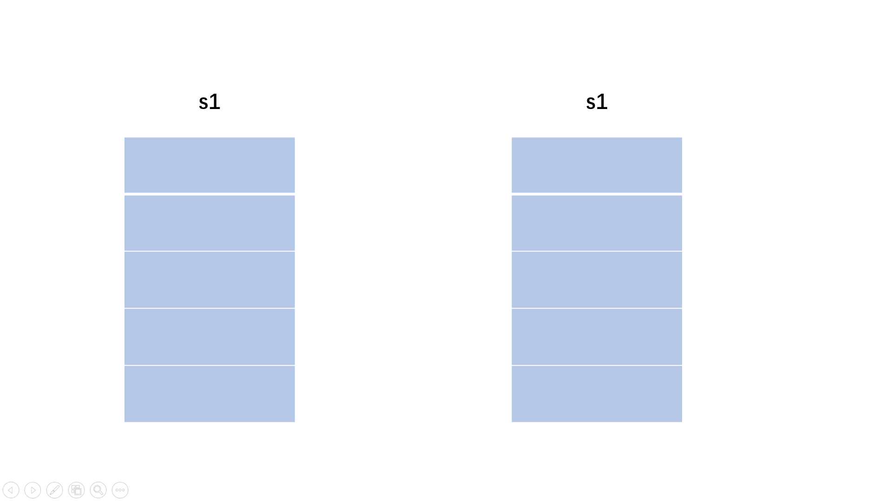

# 牛客热题：包含min函数的栈

## 题目链接

[包含min函数的栈_牛客题霸_牛客网 (nowcoder.com)](https://www.nowcoder.com/practice/4c776177d2c04c2494f2555c9fcc1e49?tpId=295&tqId=23268&ru=/exam/oj&qru=/ta/format-top101/question-ranking&sourceUrl=%2Fexam%2Foj)

## 方法一：单调栈

### 思路

- 一个栈`s1`用来存放数据

- 另一个栈`s2`维护一个单调栈，用于实现常数级的min查询

  如何维护：

  入栈：

  ​	    判断当前的值和s2的栈顶的数据比较，

  ​		如果该值小就将其同时入栈给两个栈

  ​		否则，只入栈给第一个栈`s1`，而第二个栈将自己的栈顶数据重入一遍。

  出栈：

  ​		两个栈同时出栈即可



### 代码

```cpp
#include <vector>
class Solution 
{

public:
    stack<int> s1;
    stack<int> s2;
    void push(int value) 
    {
        s1.push(value);
        if(s2.empty() || s2.top() > value)
        {
            s2.push(value);
        }
        else 
        {
            s2.push(s2.top());
        }
    }
    void pop() 
    {
        s1.pop();
        s2.pop();
    }
    int top() 
    {
        return s1.top();
    }
    int min() 
    {
        return s2.top();
    }
};
```

### 复杂度

> 时间复杂度：O(1), 所有的请求均以O(1)的方式实现
>
> 空间复杂度：O(N), 使用了两个栈空间

---

思路来自牛客大佬题解