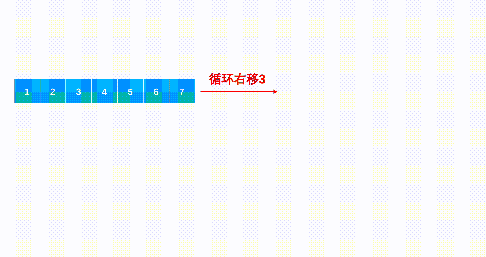

# 牛客热题：旋转数组

## 题目链接

[旋转数组_牛客题霸_牛客网 (nowcoder.com)](https://www.nowcoder.com/practice/e19927a8fd5d477794dac67096862042?tpId=295&tqId=1024689&ru=/exam/oj&qru=/ta/format-top101/question-ranking&sourceUrl=%2Fexam%2Foj)

## 方法一：实现移动一次的方法，然后移动m次

### 思路

我们先实现移动一次的方式，然后调用m次的这样的方式即可

### 代码

```cpp
void swap(int& a, int& b)
    {
        int temp = a;
        a = b;
        b = temp;
    }
    vector<int> solve(int n, int m, vector<int>& a) 
    {

        m = m % n;
        for(int j = 0; j < m; ++j)
        {
            int temp = a[0];
            a[0] = a[n - 1];
            for(int i = 1; i < n; ++i)
            {
                swap(a[i], temp);
            }
        }
        
        return a;
    }
```

### 复杂度

> 时间复杂度：$O(n ^ 2)$, 最差情况下接近$n ^ 2$
>
> 空间复杂度：O(1), 只用了一个额外的temp变量

## 方法二：旋转三次

### 思路

step1:先将对应的m进行取模，因为m可能会大于n

step2:将整个数组进行反转

step3:将前m个进行反转

step4:将后n - m个进行反转



### 代码

```cpp
vector<int> solve(int n, int m, vector<int>& a) 
    {
        m = m % n;

        //1.整体反转
        reverse(a.begin(), a.end());

        //2.反转前m个
        reverse(a.begin(), a.begin() + m);

        //3.反转后n - m个
        reverse(a.begin() + m, a.end());


        return a;
    }
```

### 复杂度

> 时间复杂度：$O(N)$利用了三次旋转，每次旋转的时间复杂度是O(N)
>
> 空间复杂度：O(1), 没有使用额外的变量