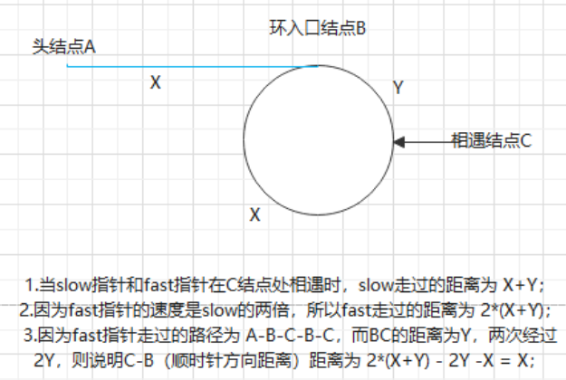

# 牛客热题：**链表中环的入口结点**

## 题目链接

[链表中环的入口结点_牛客题霸_牛客网 (nowcoder.com)](https://www.nowcoder.com/practice/253d2c59ec3e4bc68da16833f79a38e4?tpId=295&tqId=23449&ru=/exam/oj&qru=/ta/format-top101/question-ranking&sourceUrl=%2Fexam%2Foj)

## 方法一：哈希表

### 思路

- 遍历链表，然后将每一个节点的地址存储在哈希表
- 当我们遇到已经被遍历过的节点，那么我们认为这个节点就是对应的环的入口

### 代码

```cpp
class Solution {
public:
    ListNode* EntryNodeOfLoop(ListNode* pHead) 
    {
        unordered_set<ListNode*> hash;

        while(pHead != nullptr)
        {
            if(hash.count(pHead)) return pHead;
            else hash.insert(pHead);
            pHead = pHead->next;
        }

        return nullptr;
    }
};
```

### 复杂度

> - **时间复杂度：**O(N), 遍历了一次链表
> - **空间复杂度：**O(N), 创建了一个哈希表，这个哈希表的最大大小也就是链表的长度

## 方法二：快慢指针

### 思路

> 通过定义slow和fast指针，slow每走一步，fast走两步，若是有环，则一定会在环的某个结点处相遇（slow == fast），根据下图分析计算，可知从`相遇处到入口结点的距离`与`头结点与入口结点的距离`相同
>
> 
>
### 代码

```cpp
class Solution {
public:
    ListNode* EntryNodeOfLoop(ListNode* pHead) 
    {
        if(pHead == nullptr) return pHead;
        ListNode* l = pHead;
        ListNode* r = pHead;

        while(r != nullptr && r->next != nullptr)
        {
            //快指针走两步，慢指针走一步
            r = r->next->next;
            l = l->next;
            if(l == r) break;
        }
        //不存在环的情况
        if(r == nullptr || r->next == nullptr) return nullptr;
        
        //重新指向链表头部
        r = pHead;
        //与第一次相遇的节点相同的速度出发,相遇的节点为入口节点
        while(l != r)
        {
            l = l->next;
            r = r->next;
        }
        return r;
    }
};
```

### 复杂度
> - **时间复杂度：**O(N), 遍历了一次链表
> - **空间复杂度：**O(1), 创建了两个指针