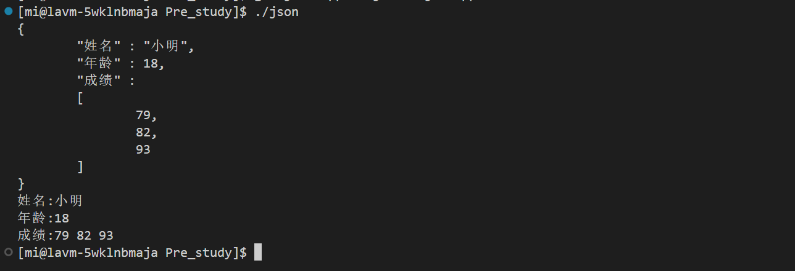

# 云备份day02

## 1.Json库的使用

在现代软件开发中，数据的交换与处理是不可或缺的一环，尤其是在多平台、多语言的环境下。这里，我们要探讨的是JSONCPP —— 一个处理JSON数据的C++库，它提供了一套丰富的API来解析、构造、操作和序列化JSON数据。让我们从头开始，逐步深入了解JSONCPP的使用。

### 1.1JSON与JSONCPP简介

**JSON（JavaScript Object Notation）**是一种轻量级的数据交换格式。它基于文本，易于人类阅读和编写，同时也易于机器解析和生成。JSON主要用于存储和交换文本信息，格式简洁明了，具有良好的自描述性，因此被广泛应用于Web API、配置文件和数据库之间的数据交换。

**JSONCPP**是一个在C++中处理JSON数据的库，它提供了强大的功能，包括读取JSON数据、写入JSON数据、数据操作和查询等。通过JSONCPP，开发者可以在C++项目中轻松地实现复杂的JSON数据处理任务。

### 1.2安装JSONCPP

在开始使用JSONCPP之前，首先需要将其集成到你的C++项目中。JSONCPP可以通过多种方式安装，包括源码编译、包管理器（如vcpkg、apt-get）或直接在某些IDE中添加依赖。

```bash
# 例如，使用apt-get在Ubuntu中安装JSONCPP
sudo apt-get install libjsoncpp-dev
```

### 1.3JSONCPP的基本使用

在JSONCPP中，`Json::Value`是最核心的类，它代表了JSON数据中的任意元素，无论是一个对象、数组还是基本数据类型。接下来，我们将通过一些基本示例来了解如何使用JSONCPP进行JSON数据的读取和写入。

#### 1.3.1读取JSON数据

假设我们有一个JSON字符串，我们想要解析它并访问其中的数据。

```cpp
#include <json/json.h>
#include <iostream>

int main() {
    std::string strJson = R"({
        "name": "John Doe",
        "age": 30,
        "is_student": false,
        "skills": ["C++", "Python", "JavaScript"]
    })";

    Json::Value root;   
    Json::Reader reader;
    bool parsingSuccessful = reader.parse(strJson, root);
    if (!parsingSuccessful) {
        std::cout << "Failed to parse JSON" << std::endl;
        return 1;
    }

    std::string name = root["name"].asString();
    int age = root["age"].asInt();
    bool isStudent = root["is_student"].asBool();
    std::cout << "Name: " << name << ", Age: " << age << ", Is Student: " << isStudent << std::endl;

    const Json::Value skills = root["skills"];
    for (int index = 0; index < skills.size(); ++index) {
        std::cout << "Skill " << index + 1 << ": " << skills[index].asString() << std::endl;
    }

    return 0;
}
```

#### 1.3.2写入JSON数据

创建和修改JSON数据同样简单。我们可以通过操作`Json::Value`对象来构建一个JSON结构。

```cpp
#include <json/json.h>
#include <iostream>

int main() {
    Json::Value root;
    root["name"] = "Jane Doe";
    root["age"] = 25;
    root["is_student"] = true;
    root["skills"].append("C++");
    root["skills"].append("Python");
    root["skills"].append("JavaScript");

    Json::StreamWriterBuilder builder;
    const std::unique_ptr<Json::StreamWriter> writer(builder.newStreamWriter());
    writer->write(root, &std::cout);
    std::cout << std::endl;

    return 0;
}
```

接下来我们将详细介绍：

### 1.4json的数据对象类

```cpp
//Json数据对象类
class Json::Value{
	Value &operator=(const Value &other); //Value重载了[]和=，因此所有的赋值和获取数据都可以通过
	Value& operator[](const std::string& key);//简单的方式完成 val["姓名"] = "小明";
	Value& operator[](const char* key);
	Value removeMember(const char* key);//移除元素
	const Value& operator[](ArrayIndex index) const; //val["成绩"][0]
	Value& append(const Value& value);//添加数组元素val["成绩"].append(88);
	ArrayIndex size() const;//获取数组元素个数 val["成绩"].size();
	std::string asString() const;//转string string name = val["name"].asString();
	const char* asCString() const;//转char* char *name = val["name"].asCString();
	Int asInt() const;//转int int age = val["age"].asInt();
	float asFloat() const;//转float
	bool asBool() const;//转 bool
};

//json序列化类，低版本用这个更简单
class JSON_API Writer 
{
	virtual std::string write(const Value& root) = 0;
}
class JSON_API FastWriter : public Writer 
{
	virtual std::string write(const Value& root);
}
class JSON_API StyledWriter : public Writer 
{
	virtual std::string write(const Value& root);
}
//json序列化类，高版本推荐，如果用低版本的接口可能会有警告
class JSON_API StreamWriter 
{
	virtual int write(Value const& root, std::ostream* sout) = 0;
}
class JSON_API StreamWriterBuilder : public StreamWriter::Factory 
{
	virtual StreamWriter* newStreamWriter() const;
}
//json反序列化类，低版本用起来更简单
class JSON_API Reader 
{
	bool parse(const std::string& document, Value& root, bool collectComments = true);
}
//json反序列化类，高版本更推荐
class JSON_API CharReader 
{
	virtual bool parse(char const* beginDoc, char const* endDoc,
	Value* root, std::string* errs) = 0;
}
class JSON_API CharReaderBuilder : public CharReader::Factory 
{
	virtual CharReader* newCharReader() const;
}
```

#### 1.4.1 Json::Value
`Json::Value` 是JsonCpp库中的核心类，用于表示JSON数据的所有可能类型：null、布尔值、整数、实数（浮点数）、字符串、数组和对象。

```cpp
#include <json/json.h>
#include <string>
#include <iostream>

int main() {
    // 创建一个Json::Value对象
    Json::Value data;

    // 通过不同方式设置值
    data["integer"] = 1;  // 整数
    data["float"] = 1.1;  // 浮点数
    data["string"] = "example";  // 字符串
    data["boolean"] = true;  // 布尔值
    data["array"] = Json::arrayValue;  // 数组
    data["array"].append(1);  // 向数组中添加元素
    data["array"].append("two");
    data["object"] = Json::objectValue;  // 对象
    data["object"]["key"] = "value";  // 向对象中添加键值对

    // 打印生成的JSON字符串
    std::cout << data.toStyledString() << std::endl;

    return 0;
}
```

#### 1.4.2 Json::Reader
`Json::Reader` 类用于将JSON格式的字符串解析为 `Json::Value` 对象。这对于读取JSON数据非常有用。

```cpp
#include <json/json.h>
#include <string>
#include <iostream>

int main() {
    std::string str = "{\"age\": 25, \"name\": \"John\"}";

    Json::Value root;
    Json::Reader reader;

    bool parsingSuccessful = reader.parse(str, root);
    if (parsingSuccessful) {
        std::cout << "Name: " << root["name"].asString() << std::endl;
        std::cout << "Age: " << root["age"].asInt() << std::endl;
    } else {
        std::cerr << "Failed to parse JSON" << std::endl;
    }

    return 0;
}
```

#### 1.4.3Json::Writer
`Json::Writer` 是一个抽象基类，定义了将 `Json::Value` 对象转换成JSON格式字符串的接口。`Json::FastWriter`、`Json::StyledWriter` 和 `Json::StyledStreamWriter` 是继承自 `Json::Writer` 的具体实现类，用于生成不同风格的JSON字符串。

由于JsonCpp的较新版本推荐使用 `Json::Value` 自带的 `toStyledString` 方法直接生成字符串，`Json::Writer` 及其派生类的使用变得不那么常见。不过，如果需要更复杂的定制化输出，这些类仍然很有用。

```cpp
#include <json/json.h>
#include <string>
#include <iostream>

int main() {
    Json::Value root;
    root["action"] = "run";
    root["data"]["value"] = 10;

    // 使用StyledWriter生成格式化的JSON字符串
    Json::StyledWriter writer;
    std::string output = writer.write(root);

    std::cout << output << std::endl;

    return 0;
}
```

以上代码提供了使用JsonCpp处理JSON数据的基本方法，包括创建和操作JSON对象、解析JSON字符串和生成JSON字符串。

### 1.5json序列化和反序列化的例子

```cpp
#include<iostream> // 引入标准输入输出流库，用于控制台输入输出。
#include<sstream> // 引入字符串流库，用于在内存中读写字符串。
#include<memory> // 引入智能指针库，提供对智能指针如 unique_ptr 的支持。
#include<string> // 引入字符串库，支持string类型的操作。
#include<jsoncpp/json/json.h> // 引入JsonCpp库，用于处理JSON数据的序列化与反序列化。
#include<cstring> // 引入字符串处理库。

using namespace std; // 使用标准命名空间，避免每次调用标准库时都需要前缀 std::。

int main() // 主函数，程序的入口点。
{
    const char* name = "小明"; // 定义常量字符指针，指向姓名字符串。
    int age = 18; // 定义整数变量，表示年龄。
    int score[] = {79, 82, 93}; // 定义整型数组，存储三个成绩。

    Json::Value rootw; // 创建Json::Value对象，用作JSON的根节点。

    rootw["姓名"] = name; // 向JSON对象添加“姓名”字段。
    rootw["年龄"] = age; // 向JSON对象添加“年龄”字段。
    // 循环添加成绩到JSON的“成绩”数组中。
    rootw["成绩"].append(score[0]);
    rootw["成绩"].append(score[1]);
    rootw["成绩"].append(score[2]);

    // 序列化JSON对象。
    Json::StreamWriterBuilder swb; // 创建StreamWriterBuilder对象，用于构建StreamWriter。
    unique_ptr<Json::StreamWriter> sw(swb.newStreamWriter()); // 使用StreamWriterBuilder创建StreamWriter的unique_ptr。
    stringstream ss; // 创建一个stringstream对象，用作序列化的输出缓冲区。
    sw->write(rootw, &ss); // 使用StreamWriter将JSON对象序列化到stringstream。

    cout << ss.str() << endl; // 将序列化的JSON字符串输出到控制台。

    // 定义一个JSON字符串。
    string str = R"({"姓名" : "小明","年龄" : 18,"成绩" : [79, 82, 93]})";

    Json::Value rootr; // 创建用于反序列化的Json::Value对象。
    Json::CharReaderBuilder crb; // 创建CharReaderBuilder对象。
    string err; // 定义字符串以存储可能的错误信息。
    unique_ptr<Json::CharReader> cr(crb.newCharReader()); // 使用CharReaderBuilder创建CharReader的unique_ptr。
    // 尝试解析JSON字符串。
    bool ret = cr->parse(str.c_str(), str.c_str() + str.size(), &rootr, &err);
    if(ret == false) // 检查解析是否成功，这里有个逻辑错误，应该使用==比较。
    {
        cout << err << endl; // 如果解析失败，输出错误信息。
        return -1; // 并结束程序。
    }

    // 如果解析成功，输出解析得到的数据。
    cout << "姓名:" << rootr["姓名"].asString() << endl;
    cout << "年龄:" << rootr["年龄"].asInt() << endl;

    int sz = rootr["成绩"].size(); // 获取成绩数组的大小。
    cout << "成绩:";
    for(int i = 0; i < sz; ++i) cout << rootr["成绩"][i] << " "; // 循环输出每一项成绩。

    puts(""); // 输出换行。
    return 0; // 程序正常结束。
}

```



## 2.bundle文件压缩库的使用

Bundle是一个嵌入式C++压缩库，支持多种压缩算法和档案格式。设计上追求高压缩比和快速解压速度，可配置，且兼容C++03及C++11的可选特性。该库支持多种流和档案格式，如.bun和.zip，包括DEFLATE、LZMA、ZPAQ、LZ4、ZSTD、BROTLI等23种压缩算法。项目采用Zlib许可证，是一种宽松的使用许可。更多详情可以参考其[GitHub仓库](https://github.com/r-lyeh-archived/bundle)。

### 2.1尝试使用bundle库来实现文件的压缩

> 注意我们先将`bundle.cpp`和`bundle.h`都移动到当前的目录下，然后在编译的时候要连接`pthread`库.

```cpp
#include<iostream>
#include<string>
#include<fstream>

#include"bundle.h"

using namespace std;

void Usage(char* argv[])
{
    cout << "Usage:" << argv[0] << " origin_file " << "Zip_file" << endl;
}

int main(int argc, char* argv[])
{
    if(argc != 3) 
    {
        Usage(argv);
        return -1;
    }

    string ifilename = argv[1];
    string ofilename = argv[2];

    ifstream ifs;
    ifs.open(ifilename, ios::binary);
    ifs.seekg(0, ios::end); 
    size_t fsz = ifs.tellg();
    ifs.seekg(0, ios::beg);
    string body;
    body.resize(fsz);
    ifs.read(&body[0], fsz);

    string packed = bundle::pack(bundle::LZIP, body);

    ofstream ofs;
    ofs.open(ofilename, ios::binary);
    ofs.write(&packed[0], packed.size());

    ifs.close();
    ofs.close();
    return 0;
}
```

压缩后的效果：其中`b.cpp`被压缩为`b.cpp.lz`

```bash
[mi@lavm-5wklnbmaja Pre_study]$ ls -lh
total 15M
-rw-rw-r-- 1 mi mi 5.4M Apr  2 19:54 b.cpp
-rw-rw-r-- 1 mi mi 668K Apr  2 19:55 b.cpp.lz
-rw-rw-r-- 1 mi mi 5.4M Apr  2 19:51 bundle.cpp
-rw-rw-r-- 1 mi mi  29K Apr  2 19:32 bundle.h
-rwxrwxr-x 1 mi mi 3.2M Apr  2 19:53 compress
-rw-rw-r-- 1 mi mi  790 Apr  2 19:56 compress.cpp
-rw-rw-r-- 1 mi mi 3.0K Apr  2 19:06 JsonTest.cpp
```

### 2.2使用bundle库来实现文件的解压缩

```cpp
#include<iostream>   // 包含输入输出库
#include<string>     // 包含字符串库
#include<fstream>    // 包含文件操作库
#include"bundle.h"  // 包含定义的bundle库
using namespace std;
// 用于在参数数量不正确时显示正确的使用方式
void Usage(char* argv[])
{
    // 输出正确的使用方式
    cout << \"Usage:\" << argv[0] << \" Zip_file \" << \"UnZip_file\" << endl;
}
int main(int argc, char* argv[])
{
    // 如果参数数量不正确，显示使用方法并返回错误码
    if(argc != 3) 
    {
        Usage(argv);
        return -1;
    }
    // 获取压缩和解压文件的名字
    string ifilename = argv[1];
    string ofilename = argv[2];
    ifstream ifs;  // 创建一个ifstream 对象
    ifs.open(ifilename, ios::binary); // 以二进制方式打开压缩文件
    ifs.seekg(0, ios::end);  // 获取压缩文件的大小
    size_t fsize = ifs.tellg();
    ifs.seekg(0, ios::beg);  // 回到文件开头
    string body;
    body.resize(fsize);    // 将压缩文件的内容读入内存
    ifs.read(&body[0], fsize); // 读取文件内容
    ifs.close(); // 关闭压缩文件
    // 使用bundle库的unpack函数解压文件内容
    string unpacked = bundle::unpack(body);
    ofstream ofs;     // 创建一个ofstream 对象
    ofs.open(ofilename, ios::binary); //以二进制方式打开解压文件
    ofs.write(&unpacked[0], unpacked.size()); // 将解压后的内容写入解压文件
    // 关闭解压文件
    ofs.close();
    //主函数返回值
    return 0;
}

```

