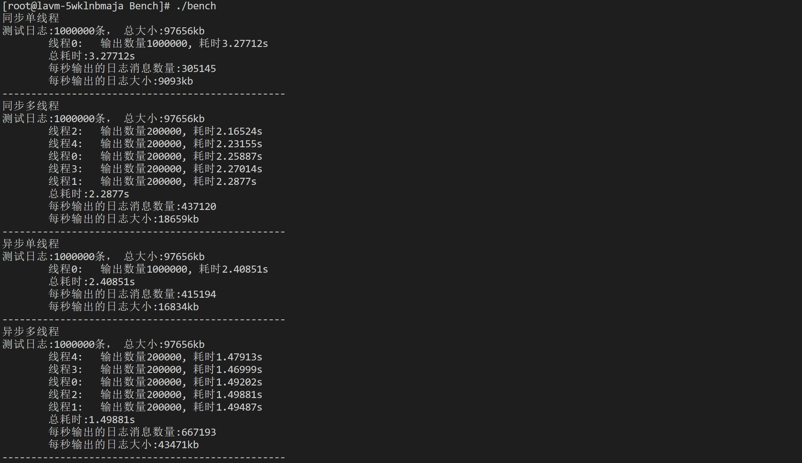

# C++基于多设计模式下的同步&异步日志系统day7（终）

## 1.项目目录结构梳理

- Example

  用于存储我们的样例代码文件

- Extend

  存储我们的拓展代码文件

- Logs

  存储项目的所有的头文件

- `PreSturdy`

  项目前期需要补充学习的代码内容文件


## 2.项目性能测试代码的设计和实现

测试三要素：①测试环境②测试方法③测试结果

### 2.1测试工具的编写

①可以控制写日志线程数量

②可以控制写日志的总数量

③分别对同步/异步日志器，进行性能测试

- 需要测试单写日志线程的性能
- 需要测试多写日志线程的性能

**实现**

- 封装一个接口，传入日志器名称，以及线程数量，以及日志数量，单条日志大小
- 在接口内，创建指定数量的线程，各自负责一部分日志的输出
- 在输出之前开始计时，在输出结束之后计时结束，所耗时间 = 结束时间 - 起始时间
- 每秒输出量 = 总日志数 / 总时间
- 每秒输出大小 = 日志数量 * 单个日志大小 / 总耗时

注意：异步日志输出这里，我们采用非安全模式，纯内存写入（不考虑实际落地的时间）

```cpp
#include"../Logs/xupt.h"

#include<vector>
#include<thread>
#include<chrono>

void bench(const std::string& logger_name, size_t thread_count, size_t msg_count, size_t msg_len)
{
    //1.获取日志器
    xupt::Logger::ptr logger = xupt::getLogger(logger_name);
    if(logger.get() == nullptr)  //获取日志器失败
    {
        return ;
    }
    std::cout << "测试日志:" << msg_count << "条， 总大小:" << msg_count * msg_len / 1024 <<"kb" << std::endl;
    //2.组织指定长度的日志消息
    std::string msg(msg_len - 1, 'A');  //这里长度减一是为了后续占用一个换行符
    //3.创建指定数量的线程
    std::vector<std::thread> threads;
    int msg_per_thr = msg_count / thread_count;
    std::vector<double> cost_arry(thread_count);  //存储每个线程消耗的时间
    for(size_t i = 0; i < thread_count; ++i)
    {
        threads.emplace_back([&, i]()
        {
            //4.线程函数内部开始计时
            auto start = std::chrono::high_resolution_clock::now();
            //5.开始循环写日志
            for(int j = 0; j < msg_per_thr; ++j)
            {
                logger->fatal("%s", msg.c_str());
            }
            //6.线程函数内部结束计时
            auto end = std::chrono::high_resolution_clock::now();
            std::chrono::duration<double> cost = end - start;
            cost_arry[i] = cost.count(); //将每次的线程耗时存储在数组中，以备计算总耗时
            std::cout <<"\t线程" << i << ": " << "\t 输出数量" << msg_per_thr << ", 耗时" << cost.count() << "s" << std::endl;
        });
    }
    for(int i = 0; i < thread_count; ++i)
    {
        threads[i].join();
    }
    //7.计算总耗时
    double max_cost = cost_arry[0];
    for(int i = 0; i < thread_count; ++i) max_cost = max_cost < cost_arry[i] ? cost_arry[i] : max_cost;
    size_t msg_per_sec = msg_count / max_cost; //每秒输出的日志消息数量
    size_t size_per_sec = (msg_per_sec * msg_len) / (max_cost * 1024);//每秒输出的kb数
    //8.进行输出打印
    std::cout << "\t总耗时:" << max_cost << "s" << std::endl;
    std::cout << "\t每秒输出的日志消息数量:" << msg_per_sec << std::endl;
    std::cout << "\t每秒输出的日志大小:" << size_per_sec << "kb"<<std::endl;
}


void sync_bench()
{
    std::unique_ptr<xupt::LoggerBuilder> builder(new xupt::GlobalLoggerBuilder());
    builder->buildLoggerName("sync_logger");
    builder->buildLoggerType(xupt::LoggerType::LOGGER_SYNC);
    builder->buildFomatter("%m%n");
    builder->buildSink<xupt::FileSink>("./logfile/sync.log");
    builder->build();    
    bench("sync_logger", 3, 1000000, 100);
}

void async_bench()
{
    std::unique_ptr<xupt::LoggerBuilder> builder(new xupt::GlobalLoggerBuilder());
    builder->buildLoggerName("async_logger");
    builder->buildLoggerType(xupt::LoggerType::LOGGER_ASYNC);
    builder->buildFomatter("%m%n");
    builder->buildEnableUnsafeAsync(); //开启非安全模式---为了将实际落地时间排除在外
    builder->buildSink<xupt::FileSink>("./logfile/async.log");
    builder->build();    
    bench("async_logger", 5, 1000000, 100);
}

int main()
{
    //sync_bench();
    async_bench();
    return 0;
}
```

### 2.2测试

我们分别在云服务器和本地的虚拟器上进行测试，分别测试同步单线程，同步多线程，异步单线程，异步多线程

云服务器环境：

- CPU：2核
- 内存：2GB

本地虚拟机环境：

- CPU：AMDRyzen5 5600H withRadeonGraphics3.30GHz
- RAM：16GDDR4 3200
- ROM：512G-SSD
- OS：CentOS7虚拟机（4CPU核⼼/2G内存）  

#### ①云服务器环境下：



#### ②本地虚拟机：


我们可以看出本地虚拟机的同步单线程的优势比云服务器的同步单线程优势大很多，那么证明本地的虚拟机串行执行的速度相对较快

但是我们观察的到同步不管是多线程还是单线程虚拟机都是比云服务器强很多的，但是异步不管是多线程还是单线程都比云服务器慢一些。

因为异步的方式是不包含将日志写入到磁盘中的时间，那么证明本地的虚拟机IO的速度比云服务器的IO速度要快不少。